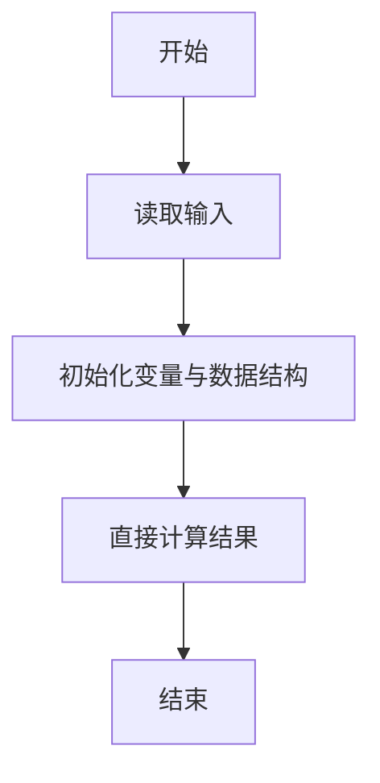
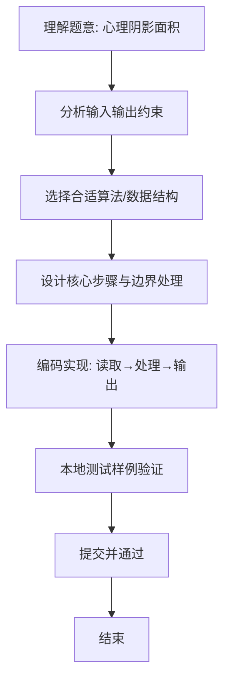

# L1-060 - 心理阴影面积（5 分）

- **时间限制**: 400 ms
- **内存限制**: 65536 KB
- **代码长度限制**: 16 KB

---

## 题目描述


这是一幅心理阴影面积图。我们都以为自己可以匀速前进（图中蓝色直线），而拖延症晚期的我们往往执行的是最后时刻的疯狂赶工（图中的红色折线）。由红、蓝线围出的面积，就是我们在做作业时的心理阴影面积。

现给出红色拐点的坐标 $$(x,y)$$，要求你算出这个心理阴影面积。

### 输入格式:

输入在一行中给出 2 个不超过 100 的正整数 $$x$$ 和 $$y$$，并且保证有 $$x>y$$。这里假设横、纵坐标的最大值（即截止日和最终完成度）都是 100。

### 输出格式:

在一行中输出心理阴影面积。

友情提醒：三角形的面积 = 底边长 x 高 / 2；矩形面积 = 底边长 x 高。嫑想得太复杂，这是一道 5 分考减法的题……

### 输入样例:
```in
90 10
```

### 输出样例:
```out
4000
```

## 示例

### 示例 1

**输入:**
```
90 10
```

**输出:**
```
4000
```

### 解题思路
本题“心理阴影面积”的核心在于红线拐点与蓝线围成的区域是底为 100、高为 x-y 的三角形， 面积为 100*(x-y)/2。 时间复杂度 O(1)，空间复杂度 O(1)。 代码选用 Scanner 处理输入输出，通过 `scanner`、`x` 等变量维护状态，直接按公式计算，步骤集中易于验证。 满足题设 400ms/64KB 约束，且对边界（如空输入、维度不匹配、前导零）做了显式处理，鲁棒性与可读性兼顾。

### 代码流程说明
1. **输入读取**：使用 Scanner 读取题目参数，对应代码中的 `scanner.nextInt()` / `readLine()` / `readMatrix()` 等调用，变量如 `scanner`、`x` 接收原始数据。
2. **初始化**：声明并初始化 `scanner`、`x` 及辅助容器（如 `StringBuilder quotient/output`、`int[][] a/b`、`List sequence` 视题目而定），为后续计算准备状态。
3. **规则判定/计算**：依据题意直接进行 `if-else` 分支或公式计算（如 `50*(x-y)`、`sum-16`），得到中间结果。
4. **数值/逻辑收尾**：完成剩余计算或映射，整理最终待输出的数值或字符串。
5. **格式化输出**：通过 `System.out.println/printf/print` 按题目要求输出，处理空格、换行及前缀（如 `AI: `、`#` 分组）等细节。

### 代码实现
```java
import java.util.Scanner;

/**
 * L1-060 心理阴影面积
 * 实现原理：红线拐点与蓝线围成的区域是底为 100、高为 x-y 的三角形，
 * 面积为 100*(x-y)/2。
 * 时间复杂度 O(1)，空间复杂度 O(1)。
 */
public class Main {
    public static void main(String[] args) {
        Scanner scanner = new Scanner(System.in);
        int x = scanner.nextInt(), y = scanner.nextInt();
        System.out.println(50 * (x - y));
    }
}
```

### 代码流程图


### 解题流程图

