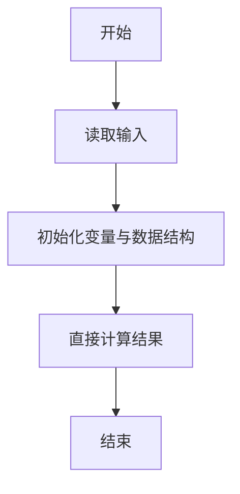
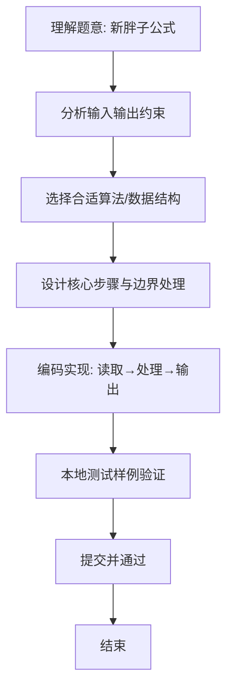

# L1-061 - 新胖子公式（10 分）

- **时间限制**: 400 ms
- **内存限制**: 65536 KB
- **代码长度限制**: 16 KB

---

## 题目描述


根据钱江晚报官方微博的报导，最新的肥胖计算方法为：体重(kg) / 身高(m) 的平方。如果超过 25，你就是胖子。于是本题就请你编写程序自动判断一个人到底算不算胖子。

### 输入格式:

输入在一行中给出两个正数，依次为一个人的体重（以 kg 为单位）和身高（以 m 为单位），其间以空格分隔。其中体重不超过 1000 kg，身高不超过 3.0 m。

### 输出格式:

首先输出将该人的体重和身高代入肥胖公式的计算结果，保留小数点后 1 位。如果这个数值大于 25，就在第二行输出 `PANG`，否则输出 `Hai Xing`。

### 输入样例 1：
```in
100.1 1.74
```

### 输出样例 1：
```out
33.1
PANG
```

### 输入样例 2：
```in
65 1.70
```

### 输出样例 2：
```out
22.5
Hai Xing
```

## 示例

### 示例 1

**输入:**
```
100.1 1.74
```

**输出:**
```
33.1
PANG
```

### 示例 2

**输入:**
```
65 1.70
```

**输出:**
```
22.5
Hai Xing
```

### 解题思路
本题“新胖子公式”的核心在于BMI=体重/身高²；按一位小数输出，再依据未舍入的数值是否大于 25 判断。 时间复杂度 O(1)，空间复杂度 O(1)。 代码选用 Scanner 处理输入输出，通过 `scanner`、`weight`、`bmi` 等变量维护状态，直接按公式计算，步骤集中易于验证。 满足题设 400ms/64KB 约束，且对边界（如空输入、维度不匹配、前导零）做了显式处理，鲁棒性与可读性兼顾。

### 代码流程说明
1. **输入读取**：使用 Scanner 读取题目参数，对应代码中的 `scanner.nextInt()` / `readLine()` / `readMatrix()` 等调用，变量如 `scanner`、`weight`、`bmi` 接收原始数据。
2. **初始化**：声明并初始化 `scanner`、`weight`、`bmi` 及辅助容器（如 `StringBuilder quotient/output`、`int[][] a/b`、`List sequence` 视题目而定），为后续计算准备状态。
3. **规则判定/计算**：依据题意直接进行 `if-else` 分支或公式计算（如 `50*(x-y)`、`sum-16`），得到中间结果。
4. **数值/逻辑收尾**：完成剩余计算或映射，整理最终待输出的数值或字符串。
5. **格式化输出**：通过 `System.out.println/printf/print` 按题目要求输出，处理空格、换行及前缀（如 `AI: `、`#` 分组）等细节。

### 代码实现
```java
import java.util.Scanner;

/**
 * L1-061 新胖子公式
 * 实现原理：BMI=体重/身高²；按一位小数输出，再依据未舍入的数值是否大于 25 判断。
 * 时间复杂度 O(1)，空间复杂度 O(1)。
 */
public class Main {
    public static void main(String[] args) {
        Scanner scanner = new Scanner(System.in);
        double weight = scanner.nextDouble(), height = scanner.nextDouble();
        double bmi = weight / (height * height);
        System.out.printf("%.1f%n", bmi);
        System.out.println(bmi > 25 ? "PANG" : "Hai Xing");
    }
}
```

### 代码流程图


### 解题流程图

