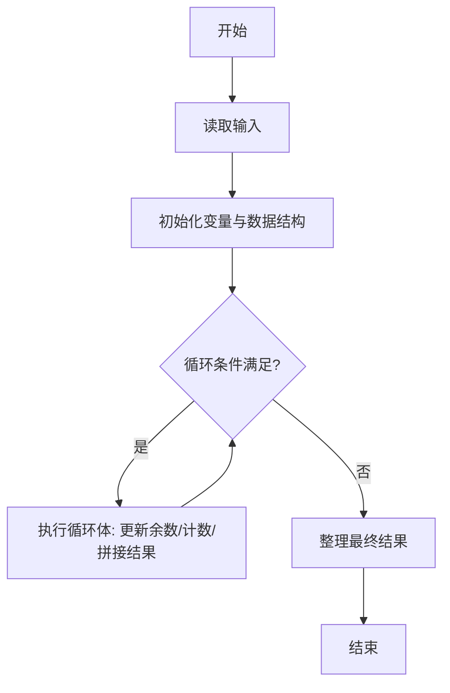
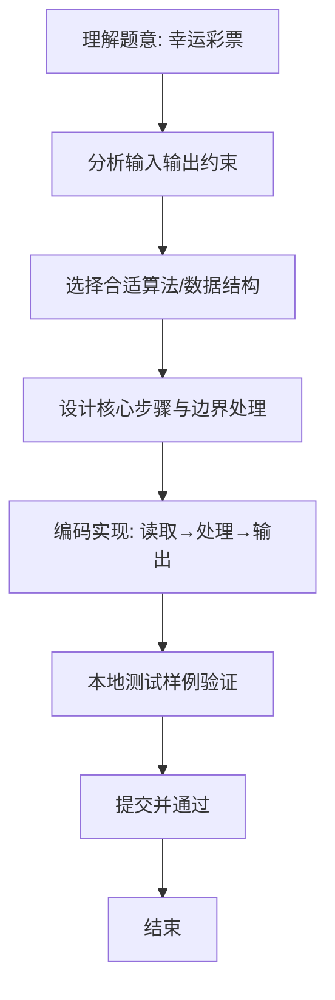

# L1-062 - 幸运彩票（15 分）

- **时间限制**: 400 ms
- **内存限制**: 65536 KB
- **代码长度限制**: 16 KB

---

## 题目描述


彩票的号码有 6 位数字，若一张彩票的前 3 位上的数之和等于后 3 位上的数之和，则称这张彩票是幸运的。本题就请你判断给定的彩票是不是幸运的。

### 输入格式:

输入在第一行中给出一个正整数 N（$$\le$$ 100）。随后 N 行，每行给出一张彩票的 6 位数字。

### 输出格式:

对每张彩票，如果它是幸运的，就在一行中输出 `You are lucky!`；否则输出 `Wish you good luck.`。

### 输入样例:
```in
2
233008
123456
```

### 输出样例:
```out
You are lucky!
Wish you good luck.
```

## 示例

### 示例 1

**输入:**
```
2
233008
123456
```

**输出:**
```
You are lucky!
Wish you good luck.
```

### 解题思路
本题“幸运彩票”的核心在于将 6 位号码作为字符串，分别累加前三位与后三位数值并比较。 时间复杂度 O(N)，空间复杂度 O(1)。 代码选用 Scanner 处理输入输出，通过 `scanner`、`n`、`ticket`、`left` 等变量维护状态，采用循环/模拟逐步推进，避免一次性构造超大结构，以增量方式得到结果。 满足题设 400ms/64KB 约束，且对边界（如空输入、维度不匹配、前导零）做了显式处理，鲁棒性与可读性兼顾。

### 代码流程说明
1. **输入读取**：使用 Scanner 读取题目参数，对应代码中的 `scanner.nextInt()` / `readLine()` / `readMatrix()` 等调用，变量如 `scanner`、`n`、`ticket`、`left` 接收原始数据。
2. **初始化**：声明并初始化 `scanner`、`n`、`ticket`、`left` 及辅助容器（如 `StringBuilder quotient/output`、`int[][] a/b`、`List sequence` 视题目而定），为后续计算准备状态。
3. **主循环**：进入 `while (n-- > 0)` 循环体，循环内按题意更新状态（如 `remainder = remainder*10+1`、`pressure` 比较、`sequence` 追加），并通过 `if` 分支决定是否拼接结果或跳过。
4. **数值/逻辑收尾**：完成剩余计算或映射，整理最终待输出的数值或字符串。
5. **格式化输出**：通过 `System.out.println/printf/print` 按题目要求输出，处理空格、换行及前缀（如 `AI: `、`#` 分组）等细节。

### 代码实现
```java
import java.util.Scanner;

/**
 * L1-062 幸运彩票
 * 实现原理：将 6 位号码作为字符串，分别累加前三位与后三位数值并比较。
 * 时间复杂度 O(N)，空间复杂度 O(1)。
 */
public class Main {
    public static void main(String[] args) {
        Scanner scanner = new Scanner(System.in);
        int n = scanner.nextInt();
        while (n-- > 0) {
            String ticket = scanner.next();
            int left = 0, right = 0;
            for (int i = 0; i < 3; i++) left += ticket.charAt(i) - '0';
            for (int i = 3; i < 6; i++) right += ticket.charAt(i) - '0';
            System.out.println(left == right ? "You are lucky!" : "Wish you good luck.");
        }
    }
}
```

### 代码流程图


### 解题流程图

