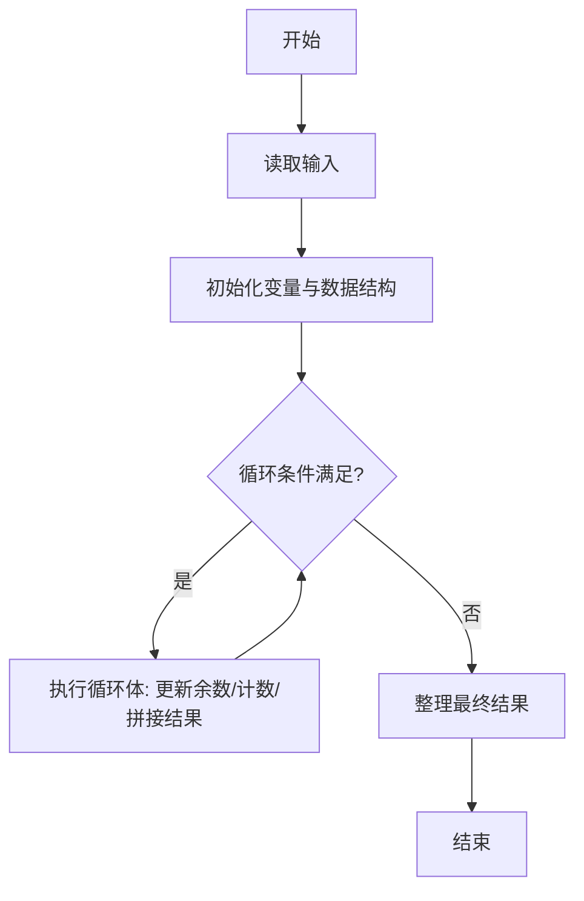
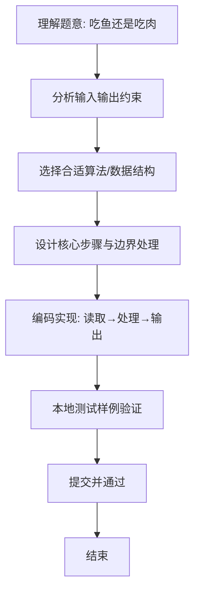

# L1-063 - 吃鱼还是吃肉（10 分）

- **时间限制**: 400 ms
- **内存限制**: 65536 KB
- **代码长度限制**: 16 KB

---

## 题目描述


  


国家给出了 8 岁男宝宝的标准身高为 130 厘米、标准体重为 27 公斤；8 岁女宝宝的标准身高为 129 厘米、标准体重为 25 公斤。

现在你要根据小宝宝的身高体重，给出补充营养的建议。

### 输入格式:

输入在第一行给出一个不超过 10 的正整数 $$N$$，随后 $$N$$ 行，每行给出一位宝宝的身体数据：
```
性别 身高 体重
```
其中`性别`是 1 表示男生，0 表示女生。`身高`和`体重`都是不超过 200 的正整数。

### 输出格式:

对于每一位宝宝，在一行中给出你的建议：

- 如果太矮了，输出：`duo chi yu!`（多吃鱼）；
- 如果太瘦了，输出：`duo chi rou!`（多吃肉）；
- 如果正标准，输出：`wan mei!`（完美）；
- 如果太高了，输出：`ni li hai!`（你厉害）；
- 如果太胖了，输出：`shao chi rou!`（少吃肉）。

先评价身高，再评价体重。两句话之间要有 1 个空格。

### 输入样例:
```in
4
0 130 23
1 129 27
1 130 30
0 128 27
```

### 输出样例:
```out
ni li hai! duo chi rou!
duo chi yu! wan mei!
wan mei! shao chi rou!
duo chi yu! shao chi rou!
```

## 示例

### 示例 1

**输入:**
```
4
0 130 23
1 129 27
1 130 30
0 128 27
```

**输出:**
```
ni li hai! duo chi rou!
duo chi yu! wan mei!
wan mei! shao chi rou!
duo chi yu! shao chi rou!
```

### 解题思路
本题“吃鱼还是吃肉”的核心在于由性别确定身高和体重标准值，分别比较后输出两条建议。 时间复杂度 O(N)，空间复杂度 O(1)。 代码选用 Scanner 处理输入输出，通过 `scanner`、`n`、`gender`、`height` 等变量维护状态，采用循环/模拟逐步推进，避免一次性构造超大结构，以增量方式得到结果。 满足题设 400ms/64KB 约束，且对边界（如空输入、维度不匹配、前导零）做了显式处理，鲁棒性与可读性兼顾。

### 代码流程说明
1. **输入读取**：使用 Scanner 读取题目参数，对应代码中的 `scanner.nextInt()` / `readLine()` / `readMatrix()` 等调用，变量如 `scanner`、`n`、`gender`、`height` 接收原始数据。
2. **初始化**：声明并初始化 `scanner`、`n`、`gender`、`height` 及辅助容器（如 `StringBuilder quotient/output`、`int[][] a/b`、`List sequence` 视题目而定），为后续计算准备状态。
3. **主循环**：进入 `while (n-- > 0)` 循环体，循环内按题意更新状态（如 `remainder = remainder*10+1`、`pressure` 比较、`sequence` 追加），并通过 `if` 分支决定是否拼接结果或跳过。
4. **数值/逻辑收尾**：完成剩余计算或映射，整理最终待输出的数值或字符串。
5. **格式化输出**：通过 `System.out.println/printf/print` 按题目要求输出，处理空格、换行及前缀（如 `AI: `、`#` 分组）等细节。

### 代码实现
```java
import java.util.Scanner;

/**
 * L1-063 吃鱼还是吃肉
 * 实现原理：由性别确定身高和体重标准值，分别比较后输出两条建议。
 * 时间复杂度 O(N)，空间复杂度 O(1)。
 */
public class Main {
    public static void main(String[] args) {
        Scanner scanner = new Scanner(System.in);
        int n = scanner.nextInt();
        while (n-- > 0) {
            int gender = scanner.nextInt();
            int height = scanner.nextInt();
            int weight = scanner.nextInt();
            int standardHeight = gender == 1 ? 130 : 129;
            int standardWeight = gender == 1 ? 27 : 25;
            String heightAdvice = height < standardHeight ? "duo chi yu!" : height > standardHeight ? "ni li hai!" : "wan mei!";
            String weightAdvice = weight < standardWeight ? "duo chi rou!" : weight > standardWeight ? "shao chi rou!" : "wan mei!";
            System.out.println(heightAdvice + " " + weightAdvice);
        }
    }
}
```

### 代码流程图


### 解题流程图

