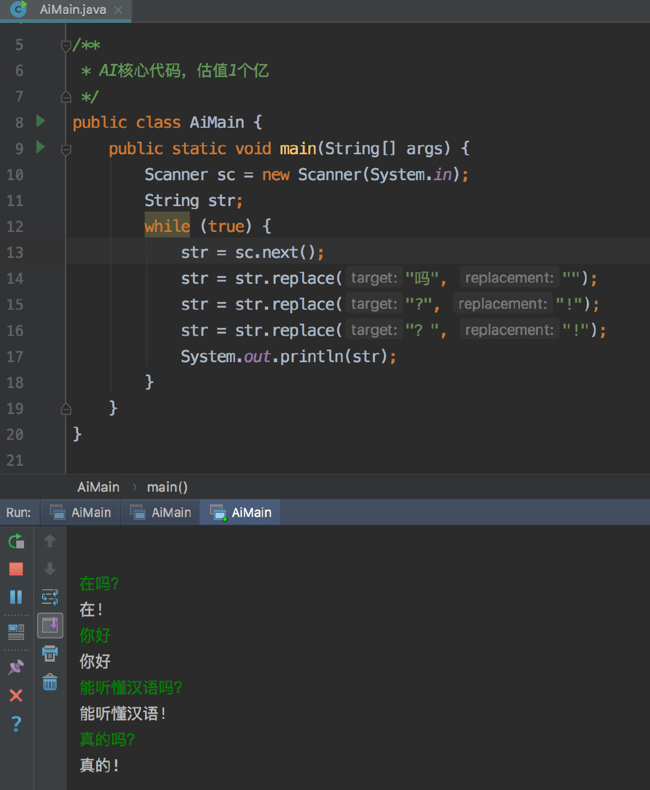
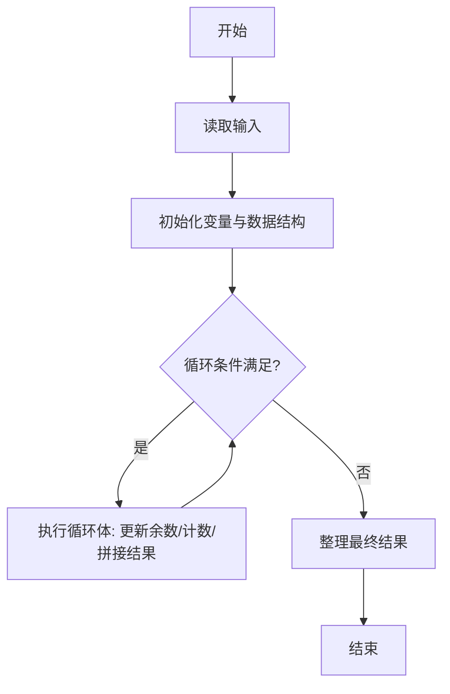
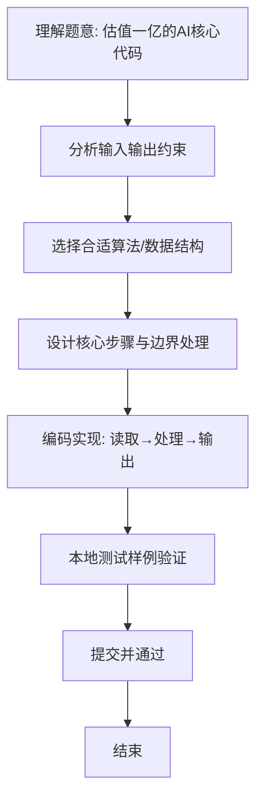

# L1-064 - 估值一亿的AI核心代码（20 分）

- **时间限制**: 400 ms
- **内存限制**: 65536 KB
- **代码长度限制**: 16 KB

---

## 题目描述





以上图片来自新浪微博。

本题要求你实现一个稍微更值钱一点的 AI 英文问答程序，规则是：

- 无论用户说什么，首先把对方说的话在一行中原样打印出来；
- 消除原文中多余空格：把相邻单词间的多个空格换成 1 个空格，把行首尾的空格全部删掉，把标点符号前面的空格删掉；
- 把原文中所有大写英文字母变成小写，除了 `I`；
- 把原文中所有独立的 `can you`、`could you` 对应地换成 `I can`、`I could`—— 这里“独立”是指被空格或标点符号分隔开的单词；
- 把原文中所有独立的 `I` 和 `me` 换成 `you`；
- 把原文中所有的问号 `?` 换成惊叹号 `!`；
- 在一行中输出替换后的句子作为 AI 的回答。

### 输入格式:

输入首先在第一行给出不超过 10 的正整数 N，随后 N 行，每行给出一句不超过 1000 个字符的、以回车结尾的用户的对话，对话为非空字符串，仅包括字母、数字、空格、可见的半角标点符号。

### 输出格式:

按题面要求输出，每个 AI 的回答前要加上 `AI:` 和一个空格。

### 输入样例:
```in
6
Hello ?
 Good to chat   with you
can   you speak Chinese?
Really?
Could you show me 5
What Is this prime? I,don 't know
```

### 输出样例:
```out
Hello ?
AI: hello!
 Good to chat   with you
AI: good to chat with you
can   you speak Chinese?
AI: I can speak chinese!
Really?
AI: really!
Could you show me 5
AI: I could show you 5
What Is this prime? I,don 't know
AI: what Is this prime! you,don't know
```

## 示例

### 示例 1

**输入:**
```
6
Hello ?
 Good to chat   with you
can   you speak Chinese?
Really?
Could you show me 5
What Is this prime? I,don 't know
```

**输出:**
```
Hello ?
AI: hello!
 Good to chat   with you
AI: good to chat with you
can   you speak Chinese?
AI: I can speak chinese!
Really?
AI: really!
Could you show me 5
AI: I could show you 5
What Is this prime? I,don 't know
AI: what Is this prime! you,don't know
```

### 解题思路
本题“估值一亿的AI核心代码”的核心在于 1) 原样打印输入行。 2) 规范化空格并转换大小写：压缩单词间多余空格、删除行首尾空格、删除标点前空格； 将所有大写字母转小写，但独立的 'I'（大写）保持不变。 3) 替换独立短语与代词：先用占位符暂存 "can you"/"could you" 的替换结果 "I can"/"I could"，再将独立的 "I" 与 "me" 换成 "you… 代码选用 BufferedReader、StringBuilder 处理输入输出，通过 `reader`、。

### 代码流程说明
1. **输入读取**：使用 BufferedReader、StringBuilder 读取题目参数，对应代码中的 `scanner.nextInt()` / `readLine()` / `readMatrix()` 等调用，变量如 `reader`、`n`、`original`、`answer` 接收原始数据。
2. **初始化**：声明并初始化 `reader`、`n`、`original`、`answer` 及辅助容器（如 `StringBuilder quotient/output`、`int[][] a/b`、`List sequence` 视题目而定），为后续计算准备状态。
3. **主循环**：进入 `while (n-- > 0)` 循环体，循环内按题意更新状态（如 `remainder = remainder*10+1`、`pressure` 比较、`sequence` 追加），并通过 `if` 分支决定是否拼接结果或跳过。
4. **结果拼接**：利用 `StringBuilder` 高效追加字符/数字，处理变长输出（如商位拼接、连续 6 替换），保证 O(n) 性能。
5. **格式化输出**：通过 `System.out.println/printf/print` 按题目要求输出，处理空格、换行及前缀（如 `AI: `、`#` 分组）等细节。

### 代码实现
```java
import java.io.BufferedReader;
import java.io.IOException;
import java.io.InputStreamReader;

/**
 * L1-064 估值一亿的AI核心代码
 * 实现原理：
 * 1) 原样打印输入行。
 * 2) 规范化空格并转换大小写：压缩单词间多余空格、删除行首尾空格、删除标点前空格；
 *    将所有大写字母转小写，但独立的 'I'（大写）保持不变。
 * 3) 替换独立短语与代词：先用占位符暂存 "can you"/"could you" 的替换结果
 *    "I can"/"I could"，再将独立的 "I" 与 "me" 换成 "you"，最后还原占位符，
 *    以避免新产生的 "I" 被二次替换。独立指被非字母数字字符（空格或标点）分隔。
 * 4) 将 '?' 全部换成 '!' 并以 "AI: " 前缀输出。
 * 时间复杂度 O(每行长度)，空间复杂度 O(每行长度)。
 */
public class Main {
    public static void main(String[] args) throws IOException {
        BufferedReader reader = new BufferedReader(new InputStreamReader(System.in));
        int n = Integer.parseInt(reader.readLine());
        while (n-- > 0) {
            String original = reader.readLine();
            if (original == null) original = "";
            System.out.println(original);
            String answer = normalizeAndLowercase(original);
            // 用不可见占位符保护 "I can"/"I could" 中的 I 避免被后续 I->you 覆盖
            final String PH_CAN = "\u0001";
            final String PH_COULD = "\u0002";
            answer = answer.replaceAll("(?<![A-Za-z0-9])can you(?![A-Za-z0-9])", PH_CAN);
            answer = answer.replaceAll("(?<![A-Za-z0-9])could you(?![A-Za-z0-9])", PH_COULD);
            answer = answer.replaceAll("(?<![A-Za-z0-9])I(?![A-Za-z0-9])", "you");
            answer = answer.replaceAll("(?<![A-Za-z0-9])me(?![A-Za-z0-9])", "you");
            answer = answer.replace(PH_CAN, "I can");
            answer = answer.replace(PH_COULD, "I could");
            answer = answer.replace('?', '!');
            System.out.println("AI: " + answer);
        }
    }

    /**
     * 规范化空格并转换大小写：
     * - 多个空格压缩为一个，且仅在字母数字间保留；
     * - 删除行首尾空格及标点前的空格；
     * - 除 'I' 外所有大写转小写。
     */
    private static String normalizeAndLowercase(String text) {
        StringBuilder result = new StringBuilder();
        boolean pendingSpace = false;
        for (int i = 0; i < text.length(); i++) {
            char c = text.charAt(i);
            if (c == ' ') {
                if (result.length() > 0) pendingSpace = true;
                continue;
            }
            // 仅在后继为字母数字时补空格，标点前不保留
            if (pendingSpace && Character.isLetterOrDigit(c)) result.append(' ');
            pendingSpace = false;
            result.append(c == 'I' ? 'I' : Character.toLowerCase(c));
        }
        return result.toString();
    }
}
```

### 代码流程图


### 解题流程图

