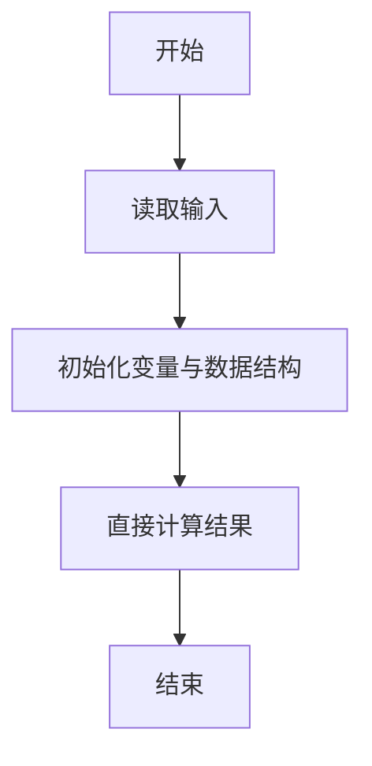
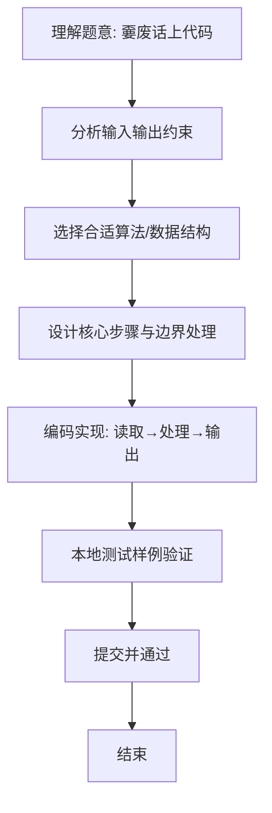

# L1-065 - 嫑废话上代码（5 分）

- **时间限制**: 400 ms
- **内存限制**: 65536 KB
- **代码长度限制**: 16 KB

---

## 题目描述


Linux 之父 Linus Torvalds 的名言是：“Talk is cheap. Show me the code.”（嫑废话，上代码）。本题就请你直接在屏幕上输出这句话。

### 输入格式:

本题没有输入。

### 输出格式:

在一行中输出 `Talk is cheap. Show me the code.`。

### 输入样例:
```in
无
```

### 输出样例:
```out
Talk is cheap. Show me the code.
```

## 示例

### 示例 1

**输入:**
```
无
```

**输出:**
```
Talk is cheap. Show me the code.
```

### 解题思路
本题“嫑废话上代码”的核心在于题目没有输入，输出指定英文句子。 时间复杂度 O(1)，空间复杂度 O(1)。 代码选用 基本变量 处理输入输出，通过 关键变量 等变量维护状态，直接按公式计算，步骤集中易于验证。 满足题设 400ms/64KB 约束，且对边界（如空输入、维度不匹配、前导零）做了显式处理，鲁棒性与可读性兼顾。

### 代码流程说明
1. **输入读取**：使用 基本变量 读取题目参数，对应代码中的 `scanner.nextInt()` / `readLine()` / `readMatrix()` 等调用，变量如 关键变量 接收原始数据。
2. **初始化**：声明并初始化 关键变量 及辅助容器（如 `StringBuilder quotient/output`、`int[][] a/b`、`List sequence` 视题目而定），为后续计算准备状态。
3. **规则判定/计算**：依据题意直接进行 `if-else` 分支或公式计算（如 `50*(x-y)`、`sum-16`），得到中间结果。
4. **数值/逻辑收尾**：完成剩余计算或映射，整理最终待输出的数值或字符串。
5. **格式化输出**：通过 `System.out.println/printf/print` 按题目要求输出，处理空格、换行及前缀（如 `AI: `、`#` 分组）等细节。

### 代码实现
```java
/**
 * L1-065 嫑废话上代码
 * 实现原理：题目没有输入，输出指定英文句子。
 * 时间复杂度 O(1)，空间复杂度 O(1)。
 */
public class Main {
    public static void main(String[] args) {
        System.out.println("Talk is cheap. Show me the code.");
    }
}
```

### 代码流程图


### 解题流程图

