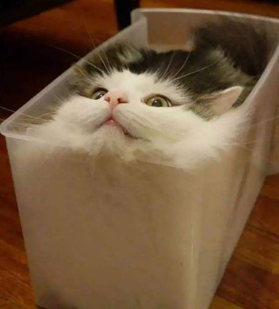
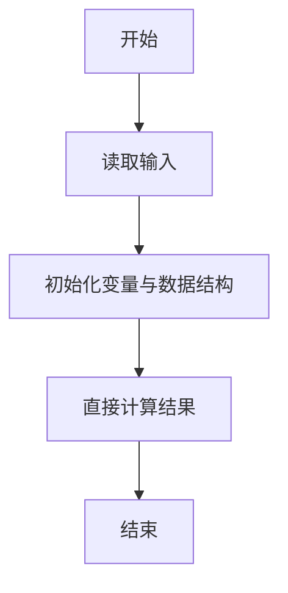
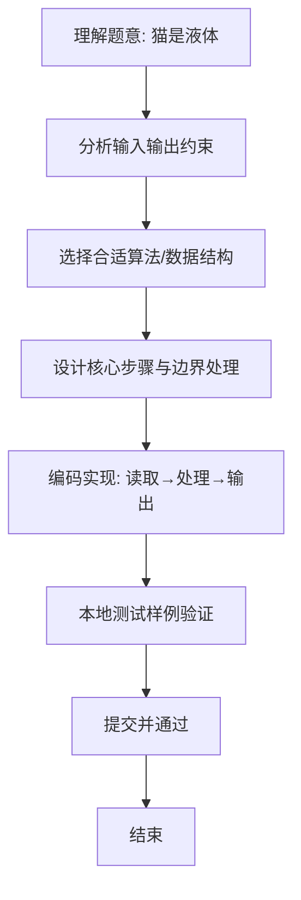

# L1-066 - 猫是液体（5 分）

- **时间限制**: 400 ms
- **内存限制**: 65536 KB
- **代码长度限制**: 16 KB

---

## 题目描述





测量一个人的体积是很难的，但猫就不一样了。因为猫是液体，所以可以很容易地通过测量一个长方体容器的容积来得到容器里猫的体积。本题就请你完成这个计算。

### 输入格式:

输入在第一行中给出 3 个不超过 100 的正整数，分别对应容器的长、宽、高。

### 输出格式:

在一行中输出猫的体积。

### 输入样例:
```in
23 15 20
```

### 输出样例:
```out
6900
```

## 示例

### 示例 1

**输入:**
```
23 15 20
```

**输出:**
```
6900
```

### 解题思路
本题“猫是液体”的核心在于长方体容积等于长、宽、高三者乘积。 时间复杂度 O(1)，空间复杂度 O(1)。 代码选用 Scanner 处理输入输出，通过 `scanner` 等变量维护状态，直接按公式计算，步骤集中易于验证。 满足题设 400ms/64KB 约束，且对边界（如空输入、维度不匹配、前导零）做了显式处理，鲁棒性与可读性兼顾。

### 代码流程说明
1. **输入读取**：使用 Scanner 读取题目参数，对应代码中的 `scanner.nextInt()` / `readLine()` / `readMatrix()` 等调用，变量如 `scanner` 接收原始数据。
2. **初始化**：声明并初始化 `scanner` 及辅助容器（如 `StringBuilder quotient/output`、`int[][] a/b`、`List sequence` 视题目而定），为后续计算准备状态。
3. **规则判定/计算**：依据题意直接进行 `if-else` 分支或公式计算（如 `50*(x-y)`、`sum-16`），得到中间结果。
4. **数值/逻辑收尾**：完成剩余计算或映射，整理最终待输出的数值或字符串。
5. **格式化输出**：通过 `System.out.println/printf/print` 按题目要求输出，处理空格、换行及前缀（如 `AI: `、`#` 分组）等细节。

### 代码实现
```java
import java.util.Scanner;

/**
 * L1-066 猫是液体
 * 实现原理：长方体容积等于长、宽、高三者乘积。
 * 时间复杂度 O(1)，空间复杂度 O(1)。
 */
public class Main {
    public static void main(String[] args) {
        Scanner scanner = new Scanner(System.in);
        System.out.println(scanner.nextInt() * scanner.nextInt() * scanner.nextInt());
    }
}
```

### 代码流程图


### 解题流程图

