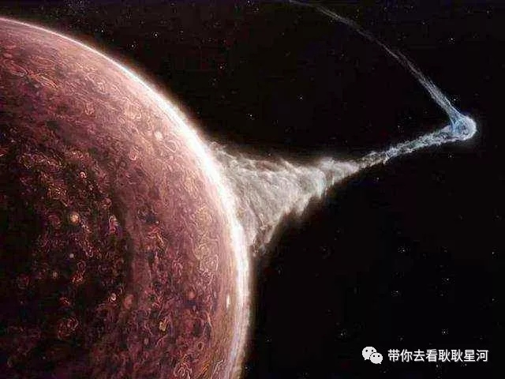
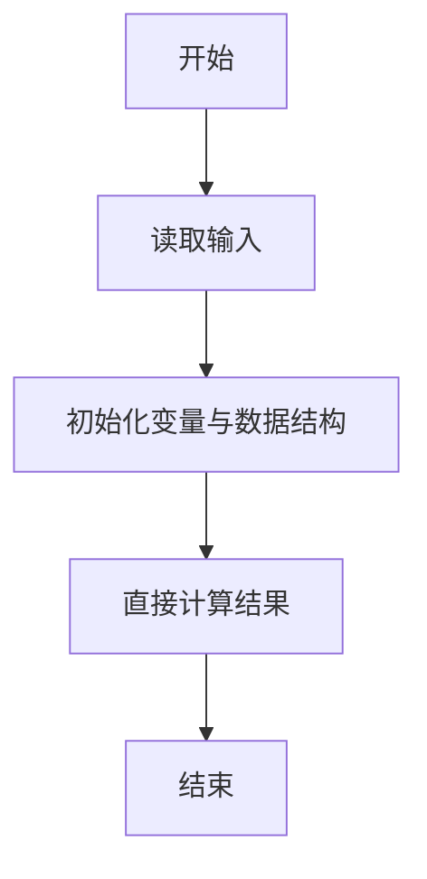
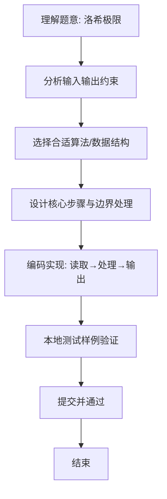

# L1-067 -  洛希极限（10 分）

- **时间限制**: 400 ms
- **内存限制**: 65536 KB
- **代码长度限制**: 16 KB

---

## 题目描述


科幻电影《流浪地球》中一个重要的情节是地球距离木星太近时，大气开始被木星吸走，而随着不断接近地木“刚体洛希极限”，地球面临被彻底撕碎的危险。但实际上，这个计算是错误的。





洛希极限（Roche limit）是一个天体自身的引力与第二个天体造成的潮汐力相等时的距离。当两个天体的距离少于洛希极限，天体就会倾向碎散，继而成为第二个天体的环。它以首位计算这个极限的人爱德华·洛希命名。（摘自百度百科）

大天体密度与小天体的密度的比值开 3 次方后，再乘以大天体的半径以及一个倍数（流体对应的倍数是 2.455，刚体对应的倍数是 1.26），就是洛希极限的值。例如木星与地球的密度比值开 3 次方是 0.622，如果假设地球是流体，那么洛希极限就是 $$0.622\times 2.455=1.52701$$ 倍木星半径；但地球是刚体，对应的洛希极限是 $$0.622\times 1.26=0.78372$$ 倍木星半径，这个距离比木星半径小，即只有当地球位于木星内部的时候才会被撕碎，换言之，就是地球不可能被撕碎。

本题就请你判断一个小天体会不会被一个大天体撕碎。

### 输入格式:

输入在一行中给出 3 个数字，依次为：大天体密度与小天体的密度的比值开 3 次方后计算出的值（$$\le 1$$）、小天体的属性（0 表示流体、1 表示刚体）、两个天体的距离与大天体半径的比值（$$>1$$ 但不超过 10）。

### 输出格式:

在一行中首先输出小天体的洛希极限与大天体半径的比值（输出小数点后2位）；随后空一格；最后输出 `^_^` 如果小天体不会被撕碎，否则输出 `T_T`。

### 输入样例 1：
```in
0.622 0 1.4
```

### 输出样例 1：
```out
1.53 T_T
```

### 输入样例 2：
```in
0.622 1 1.4
```

### 输出样例 2：
```out
0.78 ^_^
```

## 示例

### 示例 1

**输入:**
```
0.622 0 1.4
```

**输出:**
```
1.53 T_T
```

### 示例 2

**输入:**
```
0.622 1 1.4
```

**输出:**
```
0.78 ^_^
```

### 解题思路
本题“洛希极限”的核心在于流体倍数为 2.455、刚体倍数为 1.26；计算洛希极限比例后， 距离小于该比例则会被撕碎。 时间复杂度 O(1)，空间复杂度 O(1)。 代码选用 Scanner 处理输入输出，通过 `scanner`、`densityRootRatio`、`type`、`distanceRatio` 等变量维护状态，直接按公式计算，步骤集中易于验证。 满足题设 400ms/64KB 约束，且对边界（如空输入、维度不匹配、前导零）做了显式处理，鲁棒性与可读性兼顾。

### 代码流程说明
1. **输入读取**：使用 Scanner 读取题目参数，对应代码中的 `scanner.nextInt()` / `readLine()` / `readMatrix()` 等调用，变量如 `scanner`、`densityRootRatio`、`type`、`distanceRatio` 接收原始数据。
2. **初始化**：声明并初始化 `scanner`、`densityRootRatio`、`type`、`distanceRatio` 及辅助容器（如 `StringBuilder quotient/output`、`int[][] a/b`、`List sequence` 视题目而定），为后续计算准备状态。
3. **规则判定/计算**：依据题意直接进行 `if-else` 分支或公式计算（如 `50*(x-y)`、`sum-16`），得到中间结果。
4. **数值/逻辑收尾**：完成剩余计算或映射，整理最终待输出的数值或字符串。
5. **格式化输出**：通过 `System.out.println/printf/print` 按题目要求输出，处理空格、换行及前缀（如 `AI: `、`#` 分组）等细节。

### 代码实现
```java
import java.util.Scanner;

/**
 * L1-067 洛希极限
 * 实现原理：流体倍数为 2.455、刚体倍数为 1.26；计算洛希极限比例后，
 * 距离小于该比例则会被撕碎。
 * 时间复杂度 O(1)，空间复杂度 O(1)。
 */
public class Main {
    public static void main(String[] args) {
        Scanner scanner = new Scanner(System.in);
        double densityRootRatio = scanner.nextDouble();
        int type = scanner.nextInt();
        double distanceRatio = scanner.nextDouble();
        double limit = densityRootRatio * (type == 0 ? 2.455 : 1.26);
        System.out.printf("%.2f %s", limit, distanceRatio < limit ? "T_T" : "^_^");
    }
}
```

### 代码流程图


### 解题流程图

