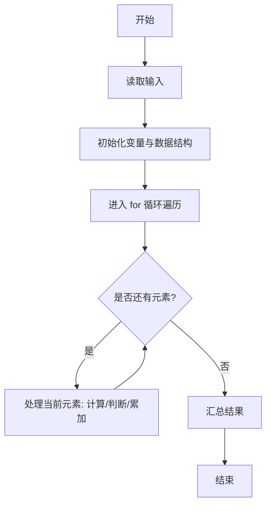
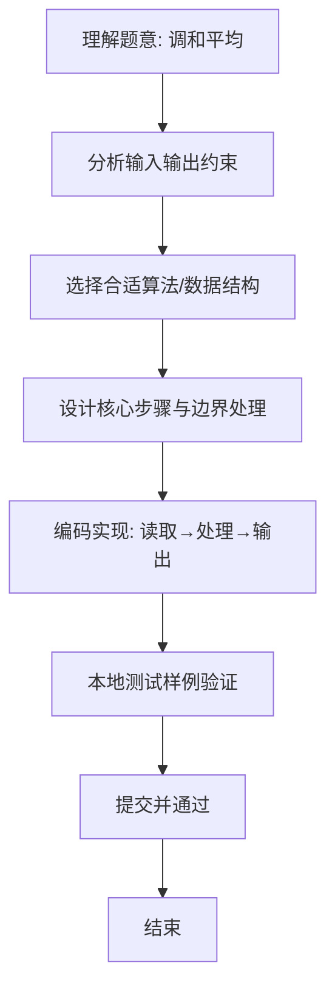

# L1-068 - 调和平均（10 分）

- **时间限制**: 400 ms
- **内存限制**: 65536 KB
- **代码长度限制**: 16 KB

---

## 题目描述


$$N$$ 个正数的**算数平均**是这些数的和除以 $$N$$，它们的**调和平均**是它们倒数的算数平均的倒数。本题就请你计算给定的一系列正数的调和平均值。

### 输入格式:

每个输入包含 1 个测试用例。每个测试用例第 1 行给出正整数 $$N$$ ($$\le 1000$$)；第 2 行给出 $$N$$ 个正数，都在区间 $$[0.1, 100]$$ 内。

### 输出格式:

在一行中输出给定数列的调和平均值，输出小数点后2位。

### 输入样例:
```in
8
10 15 12.7 0.3 4 13 1 15.6
```

### 输出样例:
```out
1.61
```

## 示例

### 示例 1

**输入:**
```
8
10 15 12.7 0.3 4 13 1 15.6
```

**输出:**
```
1.61
```

### 解题思路
本题“调和平均”的核心在于调和平均= N / sum(1/x_i)，遍历时累计倒数和。 时间复杂度 O(N)，空间复杂度 O(1)。 代码选用 Scanner 处理输入输出，通过 `scanner`、`n`、`reciprocalSum`、`i` 等变量维护状态，采用循环/模拟逐步推进，避免一次性构造超大结构，以增量方式得到结果。 满足题设 400ms/64KB 约束，且对边界（如空输入、维度不匹配、前导零）做了显式处理，鲁棒性与可读性兼顾。

### 代码流程说明
1. **输入读取**：使用 Scanner 读取题目参数，对应代码中的 `scanner.nextInt()` / `readLine()` / `readMatrix()` 等调用，变量如 `scanner`、`n`、`reciprocalSum`、`i` 接收原始数据。
2. **初始化**：声明并初始化 `scanner`、`n`、`reciprocalSum`、`i` 及辅助容器（如 `StringBuilder quotient/output`、`int[][] a/b`、`List sequence` 视题目而定），为后续计算准备状态。
3. **遍历处理**：通过 `for (int i = 0; i < n; i++)` 遍历输入元素，逐项执行核心逻辑（如矩阵三重循环 `sum += a[i][k]*b[k][j]`、字符串扫描 `text.charAt(i)`），并累加/判定。
4. **数值/逻辑收尾**：完成剩余计算或映射，整理最终待输出的数值或字符串。
5. **格式化输出**：通过 `System.out.println/printf/print` 按题目要求输出，处理空格、换行及前缀（如 `AI: `、`#` 分组）等细节。

### 代码实现
```java
import java.util.Scanner;

/**
 * L1-068 调和平均
 * 实现原理：调和平均= N / sum(1/x_i)，遍历时累计倒数和。
 * 时间复杂度 O(N)，空间复杂度 O(1)。
 */
public class Main {
    public static void main(String[] args) {
        Scanner scanner = new Scanner(System.in);
        int n = scanner.nextInt();
        double reciprocalSum = 0;
        for (int i = 0; i < n; i++) reciprocalSum += 1.0 / scanner.nextDouble();
        System.out.printf("%.2f", n / reciprocalSum);
    }
}
```

### 代码流程图


### 解题流程图

