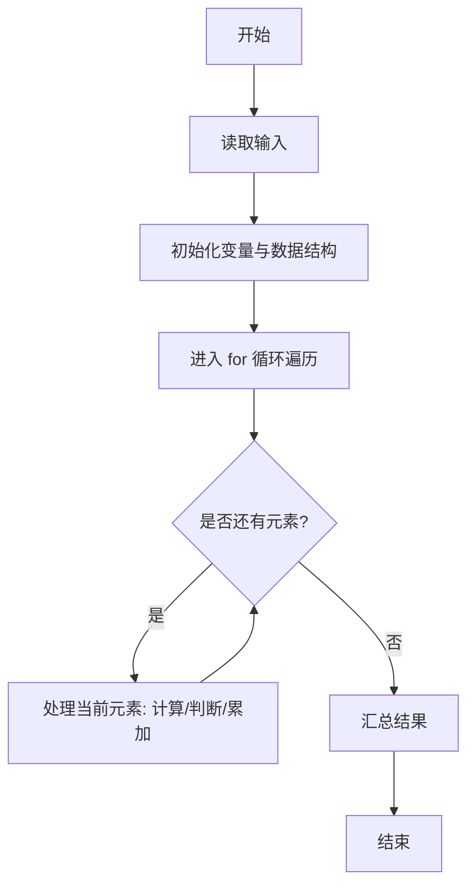
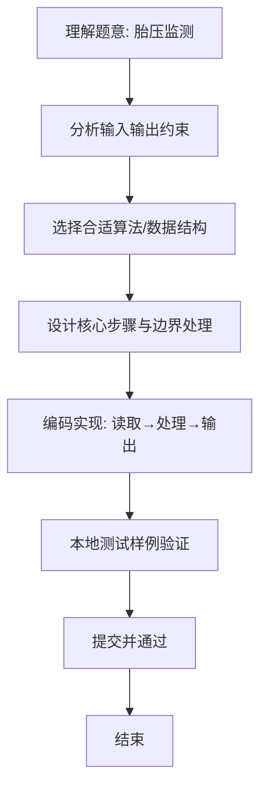

# L1-069 - 胎压监测（15 分）

- **时间限制**: 400 ms
- **内存限制**: 65536 KB
- **代码长度限制**: 16 KB

---

## 题目描述


小轿车中有一个系统随时监测四个车轮的胎压，如果四轮胎压不是很平衡，则可能对行车造成严重的影响。


让我们把四个车轮 —— 左前轮、右前轮、右后轮、左后轮 —— 顺次编号为 1、2、3、4。本题就请你编写一个监测程序，随时监测四轮的胎压，并给出正确的报警信息。报警规则如下：

- 如果所有轮胎的压力值与它们中的最大值误差在一个给定阈值内，并且都不低于系统设定的最低报警胎压，则说明情况正常，不报警；
- 如果存在一个轮胎的压力值与它们中的最大值误差超过了阈值，或者低于系统设定的最低报警胎压，则不仅要报警，而且要给出可能漏气的轮胎的准确位置；
- 如果存在两个或两个以上轮胎的压力值与它们中的最大值误差超过了阈值，或者低于系统设定的最低报警胎压，则报警要求检查所有轮胎。

### 输入格式:

输入在一行中给出 6 个 [0, 400] 范围内的整数，依次为 1~4 号轮胎的胎压、最低报警胎压、以及胎压差的阈值。

### 输出格式:

根据输入的胎压值给出对应信息：

- 如果不用报警，输出 `Normal`；
- 如果有一个轮胎需要报警，输出 `Warning: please check #X!`，其中 `X` 是出问题的轮胎的编号；
- 如果需要检查所有轮胎，输出 `Warning: please check all the tires!`。

### 输入样例 1：
```in
242 251 231 248 230 20
```

### 输出样例 1：
```out
Normal
```

### 输入样例 2：
```in
242 251 232 248 230 10
```

### 输出样例 2：
```out
Warning: please check #3!
```

### 输入样例 3：
```in
240 251 232 248 240 10
```

### 输出样例 3：
```out
Warning: please check all the tires!
```

## 示例

### 示例 1

**输入:**
```
242 251 231 248 230 20
```

**输出:**
```
Normal
```

### 示例 2

**输入:**
```
242 251 232 248 230 10
```

**输出:**
```
Warning: please check #3!
```

### 示例 3

**输入:**
```
240 251 232 248 240 10
```

**输出:**
```
Warning: please check all the tires!
```

### 解题思路
本题“胎压监测”的核心在于以四轮最大胎压为参照，低于最低值或与最大值差超过阈值即为异常； 根据异常轮胎数量输出正常、单轮或全轮检查提示。 时间复杂度 O(1)，空间复杂度 O(1)。 代码选用 Scanner、数组 处理输入输出，通过 `scanner`、`pressure`、`max`、`i` 等变量维护状态，采用循环/模拟逐步推进，避免一次性构造超大结构，以增量方式得到结果。 满足题设 400ms/64KB 约束，且对边界（如空输入、维度不匹配、前导零）做了显式处理，鲁棒性与可读性兼顾。

### 代码流程说明
1. **输入读取**：使用 Scanner、数组 读取题目参数，对应代码中的 `scanner.nextInt()` / `readLine()` / `readMatrix()` 等调用，变量如 `scanner`、`pressure`、`max`、`i` 接收原始数据。
2. **初始化**：声明并初始化 `scanner`、`pressure`、`max`、`i` 及辅助容器（如 `StringBuilder quotient/output`、`int[][] a/b`、`List sequence` 视题目而定），为后续计算准备状态。
3. **遍历处理**：通过 `for (int i = 0; i < 4; i++)` 遍历输入元素，逐项执行核心逻辑（如矩阵三重循环 `sum += a[i][k]*b[k][j]`、字符串扫描 `text.charAt(i)`），并累加/判定。
4. **数值/逻辑收尾**：完成剩余计算或映射，整理最终待输出的数值或字符串。
5. **格式化输出**：通过 `System.out.println/printf/print` 按题目要求输出，处理空格、换行及前缀（如 `AI: `、`#` 分组）等细节。

### 代码实现
```java
import java.util.Scanner;

/**
 * L1-069 胎压监测
 * 实现原理：以四轮最大胎压为参照，低于最低值或与最大值差超过阈值即为异常；
 * 根据异常轮胎数量输出正常、单轮或全轮检查提示。
 * 时间复杂度 O(1)，空间复杂度 O(1)。
 */
public class Main {
    public static void main(String[] args) {
        Scanner scanner = new Scanner(System.in);
        int[] pressure = new int[4];
        int max = 0;
        for (int i = 0; i < 4; i++) {
            pressure[i] = scanner.nextInt();
            max = Math.max(max, pressure[i]);
        }
        int minimum = scanner.nextInt(), threshold = scanner.nextInt();
        int abnormalCount = 0, abnormalIndex = -1;
        for (int i = 0; i < 4; i++) {
            if (pressure[i] < minimum || max - pressure[i] > threshold) {
                abnormalCount++;
                abnormalIndex = i;
            }
        }
        if (abnormalCount == 0) System.out.println("Normal");
        else if (abnormalCount == 1) System.out.println("Warning: please check #" + (abnormalIndex + 1) + "!");
        else System.out.println("Warning: please check all the tires!");
    }
}
```

### 代码流程图


### 解题流程图

