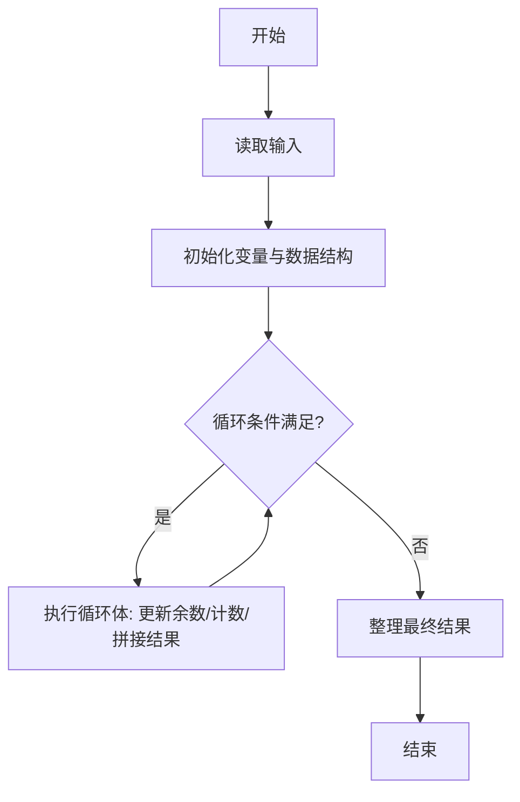
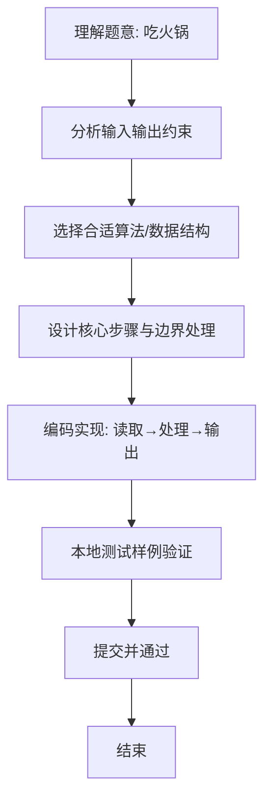

# L1-070 - 吃火锅（15 分）

- **时间限制**: 400 ms
- **内存限制**: 65536 KB
- **代码长度限制**: 16 KB

---

## 题目描述


以上图片来自微信朋友圈：这种天气你有什么破事打电话给我基本没用。但是如果你说“吃火锅”，那就厉害了，我们的故事就开始了。

本题要求你实现一个程序，自动检查你朋友给你发来的信息里有没有 `chi1 huo3 guo1`。

### 输入格式:

输入每行给出一句不超过 80 个字符的、以回车结尾的朋友信息，信息为非空字符串，仅包括字母、数字、空格、可见的半角标点符号。当读到某一行只有一个英文句点 `.` 时，输入结束，此行不算在朋友信息里。

### 输出格式:

首先在一行中输出朋友信息的总条数。然后对朋友的每一行信息，检查其中是否包含 `chi1 huo3 guo1`，并且统计这样厉害的信息有多少条。在第二行中首先输出第一次出现 `chi1 huo3 guo1` 的信息是第几条（从 1 开始计数），然后输出这类信息的总条数，其间以一个空格分隔。题目保证输出的所有数字不超过 100。

如果朋友从头到尾都没提 `chi1 huo3 guo1` 这个关键词，则在第二行输出一个表情 `-_-#`。

### 输入样例 1：
```in
Hello!
are you there?
wantta chi1 huo3 guo1?
that's so li hai le
our story begins from chi1 huo3 guo1 le
.
```

### 输出样例 1：
```out
5
3 2
```

### 输入样例 2：
```in
Hello!
are you there?
wantta qi huo3 guo1 chi1huo3guo1?
that's so li hai le
our story begins from ci1 huo4 guo2 le
.
```

### 输出样例 2：
```out
5
-_-#
```

## 示例

### 示例 1

**输入:**
```
Hello!
are you there?
wantta chi1 huo3 guo1?
that's so li hai le
our story begins from chi1 huo3 guo1 le
.
```

**输出:**
```
5
3 2
```

### 示例 2

**输入:**
```
Hello!
are you there?
wantta qi huo3 guo1 chi1huo3guo1?
that's so li hai le
our story begins from ci1 huo4 guo2 le
.
```

**输出:**
```
5
-_-#
```

### 解题思路
本题“吃火锅”的核心在于逐行读取到单独句点为止，统计总消息数与包含目标子串的消息数， 并在首次包含时记录其从 1 开始的位置。 时间复杂度 O(总字符数)，空间复杂度 O(1)。 代码选用 BufferedReader 处理输入输出，通过 `reader`、`total`、`line` 等变量维护状态，采用循环/模拟逐步推进，避免一次性构造超大结构，以增量方式得到结果。 满足题设 400ms/64KB 约束，且对边界（如空输入、维度不匹配、前导零）做了显式处理，鲁棒性与可读性兼顾。

### 代码流程说明
1. **输入读取**：使用 BufferedReader 读取题目参数，对应代码中的 `scanner.nextInt()` / `readLine()` / `readMatrix()` 等调用，变量如 `reader`、`total`、`line` 接收原始数据。
2. **初始化**：声明并初始化 `reader`、`total`、`line` 及辅助容器（如 `StringBuilder quotient/output`、`int[][] a/b`、`List sequence` 视题目而定），为后续计算准备状态。
3. **主循环**：进入 `while (!(line = reader.readLine()` 循环体，循环内按题意更新状态（如 `remainder = remainder*10+1`、`pressure` 比较、`sequence` 追加），并通过 `if` 分支决定是否拼接结果或跳过。
4. **数值/逻辑收尾**：完成剩余计算或映射，整理最终待输出的数值或字符串。
5. **格式化输出**：通过 `System.out.println/printf/print` 按题目要求输出，处理空格、换行及前缀（如 `AI: `、`#` 分组）等细节。

### 代码实现
```java
import java.io.BufferedReader;
import java.io.IOException;
import java.io.InputStreamReader;

/**
 * L1-070 吃火锅
 * 实现原理：逐行读取到单独句点为止，统计总消息数与包含目标子串的消息数，
 * 并在首次包含时记录其从 1 开始的位置。
 * 时间复杂度 O(总字符数)，空间复杂度 O(1)。
 */
public class Main {
    public static void main(String[] args) throws IOException {
        BufferedReader reader = new BufferedReader(new InputStreamReader(System.in));
        int total = 0, hits = 0, first = -1;
        String line;
        while (!(line = reader.readLine()).equals(".")) {
            total++;
            if (line.contains("chi1 huo3 guo1")) {
                hits++;
                if (first == -1) first = total;
            }
        }
        System.out.println(total);
        System.out.println(hits == 0 ? "-_-#" : first + " " + hits);
    }
}
```

### 代码流程图


### 解题流程图

