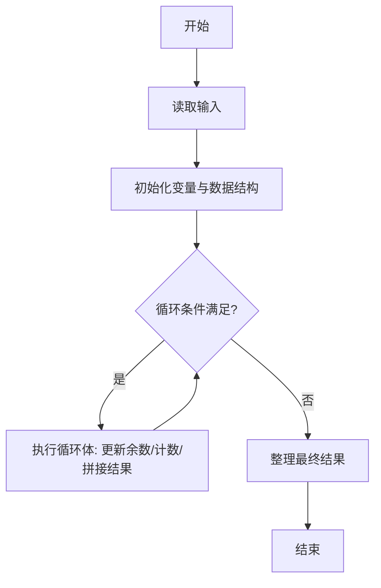
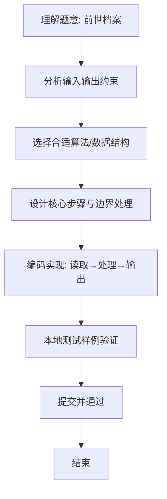

# L1-071 - 前世档案（20 分）

- **时间限制**: 400 ms
- **内存限制**: 65536 KB
- **代码长度限制**: 16 KB

---

## 题目描述


网络世界中时常会遇到这类滑稽的算命小程序，实现原理很简单，随便设计几个问题，根据玩家对每个问题的回答选择一条判断树中的路径（如下图所示），结论就是路径终点对应的那个结点。


现在我们把结论从左到右顺序编号，编号从 1 开始。这里假设回答都是简单的“是”或“否”，又假设回答“是”对应向左的路径，回答“否”对应向右的路径。给定玩家的一系列回答，请你返回其得到的结论的编号。

### 输入格式:

输入第一行给出两个正整数：$$N$$（$$\le 30$$）为玩家做一次测试要回答的问题数量；$$M$$（$$\le 100$$）为玩家人数。

随后 $$M$$ 行，每行顺次给出玩家的 $$N$$ 个回答。这里用 `y` 代表“是”，用 `n` 代表“否”。

### 输出格式:

对每个玩家，在一行中输出其对应的结论的编号。

### 输入样例:
```in
3 4
yny
nyy
nyn
yyn
```

### 输出样例:
```out
3
5
6
2
```

## 示例

### 示例 1

**输入:**
```
3 4
yny
nyy
nyn
yyn
```

**输出:**
```
3
5
6
2
```

### 解题思路
本题“前世档案”的核心在于判断树叶从左到右编号等价于把回答串看作二进制数：y 走左边记 0， n 走右边记 1。二进制值加 1 即为叶子编号。 时间复杂度 O(MN)，空间复杂度 O(1)。 代码选用 Scanner 处理输入输出，通过 `scanner`、`n`、`answers`、`index` 等变量维护状态，采用循环/模拟逐步推进，避免一次性构造超大结构，以增量方式得到结果。 满足题设 400ms/64KB 约束，且对边界（如空输入、维度不匹配、前导零）做了显式处理，鲁棒性与可读性兼顾。

### 代码流程说明
1. **输入读取**：使用 Scanner 读取题目参数，对应代码中的 `scanner.nextInt()` / `readLine()` / `readMatrix()` 等调用，变量如 `scanner`、`n`、`answers`、`index` 接收原始数据。
2. **初始化**：声明并初始化 `scanner`、`n`、`answers`、`index` 及辅助容器（如 `StringBuilder quotient/output`、`int[][] a/b`、`List sequence` 视题目而定），为后续计算准备状态。
3. **主循环**：进入 `while (m-- > 0)` 循环体，循环内按题意更新状态（如 `remainder = remainder*10+1`、`pressure` 比较、`sequence` 追加），并通过 `if` 分支决定是否拼接结果或跳过。
4. **数值/逻辑收尾**：完成剩余计算或映射，整理最终待输出的数值或字符串。
5. **格式化输出**：通过 `System.out.println/printf/print` 按题目要求输出，处理空格、换行及前缀（如 `AI: `、`#` 分组）等细节。

### 代码实现
```java
import java.util.Scanner;

/**
 * L1-071 前世档案
 * 实现原理：判断树叶从左到右编号等价于把回答串看作二进制数：y 走左边记 0，
 * n 走右边记 1。二进制值加 1 即为叶子编号。
 * 时间复杂度 O(MN)，空间复杂度 O(1)。
 */
public class Main {
    public static void main(String[] args) {
        Scanner scanner = new Scanner(System.in);
        int n = scanner.nextInt(), m = scanner.nextInt();
        while (m-- > 0) {
            String answers = scanner.next();
            int index = 0;
            for (int i = 0; i < n; i++) index = index * 2 + (answers.charAt(i) == 'n' ? 1 : 0);
            System.out.println(index + 1);
        }
    }
}
```

### 代码流程图


### 解题流程图

