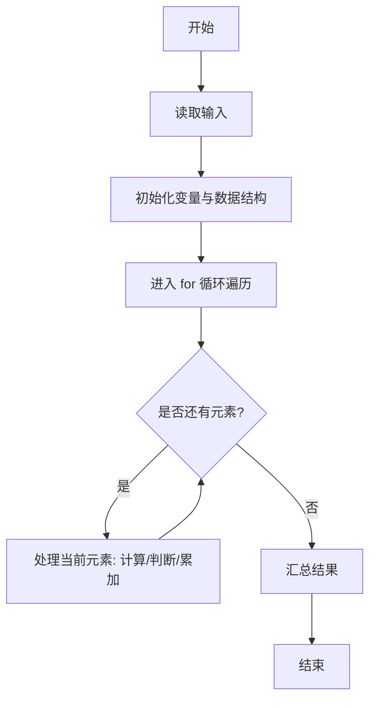
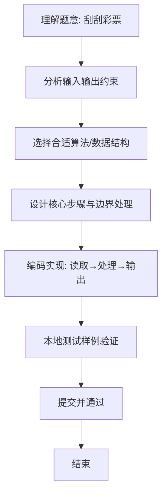

# L1-072 - 刮刮彩票（20 分）

- **时间限制**: 400 ms
- **内存限制**: 65536 KB
- **代码长度限制**: 16 KB

---

## 题目描述


“刮刮彩票”是一款网络游戏里面的一个小游戏。如图所示：


每次游戏玩家会拿到一张彩票，上面会有 9 个数字，分别为数字 1 到数字 9，数字各不重复，并以 $$3\times3$$ 的“九宫格”形式排布在彩票上。

在游戏开始时能看见一个位置上的数字，其他位置上的数字均不可见。你可以选择三个位置的数字刮开，这样玩家就能看见四个位置上的数字了。最后玩家再从 3 横、3 竖、2 斜共 8 个方向中挑选一个方向，方向上三个数字的和可根据下列表格进行兑奖，获得对应数额的金币。


| 数字合计 | 获得金币 | 数字合计 | 获得金币 |
| -------- | -------- | -------- | -------- |
| 6     | 10,000     | 16     | 72     |
| 7     | 36     | 17     | 180     |
| 8     | 720     | 18     | 119     |
| 9     | 360     | 19     | 36     |
| 10     | 80     | 20     | 306     |
| 11    | 252     | 21     | 1,080     |
| 12    | 108     | 22    | 144     |
| 13    | 72     | 23    | 1,800     |
| 14    | 54     | 24    | 3,600     |
| 15    | 180     |      ||      |


现在请你写出一个模拟程序，模拟玩家的游戏过程。

### 输入格式:

输入第一部分给出一张合法的彩票，即用 3 行 3 列给出 0 至 9 的数字。**0 表示的是这个位置上的数字初始时就能看见了**，而不是彩票上的数字为 0。

第二部给出玩家刮开的三个位置，分为三行，每行按格式 `x y` 给出玩家刮开的位置的行号和列号（题目中定义左上角的位置为第 1 行、第 1 列。）。数据保证玩家不会重复刮开已刮开的数字。

最后一部分给出玩家选择的方向，即一个整数： 1 至 3 表示选择横向的第一行、第二行、第三行，4 至 6 表示纵向的第一列、第二列、第三列，7、8分别表示左上到右下的主对角线和右上到左下的副对角线。

### 输出格式:

对于每一个刮开的操作，在一行中输出玩家能看到的数字。最后对于选择的方向，在一行中输出玩家获得的金币数量。

### 输入样例:
```in
1 2 3
4 5 6
7 8 0
1 1
2 2
2 3
7
```

### 输出样例:
```out
1
5
6
180
```

## 示例

### 示例 1

**输入:**
```
1 2 3
4 5 6
7 8 0
1 1
2 2
2 3
7
```

**输出:**
```
1
5
6
180
```

### 解题思路
本题“刮刮彩票”的核心在于输入中 0 是初始显示位置，其实际数字为 1..9 中未出现的唯一数字。 补全后按三次刮开坐标输出数字，最后根据指定方向计算三数和并查表兑奖。 时间复杂度 O(1)，空间复杂度 O(1)。 代码选用 Scanner、二维数组 处理输入输出，通过 `PRIZE`、`scanner`、`zeroRow`、`i` 等变量维护状态，采用循环/模拟逐步推进，避免一次性构造超大结构，以增量方式得到结果。 满足题设 400ms/64KB 约束，且对边界（如空输入、维度不匹配、前导零）做了显式处理，鲁棒性与可读性兼顾。

### 代码流程说明
1. **输入读取**：使用 Scanner、二维数组 读取题目参数，对应代码中的 `scanner.nextInt()` / `readLine()` / `readMatrix()` 等调用，变量如 `PRIZE`、`scanner`、`zeroRow`、`i` 接收原始数据。
2. **初始化**：声明并初始化 `PRIZE`、`scanner`、`zeroRow`、`i` 及辅助容器（如 `StringBuilder quotient/output`、`int[][] a/b`、`List sequence` 视题目而定），为后续计算准备状态。
3. **遍历处理**：通过 `for (int i = 0; i < 3; i++)` 遍历输入元素，逐项执行核心逻辑（如矩阵三重循环 `sum += a[i][k]*b[k][j]`、字符串扫描 `text.charAt(i)`），并累加/判定。
4. **数值/逻辑收尾**：完成剩余计算或映射，整理最终待输出的数值或字符串。
5. **格式化输出**：通过 `System.out.println/printf/print` 按题目要求输出，处理空格、换行及前缀（如 `AI: `、`#` 分组）等细节。

### 代码实现
```java
import java.util.Scanner;

/**
 * L1-072 刮刮彩票
 * 实现原理：输入中 0 是初始显示位置，其实际数字为 1..9 中未出现的唯一数字。
 * 补全后按三次刮开坐标输出数字，最后根据指定方向计算三数和并查表兑奖。
 * 时间复杂度 O(1)，空间复杂度 O(1)。
 */
public class Main {
    private static final int[] PRIZE = {0, 0, 0, 0, 0, 0, 10000, 36, 720, 360, 80, 252, 108, 72, 54, 180, 72, 180, 119, 36, 306, 1080, 144, 1800, 3600};

    public static void main(String[] args) {
        Scanner scanner = new Scanner(System.in);
        int[][] board = new int[3][3];
        boolean[] exists = new boolean[10];
        int zeroRow = 0, zeroCol = 0;
        for (int i = 0; i < 3; i++) {
            for (int j = 0; j < 3; j++) {
                board[i][j] = scanner.nextInt();
                if (board[i][j] == 0) {
                    zeroRow = i;
                    zeroCol = j;
                } else exists[board[i][j]] = true;
            }
        }
        for (int value = 1; value <= 9; value++) if (!exists[value]) board[zeroRow][zeroCol] = value;
        for (int i = 0; i < 3; i++) {
            int row = scanner.nextInt() - 1, col = scanner.nextInt() - 1;
            System.out.println(board[row][col]);
        }
        int direction = scanner.nextInt();
        int sum;
        if (direction <= 3) sum = board[direction - 1][0] + board[direction - 1][1] + board[direction - 1][2];
        else if (direction <= 6) sum = board[0][direction - 4] + board[1][direction - 4] + board[2][direction - 4];
        else if (direction == 7) sum = board[0][0] + board[1][1] + board[2][2];
        else sum = board[0][2] + board[1][1] + board[2][0];
        System.out.println(PRIZE[sum]);
    }
}
```

### 代码流程图


### 解题流程图

