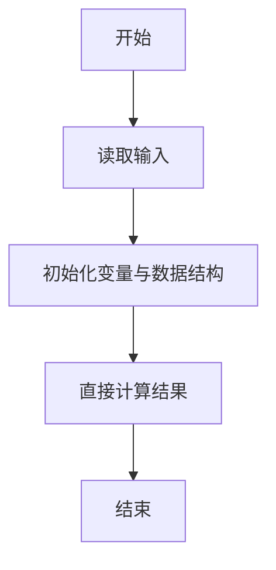
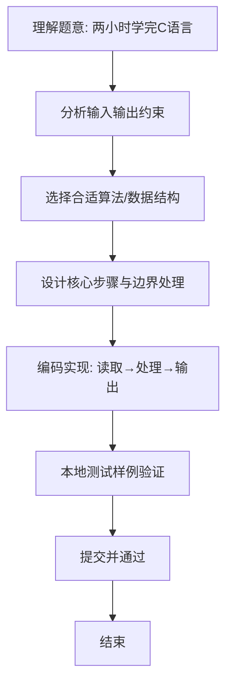

# L1-074 - 两小时学完C语言（5 分）

- **时间限制**: 400 ms
- **内存限制**: 65536 KB
- **代码长度限制**: 16 KB

---

## 题目描述


知乎上有个宝宝问：“两个小时内如何学完 C 语言？”当然，问的是“学完”并不是“学会”。

假设一本 C 语言教科书有 N 个字，这个宝宝每分钟能看 K 个字，看了 M 分钟。还剩多少字没有看？

### 输入格式:

输入在一行中给出 3 个正整数，分别是 N（不超过 400 000），教科书的总字数；K（不超过 3 000），是宝宝每分钟能看的字数；M（不超过 120），是宝宝看书的分钟数。

题目保证宝宝看完的字数不超过 N。

### 输出格式:

在一行中输出宝宝还没有看的字数。

### 输入样例:
```in
100000 1000 72
```

### 输出样例:
```out
28000
```

## 示例

### 示例 1

**输入:**
```
100000 1000 72
```

**输出:**
```
28000
```

### 解题思路
本题“两小时学完C语言”的核心在于已阅读字数为每分钟阅读量乘阅读分钟数，用总字数减去该值。 时间复杂度 O(1)，空间复杂度 O(1)。 代码选用 Scanner 处理输入输出，通过 `scanner`、`total` 等变量维护状态，直接按公式计算，步骤集中易于验证。 满足题设 400ms/64KB 约束，且对边界（如空输入、维度不匹配、前导零）做了显式处理，鲁棒性与可读性兼顾。

### 代码流程说明
1. **输入读取**：使用 Scanner 读取题目参数，对应代码中的 `scanner.nextInt()` / `readLine()` / `readMatrix()` 等调用，变量如 `scanner`、`total` 接收原始数据。
2. **初始化**：声明并初始化 `scanner`、`total` 及辅助容器（如 `StringBuilder quotient/output`、`int[][] a/b`、`List sequence` 视题目而定），为后续计算准备状态。
3. **规则判定/计算**：依据题意直接进行 `if-else` 分支或公式计算（如 `50*(x-y)`、`sum-16`），得到中间结果。
4. **数值/逻辑收尾**：完成剩余计算或映射，整理最终待输出的数值或字符串。
5. **格式化输出**：通过 `System.out.println/printf/print` 按题目要求输出，处理空格、换行及前缀（如 `AI: `、`#` 分组）等细节。

### 代码实现
```java
import java.util.Scanner;

/**
 * L1-074 两小时学完C语言
 * 实现原理：已阅读字数为每分钟阅读量乘阅读分钟数，用总字数减去该值。
 * 时间复杂度 O(1)，空间复杂度 O(1)。
 */
public class Main {
    public static void main(String[] args) {
        Scanner scanner = new Scanner(System.in);
        int total = scanner.nextInt(), perMinute = scanner.nextInt(), minutes = scanner.nextInt();
        System.out.println(total - perMinute * minutes);
    }
}
```

### 代码流程图


### 解题流程图

