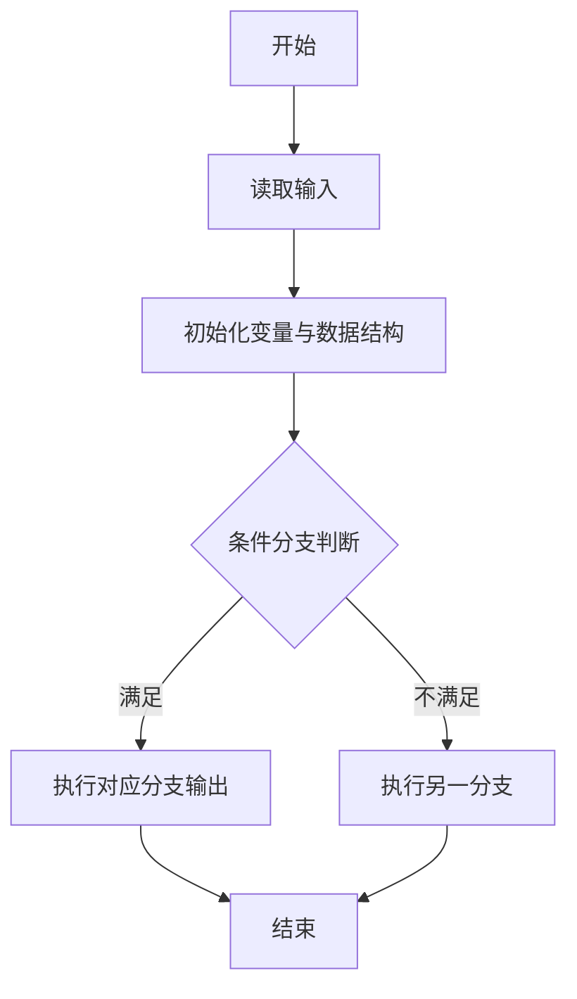
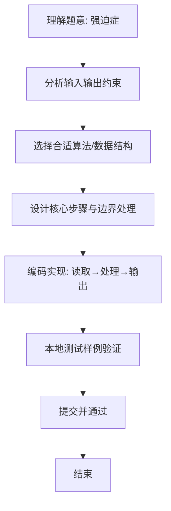

# L1-075 - 强迫症（10 分）

- **时间限制**: 400 ms
- **内存限制**: 65536 KB
- **代码长度限制**: 16 KB

---

## 题目描述


小强在统计一个小区里居民的出生年月，但是发现大家填写的生日格式不统一，例如有的人写 `199808`，有的人只写 `9808`。有强迫症的小强请你写个程序，把所有人的出生年月都整理成 `年年年年-月月` 格式。对于那些只写了年份后两位的信息，我们默认小于 `22` 都是 `20` 开头的，其他都是 `19` 开头的。

### 输入格式:

输入在一行中给出一个出生年月，为一个 6 位或者 4 位数，题目保证是 1000 年 1 月到 2021 年 12 月之间的合法年月。

### 输出格式:

在一行中按标准格式 `年年年年-月月` 将输入的信息整理输出。

### 输入样例 1：
```in
9808
```

### 输出样例 1：
```out
1998-08
```

### 输入样例 2：
```in
0510
```

### 输出样例 2：
```out
2005-10
```

### 输入样例 3：
```in
196711
```

### 输出样例 3：
```out
1967-11
```

## 示例

### 示例 1

**输入:**
```
9808
```

**输出:**
```
1998-08
```

### 示例 2

**输入:**
```
0510
```

**输出:**
```
2005-10
```

### 示例 3

**输入:**
```
196711
```

**输出:**
```
1967-11
```

### 解题思路
本题“强迫症”的核心在于六位输入已是 yyyyMM；四位输入按 yyMM 拆分，yy 小于 22 补 20， 否则补 19，最后统一插入连字符输出。 时间复杂度 O(1)，空间复杂度 O(1)。 代码选用 Scanner 处理输入输出，通过 `date`、`yy` 等变量维护状态，以条件分支直接映射题意规则，逻辑简洁分支清晰。 满足题设 400ms/64KB 约束，且对边界（如空输入、维度不匹配、前导零）做了显式处理，鲁棒性与可读性兼顾。

### 代码流程说明
1. **输入读取**：使用 Scanner 读取题目参数，对应代码中的 `scanner.nextInt()` / `readLine()` / `readMatrix()` 等调用，变量如 `date`、`yy` 接收原始数据。
2. **初始化**：声明并初始化 `date`、`yy` 及辅助容器（如 `StringBuilder quotient/output`、`int[][] a/b`、`List sequence` 视题目而定），为后续计算准备状态。
3. **规则判定/计算**：依据题意直接进行 `if-else` 分支或公式计算（如 `50*(x-y)`、`sum-16`），得到中间结果。
4. **数值/逻辑收尾**：完成剩余计算或映射，整理最终待输出的数值或字符串。
5. **格式化输出**：通过 `System.out.println/printf/print` 按题目要求输出，处理空格、换行及前缀（如 `AI: `、`#` 分组）等细节。

### 代码实现
```java
import java.util.Scanner;

/**
 * L1-075 强迫症
 * 实现原理：六位输入已是 yyyyMM；四位输入按 yyMM 拆分，yy 小于 22 补 20，
 * 否则补 19，最后统一插入连字符输出。
 * 时间复杂度 O(1)，空间复杂度 O(1)。
 */
public class Main {
    public static void main(String[] args) {
        String date = new Scanner(System.in).next();
        if (date.length() == 4) {
            int yy = Integer.parseInt(date.substring(0, 2));
            date = (yy < 22 ? "20" : "19") + date;
        }
        System.out.println(date.substring(0, 4) + "-" + date.substring(4));
    }
}
```

### 代码流程图


### 解题流程图

