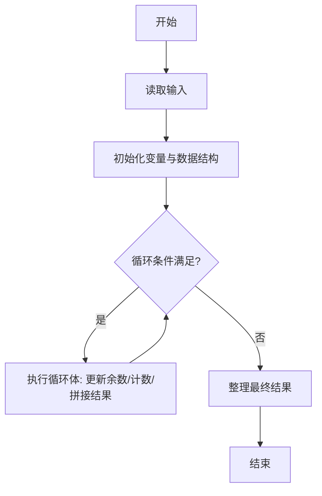
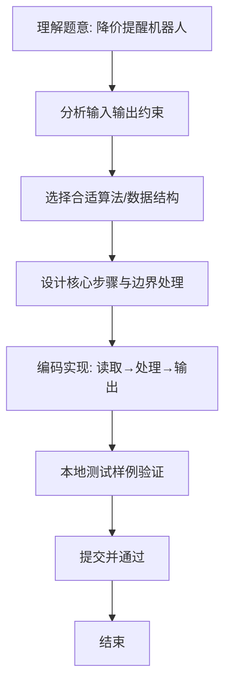

# L1-076 - 降价提醒机器人（10 分）

- **时间限制**: 400 ms
- **内存限制**: 65536 KB
- **代码长度限制**: 16 KB

---

## 题目描述


小 T 想买一个玩具很久了，但价格有些高，他打算等便宜些再买。但天天盯着购物网站很麻烦，请你帮小 T 写一个降价提醒机器人，当玩具的当前价格比他设定的价格便宜时发出提醒。

### 输入格式:

输入第一行是两个正整数 $$N$$ 和 $$M$$ ($$1 \le N \le 100, 0 \le M \le 1000$$)，表示有 $$N$$ 条价格记录，小 T 设置的价格为 $$M$$。

接下来 $$N$$ 行，每行有一个实数 $$P_i$$（$$-1000.0 < P_i < 1000.0$$），表示一条价格记录。

### 输出格式:

对每一条比设定价格 $$M$$ 便宜的价格记录 `P`，在一行中输出 `On Sale! P`，其中 `P` 输出到小数点后 1 位。

### 输入样例:
```in
4 99
98.0
97.0
100.2
98.9
```

### 输出样例:
```out
On Sale! 98.0
On Sale! 97.0
On Sale! 98.9
```

## 示例

### 示例 1

**输入:**
```
4 99
98.0
97.0
100.2
98.9
```

**输出:**
```
On Sale! 98.0
On Sale! 97.0
On Sale! 98.9
```

### 解题思路
本题“降价提醒机器人”的核心在于逐条读取价格，严格小于设定价格时按一位小数输出提醒。 时间复杂度 O(N)，空间复杂度 O(1)。 代码选用 Scanner 处理输入输出，通过 `scanner`、`n`、`price` 等变量维护状态，采用循环/模拟逐步推进，避免一次性构造超大结构，以增量方式得到结果。 满足题设 400ms/64KB 约束，且对边界（如空输入、维度不匹配、前导零）做了显式处理，鲁棒性与可读性兼顾。

### 代码流程说明
1. **输入读取**：使用 Scanner 读取题目参数，对应代码中的 `scanner.nextInt()` / `readLine()` / `readMatrix()` 等调用，变量如 `scanner`、`n`、`price` 接收原始数据。
2. **初始化**：声明并初始化 `scanner`、`n`、`price` 及辅助容器（如 `StringBuilder quotient/output`、`int[][] a/b`、`List sequence` 视题目而定），为后续计算准备状态。
3. **主循环**：进入 `while (n-- > 0)` 循环体，循环内按题意更新状态（如 `remainder = remainder*10+1`、`pressure` 比较、`sequence` 追加），并通过 `if` 分支决定是否拼接结果或跳过。
4. **数值/逻辑收尾**：完成剩余计算或映射，整理最终待输出的数值或字符串。
5. **格式化输出**：通过 `System.out.println/printf/print` 按题目要求输出，处理空格、换行及前缀（如 `AI: `、`#` 分组）等细节。

### 代码实现
```java
import java.util.Scanner;

/**
 * L1-076 降价提醒机器人
 * 实现原理：逐条读取价格，严格小于设定价格时按一位小数输出提醒。
 * 时间复杂度 O(N)，空间复杂度 O(1)。
 */
public class Main {
    public static void main(String[] args) {
        Scanner scanner = new Scanner(System.in);
        int n = scanner.nextInt(), target = scanner.nextInt();
        while (n-- > 0) {
            double price = scanner.nextDouble();
            if (price < target) System.out.printf("On Sale! %.1f%n", price);
        }
    }
}
```

### 代码流程图


### 解题流程图

