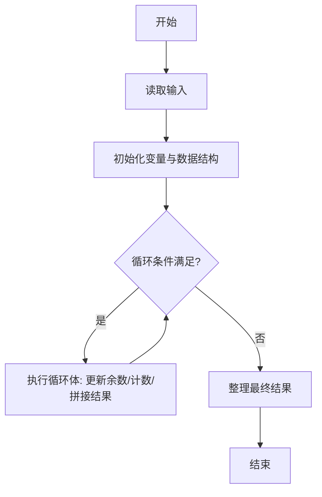
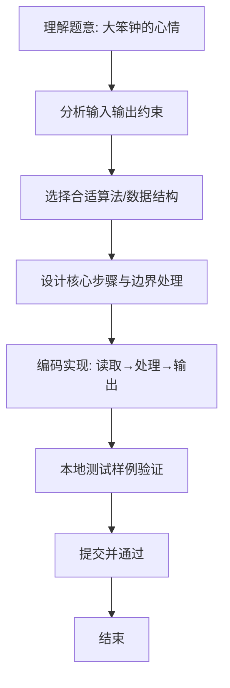

# L1-077 - 大笨钟的心情（15 分）

- **时间限制**: 400 ms
- **内存限制**: 65536 KB
- **代码长度限制**: 16 KB

---

## 题目描述


有网友问：未来还会有更多大笨钟题吗？笨钟回复说：看心情……

本题就请你替大笨钟写一个程序，根据心情自动输出回答。

### 输入格式:

输入在一行中给出 24 个 [0, 100] 区间内的整数，依次代表大笨钟在一天 24 小时中，每个小时的心情指数。

随后若干行，每行给出一个 [0, 23] 之间的整数，代表网友询问笨钟这个问题的时间点。当出现非法的时间点时，表示输入结束，这个非法输入不要处理。题目保证至少有 1 次询问。

### 输出格式:

对每一次提问，如果当时笨钟的心情指数大于 50，就在一行中输出 `心情指数 Yes`，否则输出 `心情指数 No`。

### 输入样例:
```in
80 75 60 50 20 20 20 20 55 62 66 51 42 33 47 58 67 52 41 20 35 49 50 63
17
7
3
15
-1
```

### 输出样例:
```out
52 Yes
20 No
50 No
58 Yes
```

## 示例

### 示例 1

**输入:**
```
80 75 60 50 20 20 20 20 55 62 66 51 42 33 47 58 67 52 41 20 35 49 50 63
17
7
3
15
-1
```

**输出:**
```
52 Yes
20 No
50 No
58 Yes
```

### 解题思路
本题“大笨钟的心情”的核心在于用长度为 24 的数组按小时保存心情值，读到非法小时停止； 指数严格大于 50 时回答 Yes。 时间复杂度 O(询问次数)，空间复杂度 O(1)。 代码选用 Scanner、数组 处理输入输出，通过 `scanner`、`mood`、`i`、`hour` 等变量维护状态，采用循环/模拟逐步推进，避免一次性构造超大结构，以增量方式得到结果。 满足题设 400ms/64KB 约束，且对边界（如空输入、维度不匹配、前导零）做了显式处理，鲁棒性与可读性兼顾。

### 代码流程说明
1. **输入读取**：使用 Scanner、数组 读取题目参数，对应代码中的 `scanner.nextInt()` / `readLine()` / `readMatrix()` 等调用，变量如 `scanner`、`mood`、`i`、`hour` 接收原始数据。
2. **初始化**：声明并初始化 `scanner`、`mood`、`i`、`hour` 及辅助容器（如 `StringBuilder quotient/output`、`int[][] a/b`、`List sequence` 视题目而定），为后续计算准备状态。
3. **主循环**：进入 `while (scanner.hasNextInt()` 循环体，循环内按题意更新状态（如 `remainder = remainder*10+1`、`pressure` 比较、`sequence` 追加），并通过 `if` 分支决定是否拼接结果或跳过。
4. **数值/逻辑收尾**：完成剩余计算或映射，整理最终待输出的数值或字符串。
5. **格式化输出**：通过 `System.out.println/printf/print` 按题目要求输出，处理空格、换行及前缀（如 `AI: `、`#` 分组）等细节。

### 代码实现
```java
import java.util.Scanner;

/**
 * L1-077 大笨钟的心情
 * 实现原理：用长度为 24 的数组按小时保存心情值，读到非法小时停止；
 * 指数严格大于 50 时回答 Yes。
 * 时间复杂度 O(询问次数)，空间复杂度 O(1)。
 */
public class Main {
    public static void main(String[] args) {
        Scanner scanner = new Scanner(System.in);
        int[] mood = new int[24];
        for (int i = 0; i < 24; i++) mood[i] = scanner.nextInt();
        while (scanner.hasNextInt()) {
            int hour = scanner.nextInt();
            if (hour < 0 || hour >= 24) break;
            System.out.println(mood[hour] + (mood[hour] > 50 ? " Yes" : " No"));
        }
    }
}
```

### 代码流程图


### 解题流程图

