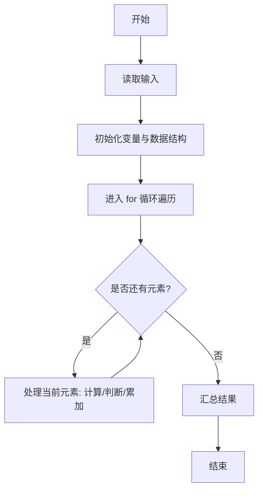
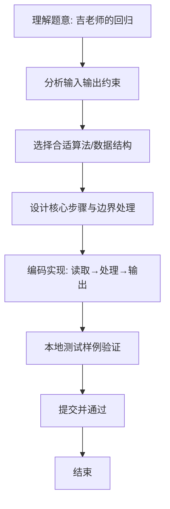

# L1-078 - 吉老师的回归（15 分）

- **时间限制**: 400 ms
- **内存限制**: 65536 KB
- **代码长度限制**: 16 KB

---

## 题目描述


曾经在天梯赛大杀四方的吉老师决定回归天梯赛赛场啦！

为了简化题目，我们不妨假设天梯赛的每道题目可以用一个不超过 500 的、只包括可打印符号的字符串描述出来，如：`Problem A: Print "Hello world!"`。

众所周知，吉老师的竞赛水平非常高超，你可以认为他每道题目都会做（事实上也是……）。因此，吉老师会按照顺序看题并做题。但吉老师水平太高了，所以签到题他就懒得做了（浪费时间），具体来说，假如题目的字符串里有 `qiandao` 或者 `easy`（区分大小写）的话，吉老师看完题目就会跳过这道题目不做。

现在给定这次天梯赛总共有几道题目以及吉老师已经做完了几道题目，请你告诉大家吉老师现在正在做哪个题，或者吉老师已经把所有他打算做的题目做完了。

*提醒：天梯赛有分数升级的规则，如果不做签到题可能导致团队总分不足以升级，一般的选手请千万不要学习吉老师的酷炫行为！*

### 输入格式:

输入第一行是两个正整数 $$N, M$$ ($$1 \le M\le N \le 30$$)，表示本次天梯赛有 $$N$$ 道题目，吉老师现在做完了 $$M$$ 道。

接下来 $$N$$ 行，每行是一个符合题目描述的字符串，表示天梯赛的题目内容。吉老师会按照给出的顺序看题——第一行就是吉老师看的第一道题，第二行就是第二道，以此类推。

### 输出格式:

在一行中输出吉老师当前正在做的题目对应的题面（即做完了 $$M$$ 道题目后，吉老师正在做哪个题）。如果吉老师已经把所有他打算做的题目做完了，输出一行 `Wo AK le`。

### 输入样例 1：
```in
5 1
L1-1 is a qiandao problem.
L1-2 is so...easy.
L1-3 is Easy.
L1-4 is qianDao.
Wow, such L1-5, so easy.
```

### 输出样例 1：
```out
L1-4 is qianDao.
```

### 输入样例 2：
```in
5 4
L1-1 is a-qiandao problem.
L1-2 is so easy.
L1-3 is Easy.
L1-4 is qianDao.
Wow, such L1-5, so!!easy.
```

### 输出样例 2：
```out
Wo AK le
```

## 示例

### 示例 1

**输入:**
```
5 1
L1-1 is a qiandao problem.
L1-2 is so...easy.
L1-3 is Easy.
L1-4 is qianDao.
Wow, such L1-5, so easy.
```

**输出:**
```
L1-4 is qianDao.
```

### 示例 2

**输入:**
```
5 4
L1-1 is a-qiandao problem.
L1-2 is so easy.
L1-3 is Easy.
L1-4 is qianDao.
Wow, such L1-5, so!!easy.
```

**输出:**
```
Wo AK le
```

### 解题思路
本题“吉老师的回归”的核心在于按顺序跳过包含 qiandao 或 easy 的签到题。每遇到非签到题，若此前 已完成数量正好为 M，该题就是当前题；否则将已完成数加一。 时间复杂度 O(N*每行长度)，空间复杂度 O(1)。 代码选用 BufferedReader 处理输入输出，通过 `reader`、`n`、`done`、`i` 等变量维护状态，采用循环/模拟逐步推进，避免一次性构造超大结构，以增量方式得到结果。 满足题设 400ms/64KB 约束，且对边界（如空输入、维度不匹配、前导零）做了显式处理，鲁棒性与可读性兼顾。

### 代码流程说明
1. **输入读取**：使用 BufferedReader 读取题目参数，对应代码中的 `scanner.nextInt()` / `readLine()` / `readMatrix()` 等调用，变量如 `reader`、`n`、`done`、`i` 接收原始数据。
2. **初始化**：声明并初始化 `reader`、`n`、`done`、`i` 及辅助容器（如 `StringBuilder quotient/output`、`int[][] a/b`、`List sequence` 视题目而定），为后续计算准备状态。
3. **遍历处理**：通过 `for (int i = 0; i < n; i++)` 遍历输入元素，逐项执行核心逻辑（如矩阵三重循环 `sum += a[i][k]*b[k][j]`、字符串扫描 `text.charAt(i)`），并累加/判定。
4. **数值/逻辑收尾**：完成剩余计算或映射，整理最终待输出的数值或字符串。
5. **格式化输出**：通过 `System.out.println/printf/print` 按题目要求输出，处理空格、换行及前缀（如 `AI: `、`#` 分组）等细节。

### 代码实现
```java
import java.io.BufferedReader;
import java.io.IOException;
import java.io.InputStreamReader;
import java.util.StringTokenizer;

/**
 * L1-078 吉老师的回归
 * 实现原理：按顺序跳过包含 qiandao 或 easy 的签到题。每遇到非签到题，若此前
 * 已完成数量正好为 M，该题就是当前题；否则将已完成数加一。
 * 时间复杂度 O(N*每行长度)，空间复杂度 O(1)。
 */
public class Main {
    public static void main(String[] args) throws IOException {
        BufferedReader reader = new BufferedReader(new InputStreamReader(System.in));
        StringTokenizer tokenizer = new StringTokenizer(reader.readLine());
        int n = Integer.parseInt(tokenizer.nextToken());
        int done = Integer.parseInt(tokenizer.nextToken());
        for (int i = 0; i < n; i++) {
            String problem = reader.readLine();
            if (problem.contains("qiandao") || problem.contains("easy")) continue;
            if (done == 0) {
                System.out.println(problem);
                return;
            }
            done--;
        }
        System.out.println("Wo AK le");
    }
}
```

### 代码流程图


### 解题流程图

