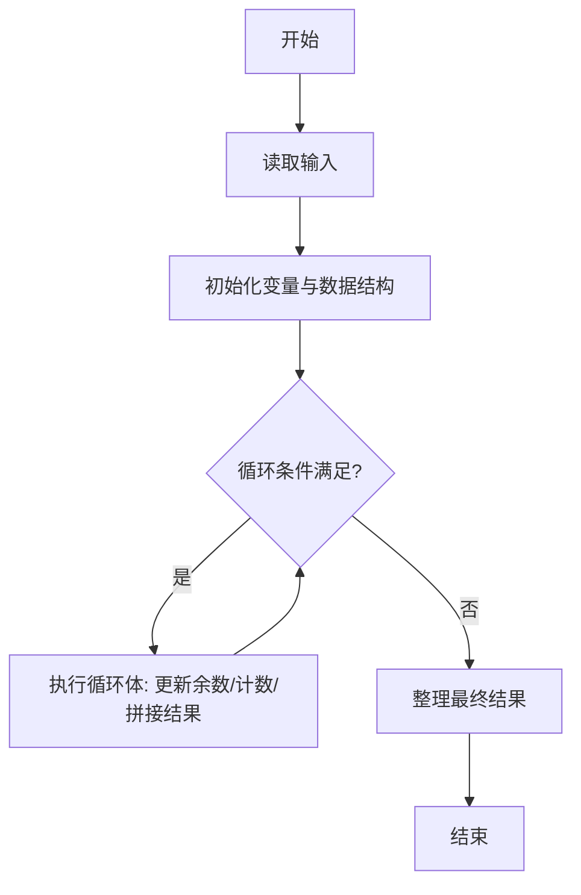
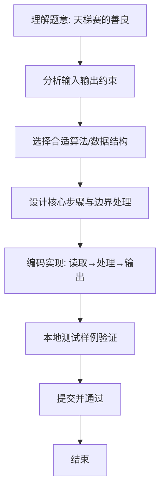

# L1-079 - 天梯赛的善良（20 分）

- **时间限制**: 200 ms
- **内存限制**: 65536 KB
- **代码长度限制**: 16 KB

---

## 题目描述


天梯赛是个善良的比赛。善良的命题组希望将题目难度控制在一个范围内，使得每个参赛的学生都有能做出来的题目，并且最厉害的学生也要非常努力才有可能得到高分。

于是命题组首先将编程能力划分成了 $$10^6$$ 个等级（太疯狂了，这是假的），然后调查了每个参赛学生的编程能力。现在请你写个程序找出所有参赛学生的最小和最大能力值，给命题组作为出题的参考。

### 输入格式:

输入在第一行中给出一个正整数 $$N$$（$$\le 2\times 10^4$$），即参赛学生的总数。随后一行给出 $$N$$ 个不超过 $$10^6$$ 的正整数，是参赛学生的能力值。

### 输出格式:

第一行输出所有参赛学生的最小能力值，以及具有这个能力值的学生人数。第二行输出所有参赛学生的最大能力值，以及具有这个能力值的学生人数。同行数字间以 1 个空格分隔，行首尾不得有多余空格。

### 输入样例:
```in
10
86 75 233 888 666 75 886 888 75 666
```

### 输出样例:
```out
75 3
888 2
```

## 示例

### 示例 1

**输入:**
```
10
86 75 233 888 666 75 886 888 75 666
```

**输出:**
```
75 3
888 2
```

### 解题思路
本题“天梯赛的善良”的核心在于单次扫描维护当前最小/最大值及其出现次数；遇到新极值时重置对应计数。 时间复杂度 O(N)，空间复杂度 O(1)。 代码选用 Scanner 处理输入输出，通过 `scanner`、`n`、`min`、`value` 等变量维护状态，采用循环/模拟逐步推进，避免一次性构造超大结构，以增量方式得到结果。 满足题设 400ms/64KB 约束，且对边界（如空输入、维度不匹配、前导零）做了显式处理，鲁棒性与可读性兼顾。

### 代码流程说明
1. **输入读取**：使用 Scanner 读取题目参数，对应代码中的 `scanner.nextInt()` / `readLine()` / `readMatrix()` 等调用，变量如 `scanner`、`n`、`min`、`value` 接收原始数据。
2. **初始化**：声明并初始化 `scanner`、`n`、`min`、`value` 及辅助容器（如 `StringBuilder quotient/output`、`int[][] a/b`、`List sequence` 视题目而定），为后续计算准备状态。
3. **主循环**：进入 `while (n-- > 0)` 循环体，循环内按题意更新状态（如 `remainder = remainder*10+1`、`pressure` 比较、`sequence` 追加），并通过 `if` 分支决定是否拼接结果或跳过。
4. **数值/逻辑收尾**：完成剩余计算或映射，整理最终待输出的数值或字符串。
5. **格式化输出**：通过 `System.out.println/printf/print` 按题目要求输出，处理空格、换行及前缀（如 `AI: `、`#` 分组）等细节。

### 代码实现
```java
import java.util.Scanner;

/**
 * L1-079 天梯赛的善良
 * 实现原理：单次扫描维护当前最小/最大值及其出现次数；遇到新极值时重置对应计数。
 * 时间复杂度 O(N)，空间复杂度 O(1)。
 */
public class Main {
    public static void main(String[] args) {
        Scanner scanner = new Scanner(System.in);
        int n = scanner.nextInt();
        int min = Integer.MAX_VALUE, max = Integer.MIN_VALUE, minCount = 0, maxCount = 0;
        while (n-- > 0) {
            int value = scanner.nextInt();
            if (value < min) { min = value; minCount = 1; }
            else if (value == min) minCount++;
            if (value > max) { max = value; maxCount = 1; }
            else if (value == max) maxCount++;
        }
        System.out.println(min + " " + minCount);
        System.out.println(max + " " + maxCount);
    }
}
```

### 代码流程图


### 解题流程图

