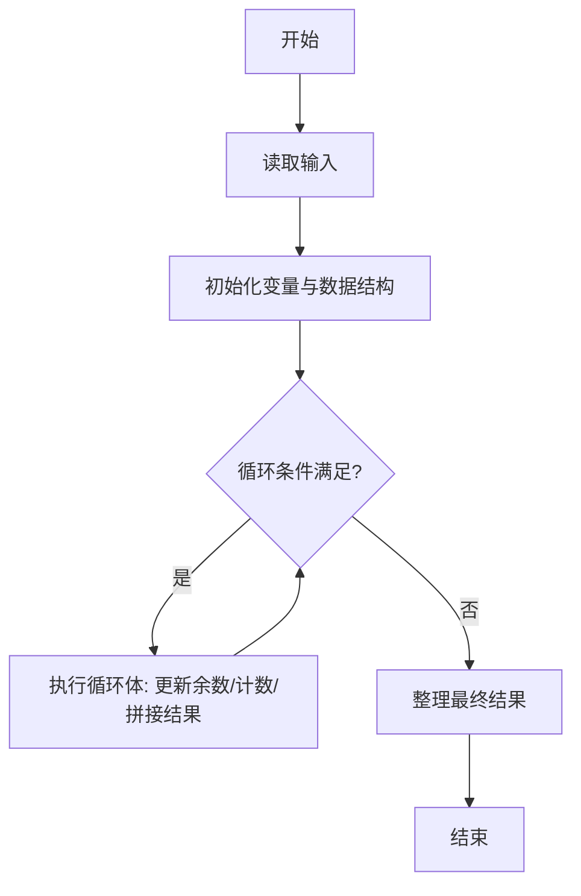
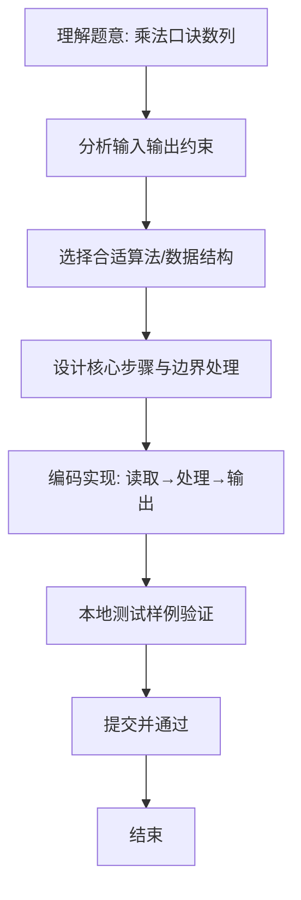

# L1-080 - 乘法口诀数列（20 分）

- **时间限制**: 400 ms
- **内存限制**: 65536 KB
- **代码长度限制**: 16 KB

---

## 题目描述


本题要求你从任意给定的两个 1 位数字 $$a_1$$ 和 $$a_2$$ 开始，用乘法口诀生成一个数列 {$$a_n$$}，规则为从 $$a_1$$ 开始顺次进行，每次将当前数字与后面一个数字相乘，将结果贴在数列末尾。如果结果不是 1 位数，则其每一位都应成为数列的一项。

### 输入格式:

输入在一行中给出 3 个整数，依次为 $$a_1$$、$$a_2$$ 和 $$n$$，满足 $$0\le a_1,a_2\le 9$$，$$0<n\le 10^3$$。

### 输出格式:

在一行中输出数列的前 $$n$$ 项。数字间以 1 个空格分隔，行首尾不得有多余空格。

### 输入样例:
```in
2 3 10
```

### 输出样例:
```out
2 3 6 1 8 6 8 4 8 4
```

## 示例

### 示例 1

**输入:**
```
2 3 10
```

**输出:**
```
2 3 6 1 8 6 8 4 8 4
```

### 解题思路
本题“乘法口诀数列”的核心在于序列当前相邻两项相乘；积为两位数时依次追加十位、个位，否则追加一位， 直到项数达到 n。 时间复杂度 O(n)，空间复杂度 O(n)。 代码选用 Scanner、ArrayList 处理输入输出，通过 `scanner`、`sequence`、`n`、`index` 等变量维护状态，采用循环/模拟逐步推进，避免一次性构造超大结构，以增量方式得到结果。 满足题设 400ms/64KB 约束，且对边界（如空输入、维度不匹配、前导零）做了显式处理，鲁棒性与可读性兼顾。

### 代码流程说明
1. **输入读取**：使用 Scanner、ArrayList 读取题目参数，对应代码中的 `scanner.nextInt()` / `readLine()` / `readMatrix()` 等调用，变量如 `scanner`、`sequence`、`n`、`index` 接收原始数据。
2. **初始化**：声明并初始化 `scanner`、`sequence`、`n`、`index` 及辅助容器（如 `StringBuilder quotient/output`、`int[][] a/b`、`List sequence` 视题目而定），为后续计算准备状态。
3. **主循环**：进入 `while (sequence.size()` 循环体，循环内按题意更新状态（如 `remainder = remainder*10+1`、`pressure` 比较、`sequence` 追加），并通过 `if` 分支决定是否拼接结果或跳过。
4. **数值/逻辑收尾**：完成剩余计算或映射，整理最终待输出的数值或字符串。
5. **格式化输出**：通过 `System.out.println/printf/print` 按题目要求输出，处理空格、换行及前缀（如 `AI: `、`#` 分组）等细节。

### 代码实现
```java
import java.util.ArrayList;
import java.util.List;
import java.util.Scanner;

/**
 * L1-080 乘法口诀数列
 * 实现原理：序列当前相邻两项相乘；积为两位数时依次追加十位、个位，否则追加一位，
 * 直到项数达到 n。
 * 时间复杂度 O(n)，空间复杂度 O(n)。
 */
public class Main {
    public static void main(String[] args) {
        Scanner scanner = new Scanner(System.in);
        List<Integer> sequence = new ArrayList<>();
        sequence.add(scanner.nextInt());
        sequence.add(scanner.nextInt());
        int n = scanner.nextInt();
        int index = 0;
        while (sequence.size() < n) {
            int product = sequence.get(index) * sequence.get(index + 1);
            if (product >= 10) sequence.add(product / 10);
            if (sequence.size() < n) sequence.add(product % 10);
            index++;
        }
        for (int i = 0; i < n; i++) {
            if (i > 0) System.out.print(' ');
            System.out.print(sequence.get(i));
        }
    }
}
```

### 代码流程图


### 解题流程图

