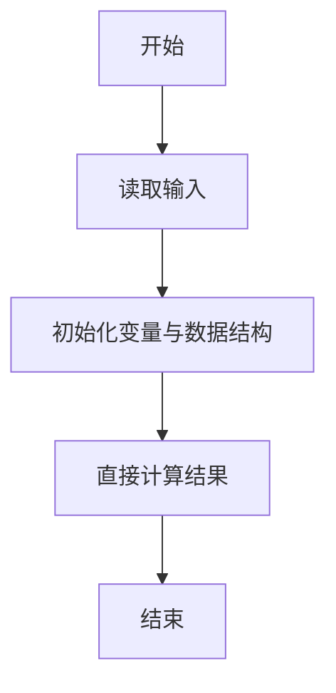
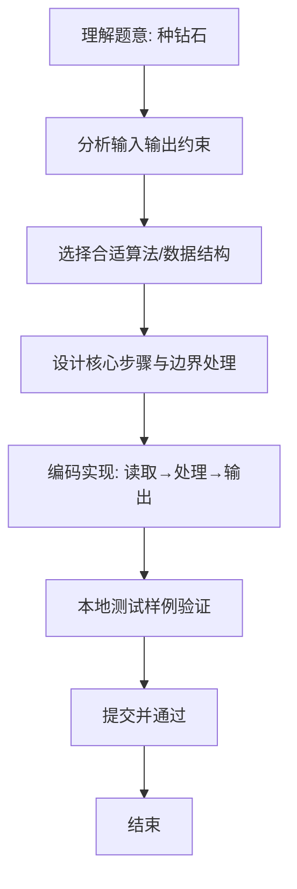

# L1-082 - 种钻石（5 分）

- **时间限制**: 400 ms
- **内存限制**: 65536 KB
- **代码长度限制**: 16 KB

---

## 题目描述


2019年10月29日，中央电视台专题报道，中国科学院在培育钻石领域，取得科技突破。科学家们用金刚石的籽晶片作为种子，利用甲烷气体在能量作用下形成碳的等离子体，慢慢地沉积到钻石种子上，一周“种”出了一颗 1 克拉大小的钻石。

本题给出钻石的需求量和人工培育钻石的速度，请你计算出货需要的时间。

### 输入格式:

输入在一行中给出钻石的需求量 $$N$$（不超过 $$10^7$$ 的正整数，以`微克拉`为单位）和人工培育钻石的速度 $$v$$（$$1\le v \le 200$$，以`微克拉/天`为单位的整数）。

### 输出格式:

在一行中输出培育 $$N$$ 微克拉钻石需要的整数天数。不到一天的时间不算在内。

### 输入样例:
```in
102000 130
```

### 输出样例:
```out
784
```

## 示例

### 示例 1

**输入:**
```
102000 130
```

**输出:**
```
784
```

### 解题思路
本题“种钻石”的核心在于题意要求不到一天不计入，因此直接取需求量除以每日速度的整数商。 时间复杂度 O(1)，空间复杂度 O(1)。 代码选用 Scanner 处理输入输出，通过 `scanner` 等变量维护状态，直接按公式计算，步骤集中易于验证。 满足题设 400ms/64KB 约束，且对边界（如空输入、维度不匹配、前导零）做了显式处理，鲁棒性与可读性兼顾。

### 代码流程说明
1. **输入读取**：使用 Scanner 读取题目参数，对应代码中的 `scanner.nextInt()` / `readLine()` / `readMatrix()` 等调用，变量如 `scanner` 接收原始数据。
2. **初始化**：声明并初始化 `scanner` 及辅助容器（如 `StringBuilder quotient/output`、`int[][] a/b`、`List sequence` 视题目而定），为后续计算准备状态。
3. **规则判定/计算**：依据题意直接进行 `if-else` 分支或公式计算（如 `50*(x-y)`、`sum-16`），得到中间结果。
4. **数值/逻辑收尾**：完成剩余计算或映射，整理最终待输出的数值或字符串。
5. **格式化输出**：通过 `System.out.println/printf/print` 按题目要求输出，处理空格、换行及前缀（如 `AI: `、`#` 分组）等细节。

### 代码实现
```java
import java.util.Scanner;

/**
 * L1-082 种钻石
 * 实现原理：题意要求不到一天不计入，因此直接取需求量除以每日速度的整数商。
 * 时间复杂度 O(1)，空间复杂度 O(1)。
 */
public class Main {
    public static void main(String[] args) {
        Scanner scanner = new Scanner(System.in);
        System.out.println(scanner.nextInt() / scanner.nextInt());
    }
}
```

### 代码流程图


### 解题流程图

