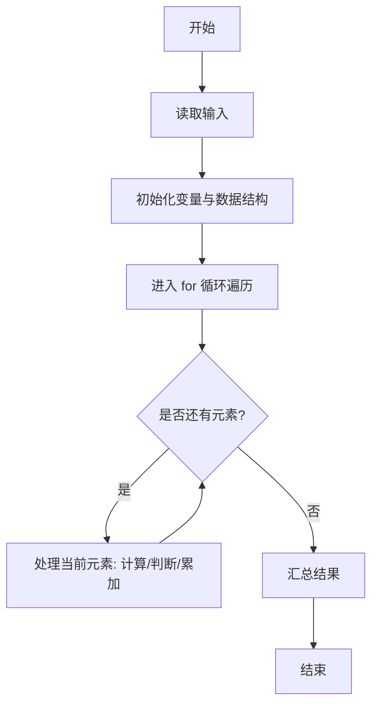
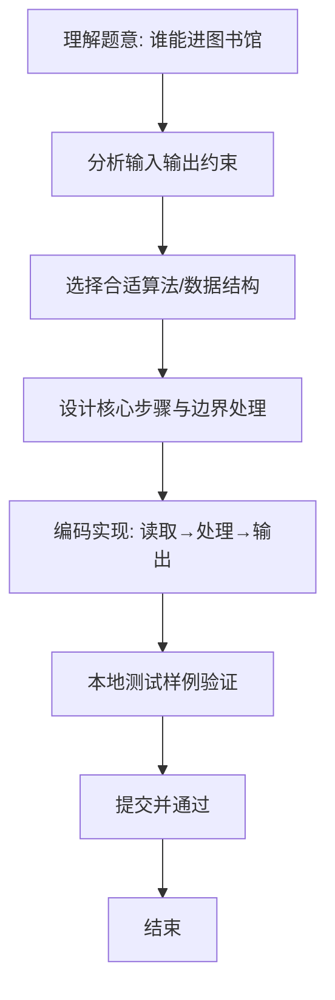

# L1-083 - 谁能进图书馆（10 分）

- **时间限制**: 400 ms
- **内存限制**: 65536 KB
- **代码长度限制**: 16 KB

---

## 题目描述


为了保障安静的阅读环境，有些公共图书馆对儿童入馆做出了限制。例如“12 岁以下儿童禁止入馆，除非有 18 岁以上（包括 18 岁）的成人陪同”。现在有两位小/大朋友跑来问你，他们能不能进去？请你写个程序自动给他们一个回复。

### 输入格式:

输入在一行中给出 4 个整数：
```
禁入年龄线 陪同年龄线 询问者1的年龄 询问者2的年龄
```

这里的`禁入年龄线`是指严格小于该年龄的儿童禁止入馆；`陪同年龄线`是指大于等于该年龄的人士可以陪同儿童入馆。默认两个询问者的编号依次分别为 `1` 和 `2`；年龄和年龄线都是 [1, 200] 区间内的整数，并且保证 `陪同年龄线` 严格大于 `禁入年龄线`。

### 输出格式:

在一行中输出对两位询问者的回答，如果可以进就输出 `年龄-Y`，否则输出 `年龄-N`，中间空 1 格，行首尾不得有多余空格。

在第二行根据两个询问者的情况输出一句话：

- 如果两个人必须一起进，则输出 `qing X zhao gu hao Y`，其中 `X` 是陪同人的编号， `Y` 是小孩子的编号；
- 如果两个人都可以进但不是必须一起的，则输出 `huan ying ru guan`；
- 如果两个人都进不去，则输出 `zhang da zai lai ba`；
- 如果一个人能进一个不能，则输出 `X: huan ying ru guan`，其中 `X` 是可以入馆的那个人的编号。

### 输入样例 1：
```in
12 18 18 8
```

### 输出样例 1：
```out
18-Y 8-Y
qing 1 zhao gu hao 2
```

### 输入样例 2：
```in
12 18 10 15
```

### 输出样例 2：
```out
10-N 15-Y
2: huan ying ru guan
```

## 示例

### 示例 1

**输入:**
```
12 18 18 8
```

**输出:**
```
18-Y 8-Y
qing 1 zhao gu hao 2
```

### 示例 2

**输入:**
```
12 18 10 15
```

**输出:**
```
10-N 15-Y
2: huan ying ru guan
```

### 解题思路
本题“谁能进图书馆”的核心在于超过禁入年龄线可独立进入；未达线儿童仅能在另一人达到陪同年龄线时进入。 根据两人的结果和是否依赖陪同，输出题目指定的说明。 时间复杂度 O(1)，空间复杂度 O(1)。 代码选用 Scanner 处理输入输出，通过 `scanner`、`forbidden`、`age1`、`together1` 等变量维护状态，采用循环/模拟逐步推进，避免一次性构造超大结构，以增量方式得到结果。 满足题设 400ms/64KB 约束，且对边界（如空输入、维度不匹配、前导零）做了显式处理，鲁棒性与可读性兼顾。

### 代码流程说明
1. **输入读取**：使用 Scanner 读取题目参数，对应代码中的 `scanner.nextInt()` / `readLine()` / `readMatrix()` 等调用，变量如 `scanner`、`forbidden`、`age1`、`together1` 接收原始数据。
2. **初始化**：声明并初始化 `scanner`、`forbidden`、`age1`、`together1` 及辅助容器（如 `StringBuilder quotient/output`、`int[][] a/b`、`List sequence` 视题目而定），为后续计算准备状态。
3. **遍历处理**：通过 `for 循环` 遍历输入元素，逐项执行核心逻辑（如矩阵三重循环 `sum += a[i][k]*b[k][j]`、字符串扫描 `text.charAt(i)`），并累加/判定。
4. **数值/逻辑收尾**：完成剩余计算或映射，整理最终待输出的数值或字符串。
5. **格式化输出**：通过 `System.out.println/printf/print` 按题目要求输出，处理空格、换行及前缀（如 `AI: `、`#` 分组）等细节。

### 代码实现
```java
import java.util.Scanner;

/**
 * L1-083 谁能进图书馆
 * 实现原理：超过禁入年龄线可独立进入；未达线儿童仅能在另一人达到陪同年龄线时进入。
 * 根据两人的结果和是否依赖陪同，输出题目指定的说明。
 * 时间复杂度 O(1)，空间复杂度 O(1)。
 */
public class Main {
    public static void main(String[] args) {
        Scanner scanner = new Scanner(System.in);
        int forbidden = scanner.nextInt(), companion = scanner.nextInt();
        int age1 = scanner.nextInt(), age2 = scanner.nextInt();
        boolean together1 = age1 < forbidden && age2 >= companion;
        boolean together2 = age2 < forbidden && age1 >= companion;
        boolean can1 = age1 >= forbidden || together1;
        boolean can2 = age2 >= forbidden || together2;
        System.out.println(age1 + "-" + (can1 ? "Y" : "N") + " " + age2 + "-" + (can2 ? "Y" : "N"));
        if (together1) System.out.println("qing 2 zhao gu hao 1");
        else if (together2) System.out.println("qing 1 zhao gu hao 2");
        else if (can1 && can2) System.out.println("huan ying ru guan");
        else if (!can1 && !can2) System.out.println("zhang da zai lai ba");
        else System.out.println((can1 ? 1 : 2) + ": huan ying ru guan");
    }
}
```

### 代码流程图


### 解题流程图

