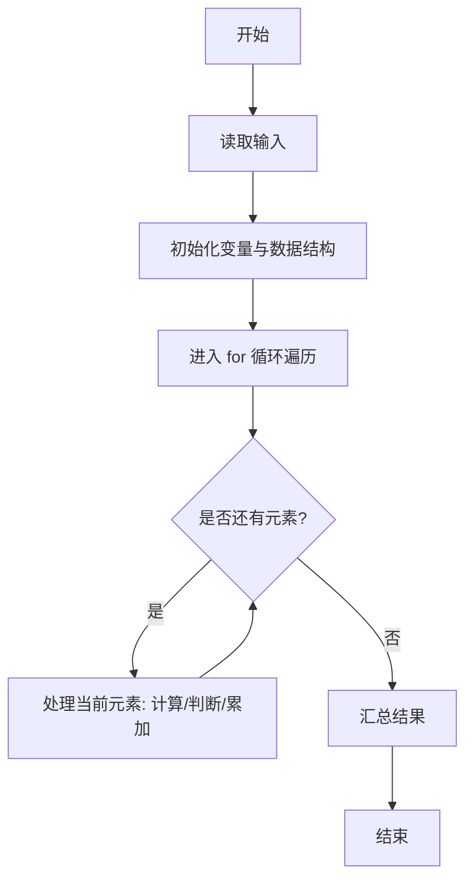
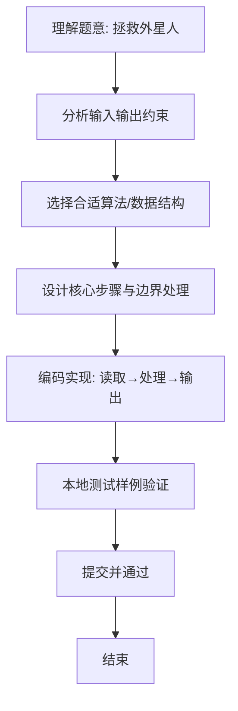

# L1-084 - 拯救外星人（10 分）

- **时间限制**: 400 ms
- **内存限制**: 65536 KB
- **代码长度限制**: 16 KB

---

## 题目描述


你的外星人朋友不认得地球上的加减乘除符号，但是会算阶乘 —— 正整数 N 的阶乘记为 “N!”，是从 1 到 N 的连乘积。所以当他不知道“5+7”等于多少时，如果你告诉他等于“12!”，他就写出了“479001600”这个答案。

本题就请你写程序模仿外星人的行为。

### 输入格式:

输入在一行中给出两个正整数 A 和 B。

### 输出格式:

在一行中输出 (A+B) 的阶乘。题目保证 (A+B) 的值小于 12。

### 输入样例:
```in
3 6
```

### 输出样例:
```out
362880
```

## 示例

### 示例 1

**输入:**
```
3 6
```

**输出:**
```
362880
```

### 解题思路
本题“拯救外星人”的核心在于计算 A+B 后，从 1 连乘到该数得到阶乘。 时间复杂度 O(A+B)，空间复杂度 O(1)。 代码选用 Scanner 处理输入输出，通过 `scanner`、`n`、`factorial`、`i` 等变量维护状态，采用循环/模拟逐步推进，避免一次性构造超大结构，以增量方式得到结果。 满足题设 400ms/64KB 约束，且对边界（如空输入、维度不匹配、前导零）做了显式处理，鲁棒性与可读性兼顾。

### 代码流程说明
1. **输入读取**：使用 Scanner 读取题目参数，对应代码中的 `scanner.nextInt()` / `readLine()` / `readMatrix()` 等调用，变量如 `scanner`、`n`、`factorial`、`i` 接收原始数据。
2. **初始化**：声明并初始化 `scanner`、`n`、`factorial`、`i` 及辅助容器（如 `StringBuilder quotient/output`、`int[][] a/b`、`List sequence` 视题目而定），为后续计算准备状态。
3. **遍历处理**：通过 `for (int i = 2; i <= n; i++)` 遍历输入元素，逐项执行核心逻辑（如矩阵三重循环 `sum += a[i][k]*b[k][j]`、字符串扫描 `text.charAt(i)`），并累加/判定。
4. **数值/逻辑收尾**：完成剩余计算或映射，整理最终待输出的数值或字符串。
5. **格式化输出**：通过 `System.out.println/printf/print` 按题目要求输出，处理空格、换行及前缀（如 `AI: `、`#` 分组）等细节。

### 代码实现
```java
import java.util.Scanner;

/**
 * L1-084 拯救外星人
 * 实现原理：计算 A+B 后，从 1 连乘到该数得到阶乘。
 * 时间复杂度 O(A+B)，空间复杂度 O(1)。
 */
public class Main {
    public static void main(String[] args) {
        Scanner scanner = new Scanner(System.in);
        int n = scanner.nextInt() + scanner.nextInt();
        int factorial = 1;
        for (int i = 2; i <= n; i++) factorial *= i;
        System.out.println(factorial);
    }
}
```

### 代码流程图


### 解题流程图

