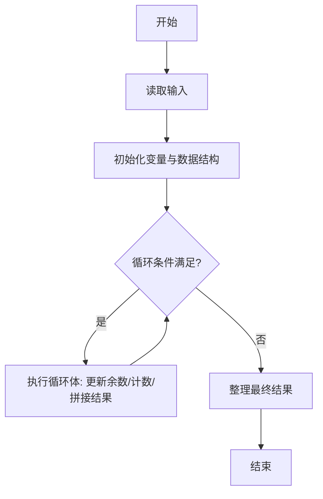
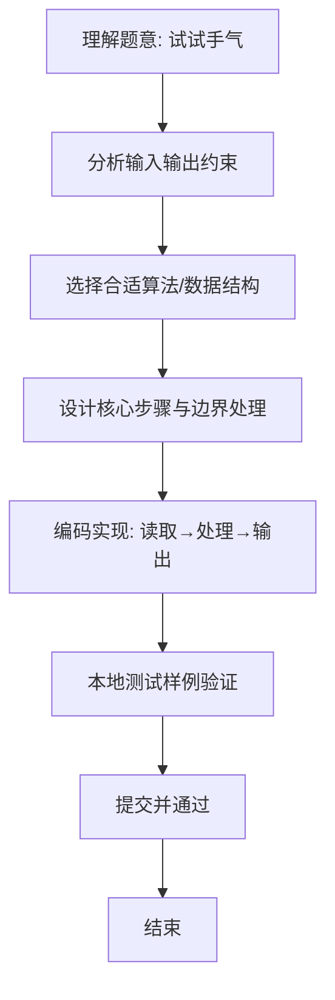

# L1-085 - 试试手气（15 分）

- **时间限制**: 400 ms
- **内存限制**: 65536 KB
- **代码长度限制**: 16 KB

---

## 题目描述


我们知道一个骰子有 6 个面，分别刻了 1 到 6 个点。下面给你 6 个骰子的初始状态，即它们朝上一面的点数，让你一把抓起摇出另一套结果。假设你摇骰子的手段特别精妙，每次摇出的结果都满足以下两个条件：

- 1、每个骰子摇出的点数都跟它之前任何一次出现的点数不同；
- 2、在满足条件 1 的前提下，每次都能让每个骰子得到可能得到的最大点数。

那么你应该可以预知自己第 $$n$$ 次（$$1\le n\le 5$$）摇出的结果。

### 输入格式:

输入第一行给出 6 个骰子的初始点数，即 [1,6] 之间的整数，数字间以空格分隔；第二行给出摇的次数 $$n$$（$$1\le n\le 5$$）。

### 输出格式:

在一行中顺序列出第 $$n$$ 次摇出的每个骰子的点数。数字间必须以 1 个空格分隔，行首位不得有多余空格。

### 输入样例:
```in
3 6 5 4 1 4
3
```

### 输出样例:
```out
4 3 3 3 4 3
```

## 示例

### 示例 1

**输入:**
```
3 6 5 4 1 4
3
```

**输出:**
```
4 3 3 3 4 3
```

### 解题思路
本题“试试手气”的核心在于每颗骰子的后续结果按 6 到 1 递减，跳过初始点数（已出现不能再用）。 在剩余候选中取得第 n 个即为第 n 次摇出的最大可行结果。 时间复杂度 O(6*6)，空间复杂度 O(1)。 代码选用 Scanner、数组 处理输入输出，通过 `scanner`、`initial`、`i`、`n` 等变量维护状态，采用循环/模拟逐步推进，避免一次性构造超大结构，以增量方式得到结果。 满足题设 400ms/64KB 约束，且对边界（如空输入、维度不匹配、前导零）做了显式处理，鲁棒性与可读性兼顾。

### 代码流程说明
1. **输入读取**：使用 Scanner、数组 读取题目参数，对应代码中的 `scanner.nextInt()` / `readLine()` / `readMatrix()` 等调用，变量如 `scanner`、`initial`、`i`、`n` 接收原始数据。
2. **初始化**：声明并初始化 `scanner`、`initial`、`i`、`n` 及辅助容器（如 `StringBuilder quotient/output`、`int[][] a/b`、`List sequence` 视题目而定），为后续计算准备状态。
3. **主循环**：进入 `while (true)` 循环体，循环内按题意更新状态（如 `remainder = remainder*10+1`、`pressure` 比较、`sequence` 追加），并通过 `if` 分支决定是否拼接结果或跳过。
4. **数值/逻辑收尾**：完成剩余计算或映射，整理最终待输出的数值或字符串。
5. **格式化输出**：通过 `System.out.println/printf/print` 按题目要求输出，处理空格、换行及前缀（如 `AI: `、`#` 分组）等细节。

### 代码实现
```java
import java.util.Scanner;

/**
 * L1-085 试试手气
 * 实现原理：每颗骰子的后续结果按 6 到 1 递减，跳过初始点数（已出现不能再用）。
 * 在剩余候选中取得第 n 个即为第 n 次摇出的最大可行结果。
 * 时间复杂度 O(6*6)，空间复杂度 O(1)。
 */
public class Main {
    public static void main(String[] args) {
        Scanner scanner = new Scanner(System.in);
        int[] initial = new int[6];
        for (int i = 0; i < 6; i++) initial[i] = scanner.nextInt();
        int n = scanner.nextInt();
        for (int i = 0; i < 6; i++) {
            int remaining = n;
            int value = 6;
            while (true) {
                if (value != initial[i] && --remaining == 0) break;
                value--;
            }
            if (i > 0) System.out.print(' ');
            System.out.print(value);
        }
    }
}
```

### 代码流程图


### 解题流程图

