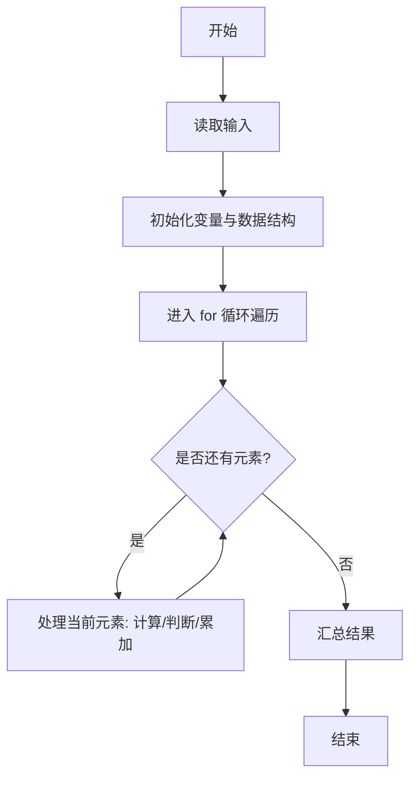
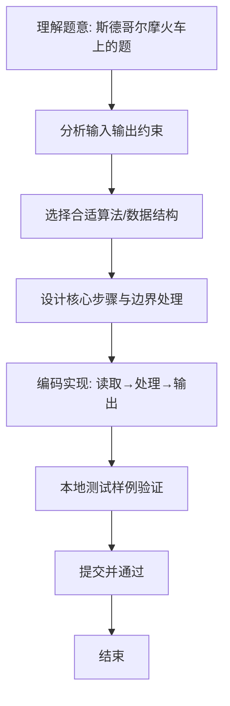

# L1-086 - 斯德哥尔摩火车上的题（15 分）

- **时间限制**: 400 ms
- **内存限制**: 65536 KB
- **代码长度限制**: 16 KB

---

## 题目描述


上图是新浪微博上的一则趣闻，是瑞典斯德哥尔摩火车上的一道题，看上去是段伪代码：

```
s = ''
a = '1112031584'
for (i = 1; i < length(a); i++) {
  if (a[i] % 2 == a[i-1] % 2) {
    s += max(a[i], a[i-1])
  }
}
goto_url('www.multisoft.se/' + s)
```

其中字符串的 `+` 操作是连接两个字符串的意思。所以这道题其实是让大家访问网站 `www.multisoft.se/112358`（**注意：比赛中千万不要访问这个网址！！！**）。

当然，能通过上述算法得到 `112358` 的原始字符串 `a` 是不唯一的。本题就请你判断，两个给定的原始字符串，能否通过上述算法得到相同的输出？

### 输入格式:

输入为两行仅由数字组成的非空字符串，长度均不超过 $$10^4$$，以回车结束。

### 输出格式:

对两个字符串分别采用上述斯德哥尔摩火车上的算法进行处理。如果两个结果是一样的，则在一行中输出那个结果；否则分别输出各自对应的处理结果，每个占一行。题目保证输出结果不为空。

### 输入样例 1：
```in
1112031584
011102315849
```

### 输出样例 1：
```out
112358
```

### 输入样例 2：
```in
111203158412334
12341112031584
```

### 输出样例 2：
```out
1123583
112358
```

## 示例

### 示例 1

**输入:**
```
1112031584
011102315849
```

**输出:**
```
112358
```

### 示例 2

**输入:**
```
111203158412334
12341112031584
```

**输出:**
```
1123583
112358
```

### 解题思路
本题“斯德哥尔摩火车上的题”的核心在于逐对相邻数字检查奇偶性；奇偶相同则向结果追加二者较大的字符。分别处理 两条原串后，结果相等只输出一次，否则依序输出两个结果。 时间复杂度 O(|A|+|B|)，空间复杂度 O(|A|+|B|)。 代码选用 BufferedReader、StringBuilder 处理输入输出，通过 `reader`、`first`、`second`、`transform` 等变量维护状态，采用循环/模拟逐步推进，避免一次性构造超大结构，以增量方式得到结果。 满足题设 400ms/64KB 约束，且对边界（如空输入、维度不匹配、前导零）做了显式处理，鲁棒性与可读性兼顾。

### 代码流程说明
1. **输入读取**：使用 BufferedReader、StringBuilder 读取题目参数，对应代码中的 `scanner.nextInt()` / `readLine()` / `readMatrix()` 等调用，变量如 `reader`、`first`、`second`、`transform` 接收原始数据。
2. **初始化**：声明并初始化 `reader`、`first`、`second`、`transform` 及辅助容器（如 `StringBuilder quotient/output`、`int[][] a/b`、`List sequence` 视题目而定），为后续计算准备状态。
3. **遍历处理**：通过 `for (int i = 1; i < text.length()` 遍历输入元素，逐项执行核心逻辑（如矩阵三重循环 `sum += a[i][k]*b[k][j]`、字符串扫描 `text.charAt(i)`），并累加/判定。
4. **结果拼接**：利用 `StringBuilder` 高效追加字符/数字，处理变长输出（如商位拼接、连续 6 替换），保证 O(n) 性能。
5. **格式化输出**：通过 `System.out.println/printf/print` 按题目要求输出，处理空格、换行及前缀（如 `AI: `、`#` 分组）等细节。

### 代码实现
```java
import java.io.BufferedReader;
import java.io.IOException;
import java.io.InputStreamReader;

/**
 * L1-086 斯德哥尔摩火车上的题
 * 实现原理：逐对相邻数字检查奇偶性；奇偶相同则向结果追加二者较大的字符。分别处理
 * 两条原串后，结果相等只输出一次，否则依序输出两个结果。
 * 时间复杂度 O(|A|+|B|)，空间复杂度 O(|A|+|B|)。
 */
public class Main {
    public static void main(String[] args) throws IOException {
        BufferedReader reader = new BufferedReader(new InputStreamReader(System.in));
        String first = transform(reader.readLine());
        String second = transform(reader.readLine());
        System.out.println(first);
        if (!first.equals(second)) System.out.println(second);
    }

    private static String transform(String text) {
        StringBuilder result = new StringBuilder();
        for (int i = 1; i < text.length(); i++) {
            int current = text.charAt(i) - '0';
            int previous = text.charAt(i - 1) - '0';
            if (current % 2 == previous % 2) result.append(Math.max(current, previous));
        }
        return result.toString();
    }
}
```

### 代码流程图


### 解题流程图

