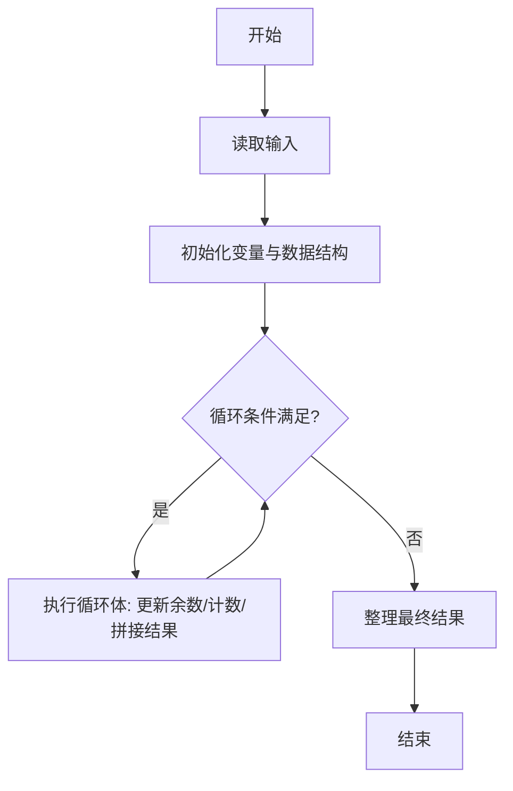
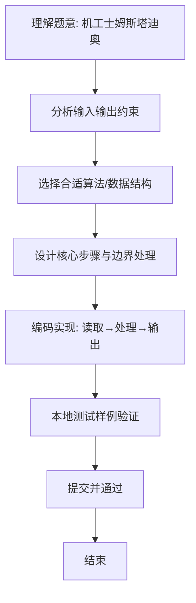

# L1-087 - 机工士姆斯塔迪奥（20 分）

- **时间限制**: 400 ms
- **内存限制**: 65536 KB
- **代码长度限制**: 16 KB

---

## 题目描述


在 MMORPG《最终幻想14》的副本“乐欲之所瓯博讷修道院”里，BOSS 机工士姆斯塔迪奥将会接受玩家的挑战。

你需要处理这个副本其中的一个机制：$N \times M$ 大小的地图被拆分为了 $N \times M$ 个 $1 \times 1$ 的格子，BOSS 会选择若干行或/及若干列释放技能，玩家不能站在释放技能的方格上，否则就会被击中而失败。

给定 BOSS 所有释放技能的行或列信息，请你计算出最后有多少个格子是安全的。

### 输入格式:

输入第一行是三个整数 $N, M, Q$ ($1 \le N \times M \le 10^5$，$0 \le Q \le 1000$)，表示地图为 $N$ 行 $M$ 列大小以及选择的行/列数量。

接下来 $Q$ 行，每行两个数 $T_i, C_i$，其中 $T_i = 0$ 表示 BOSS 选择的是一整行，$T_i = 1$ 表示选择的是一整列，$C_i$ 为选择的行号/列号。行和列的编号均从 1 开始。

### 输出格式:

输出一个数，表示安全格子的数量。

### 输入样例:
```in
5 5 3
0 2
0 4
1 3
```

### 输出样例:
```out
12
```

## 示例

### 示例 1

**输入:**
```
5 5 3
0 2
0 4
1 3
```

**输出:**
```
12
```

### 解题思路
本题“机工士姆斯塔迪奥”的核心在于用集合（此处布尔数组）去重被攻击的行和列。安全格=未攻击行数×未攻击列数。 时间复杂度 O(N+M+Q)，空间复杂度 O(N+M)。 代码选用 Scanner 处理输入输出，通过 `scanner`、`n`、`attackedRows`、`type` 等变量维护状态，采用循环/模拟逐步推进，避免一次性构造超大结构，以增量方式得到结果。 满足题设 400ms/64KB 约束，且对边界（如空输入、维度不匹配、前导零）做了显式处理，鲁棒性与可读性兼顾。

### 代码流程说明
1. **输入读取**：使用 Scanner 读取题目参数，对应代码中的 `scanner.nextInt()` / `readLine()` / `readMatrix()` 等调用，变量如 `scanner`、`n`、`attackedRows`、`type` 接收原始数据。
2. **初始化**：声明并初始化 `scanner`、`n`、`attackedRows`、`type` 及辅助容器（如 `StringBuilder quotient/output`、`int[][] a/b`、`List sequence` 视题目而定），为后续计算准备状态。
3. **主循环**：进入 `while (q-- > 0)` 循环体，循环内按题意更新状态（如 `remainder = remainder*10+1`、`pressure` 比较、`sequence` 追加），并通过 `if` 分支决定是否拼接结果或跳过。
4. **数值/逻辑收尾**：完成剩余计算或映射，整理最终待输出的数值或字符串。
5. **格式化输出**：通过 `System.out.println/printf/print` 按题目要求输出，处理空格、换行及前缀（如 `AI: `、`#` 分组）等细节。

### 代码实现
```java
import java.util.Scanner;

/**
 * L1-087 机工士姆斯塔迪奥
 * 实现原理：用集合（此处布尔数组）去重被攻击的行和列。安全格=未攻击行数×未攻击列数。
 * 时间复杂度 O(N+M+Q)，空间复杂度 O(N+M)。
 */
public class Main {
    public static void main(String[] args) {
        Scanner scanner = new Scanner(System.in);
        int n = scanner.nextInt(), m = scanner.nextInt(), q = scanner.nextInt();
        boolean[] rows = new boolean[n + 1], cols = new boolean[m + 1];
        int attackedRows = 0, attackedCols = 0;
        while (q-- > 0) {
            int type = scanner.nextInt(), index = scanner.nextInt();
            if (type == 0 && !rows[index]) { rows[index] = true; attackedRows++; }
            if (type == 1 && !cols[index]) { cols[index] = true; attackedCols++; }
        }
        System.out.println((n - attackedRows) * (m - attackedCols));
    }
}
```

### 代码流程图


### 解题流程图

