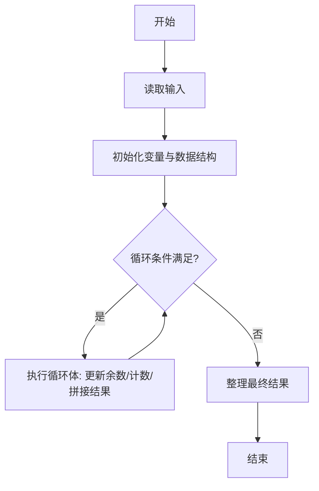
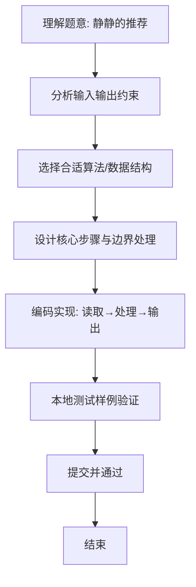

# L1-088 - 静静的推荐（20 分）

- **时间限制**: 200 ms
- **内存限制**: 65536 KB
- **代码长度限制**: 16 KB

---

## 题目描述

天梯赛结束后，某企业的人力资源部希望组委会能推荐一批优秀的学生，这个整理推荐名单的任务就由静静姐负责。企业接受推荐的流程是这样的：

- 只考虑得分不低于 175 分的学生；
- 一共接受 $$K$$ 批次的推荐名单；
- 同一批推荐名单上的学生的成绩原则上应严格递增；
- 如果有的学生天梯赛成绩虽然与前一个人相同，但其参加过 PAT 考试，且成绩达到了该企业的面试分数线，则也可以接受。

给定全体参赛学生的成绩和他们的 PAT 考试成绩，请你帮静静姐算一算，她最多能向企业推荐多少学生？

## 输入格式：

输入第一行给出 3 个正整数：$$N$$（$$\le 10^5$$）为参赛学生人数，$$K$$（$$\le 5\times 10^3$$）为企业接受的推荐批次，$$S$$（$$\le 100$$）为该企业的 PAT 面试分数线。

随后 $$N$$ 行，每行给出两个分数，依次为一位学生的天梯赛分数（最高分 290）和 PAT 分数（最高分 100）。

## 输出格式：

在一行中输出静静姐最多能向企业推荐的学生人数。

## 输入样例：
```
10 2 90
203 0
169 91
175 88
175 0
175 90
189 0
189 0
189 95
189 89
256 100
```

## 输出样例：
```
8
```

## 样例解释：

第一批可以选择 175、189、203、256 这四个分数的学生各一名，此外 175 分 PAT 分数达到 90 分的学生和 189 分 PAT 分数达到 95 分的学生可以额外进入名单。第二批就只剩下 175、189 两个分数的学生各一名可以进入名单了。最终一共 8 人进入推荐名单。

## 题解

### 解题思路
本题“静静的推荐”的核心在于PAT 达线者可与同分前项并列进入，直接计入；其余合格者每个天梯赛分数 最多只能在 K 个批次各出现一次，故对每个分数最多计 min(人数,K)。 时间复杂度 O(N)，空间复杂度 O(1)。 代码选用 Scanner、数组 处理输入输出，通过 `scanner`、`n`、`ordinary`、`recommended` 等变量维护状态，采用循环/模拟逐步推进，避免一次性构造超大结构，以增量方式得到结果。 满足题设 400ms/64KB 约束，且对边界（如空输入、维度不匹配、前导零）做了显式处理，鲁棒性与可读性兼顾。

### 代码流程说明
1. **输入读取**：使用 Scanner、数组 读取题目参数，对应代码中的 `scanner.nextInt()` / `readLine()` / `readMatrix()` 等调用，变量如 `scanner`、`n`、`ordinary`、`recommended` 接收原始数据。
2. **初始化**：声明并初始化 `scanner`、`n`、`ordinary`、`recommended` 及辅助容器（如 `StringBuilder quotient/output`、`int[][] a/b`、`List sequence` 视题目而定），为后续计算准备状态。
3. **主循环**：进入 `while (n-- > 0)` 循环体，循环内按题意更新状态（如 `remainder = remainder*10+1`、`pressure` 比较、`sequence` 追加），并通过 `if` 分支决定是否拼接结果或跳过。
4. **数值/逻辑收尾**：完成剩余计算或映射，整理最终待输出的数值或字符串。
5. **格式化输出**：通过 `System.out.println/printf/print` 按题目要求输出，处理空格、换行及前缀（如 `AI: `、`#` 分组）等细节。

### 代码实现
```java
import java.util.Scanner;

/**
 * L1-088 静静的推荐
 * 实现原理：PAT 达线者可与同分前项并列进入，直接计入；其余合格者每个天梯赛分数
 * 最多只能在 K 个批次各出现一次，故对每个分数最多计 min(人数,K)。
 * 时间复杂度 O(N)，空间复杂度 O(1)。
 */
public class Main {
    public static void main(String[] args) {
        Scanner scanner = new Scanner(System.in);
        int n = scanner.nextInt(), k = scanner.nextInt(), interviewLine = scanner.nextInt();
        int[] ordinary = new int[291];
        int recommended = 0;
        while (n-- > 0) {
            int score = scanner.nextInt(), pat = scanner.nextInt();
            if (score < 175) continue;
            if (pat >= interviewLine) recommended++;
            else ordinary[score]++;
        }
        for (int score = 175; score <= 290; score++) recommended += Math.min(k, ordinary[score]);
        System.out.println(recommended);
    }
}
```

### 代码流程图


### 解题流程图

