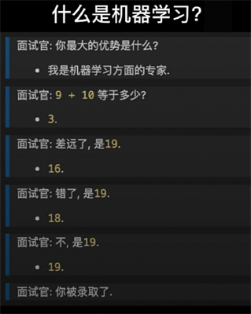
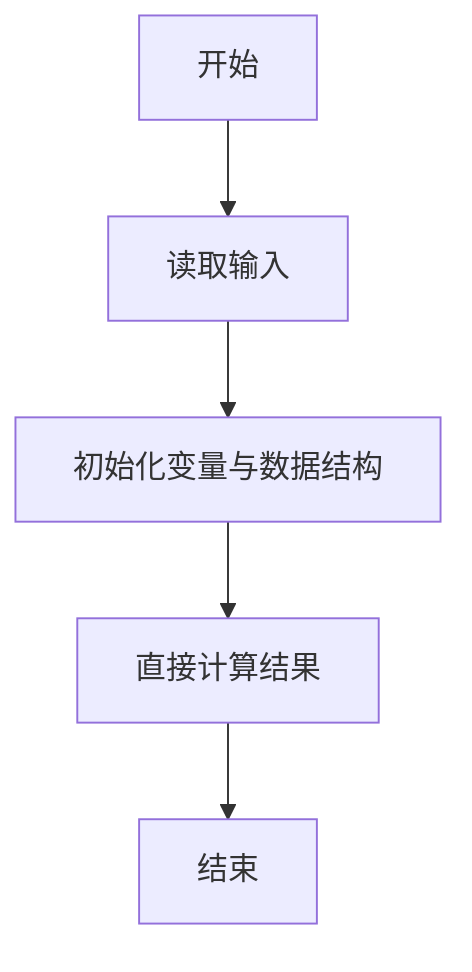
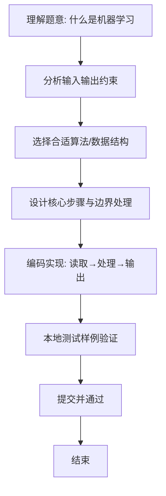

# L1-090 - 什么是机器学习（5 分）

- **时间限制**: 400 ms
- **内存限制**: 65536 KB
- **代码长度限制**: 16 KB

---

## 题目描述




什么是机器学习？上图展示了一段面试官与“机器学习程序”的对话：
```
面试官：9 + 10 等于多少？
答：3
面试官：差远了，是19。
答：16
面试官：错了，是19。
答：18
面试官：不，是19。
答：19
```
本题就请你模仿这个“机器学习程序”的行为。

### 输入格式:

输入在一行中给出两个整数，绝对值都不超过 100，中间用一个空格分开，分别表示面试官给出的两个数字 A 和 B。

### 输出格式:

要求你输出 4 行，每行一个数字。第 1 行比正确结果少 16，第 2 行少 3，第 3 行少 1，最后一行才输出 A+B 的正确结果。

### 输入样例:
```in
9 10
```

### 输出样例:
```out
3
16
18
19
```

## 示例

### 示例 1

**输入:**
```
9 10
```

**输出:**
```
3
16
18
19
```

### 解题思路
本题“什么是机器学习”的核心在于求正确和后，依次输出比其少 16、3、1 的数及正确结果。 时间复杂度 O(1)，空间复杂度 O(1)。 代码选用 Scanner 处理输入输出，通过 `scanner`、`sum` 等变量维护状态，直接按公式计算，步骤集中易于验证。 满足题设 400ms/64KB 约束，且对边界（如空输入、维度不匹配、前导零）做了显式处理，鲁棒性与可读性兼顾。

### 代码流程说明
1. **输入读取**：使用 Scanner 读取题目参数，对应代码中的 `scanner.nextInt()` / `readLine()` / `readMatrix()` 等调用，变量如 `scanner`、`sum` 接收原始数据。
2. **初始化**：声明并初始化 `scanner`、`sum` 及辅助容器（如 `StringBuilder quotient/output`、`int[][] a/b`、`List sequence` 视题目而定），为后续计算准备状态。
3. **规则判定/计算**：依据题意直接进行 `if-else` 分支或公式计算（如 `50*(x-y)`、`sum-16`），得到中间结果。
4. **数值/逻辑收尾**：完成剩余计算或映射，整理最终待输出的数值或字符串。
5. **格式化输出**：通过 `System.out.println/printf/print` 按题目要求输出，处理空格、换行及前缀（如 `AI: `、`#` 分组）等细节。

### 代码实现
```java
import java.util.Scanner;

/**
 * L1-090 什么是机器学习
 * 实现原理：求正确和后，依次输出比其少 16、3、1 的数及正确结果。
 * 时间复杂度 O(1)，空间复杂度 O(1)。
 */
public class Main {
    public static void main(String[] args) {
        Scanner scanner = new Scanner(System.in);
        int sum = scanner.nextInt() + scanner.nextInt();
        System.out.println(sum - 16);
        System.out.println(sum - 3);
        System.out.println(sum - 1);
        System.out.println(sum);
    }
}
```

### 代码流程图


### 解题流程图

