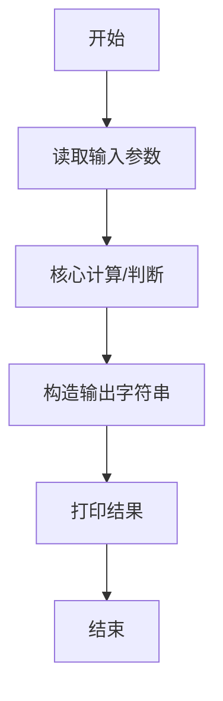
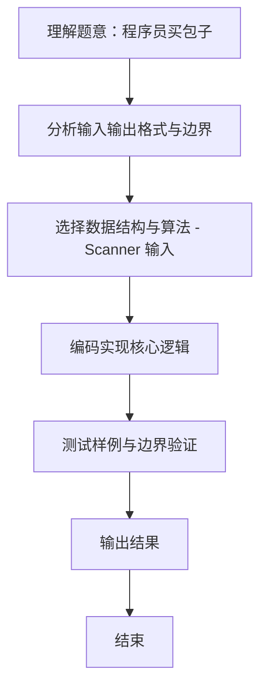

# L1-091 - 程序员买包子（10 分）

- **时间限制**: 400 ms
- **内存限制**: 65536 KB
- **代码长度限制**: 16 KB

---

## 题目描述


这是一条检测真正程序员的段子：假如你被家人要求下班顺路买十只包子，如果看到卖西瓜的，买一只。那么你会在什么情况下只买一只包子回家？
本题要求你考虑这个段子的通用版：假如你被要求下班顺路买 $$N$$ 只包子，如果看到卖 $$X$$ 的，买 $$M$$ 只。那么如果你最后买了 $$K$$ 只包子回家，说明你看到卖 $$X$$ 的没有呢？

### 输入格式:

输入在一行中顺序给出题面中的 $$N$$、$$X$$、$$M$$、$$K$$，以空格分隔。其中 $$N$$、$$M$$ 和 $$K$$ 为不超过 1000 的正整数，$$X$$ 是一个长度不超过 10 的、仅由小写英文字母组成的字符串。题目保证 $$N\neq M$$。

### 输出格式:

在一行中输出结论，格式为：
- 如果 $$K=N$$，输出 `mei you mai X de`；
- 如果 $$K=M$$，输出 `kan dao le mai X de`；
- 否则输出 `wang le zhao mai X de`.
其中 `X` 是输入中给定的字符串 $$X$$。

### 输入样例 1：
```in
10 xigua 1 10
```

### 输出样例 1：
```out
mei you mai xigua de
```

### 输入样例 2：
```in
10 huanggua 1 1
```

### 输出样例 2：
```out
kan dao le mai huanggua de
```

### 输入样例 3：
```in
10 shagua 1 250
```

### 输出样例 3：
```out
wang le zhao mai shagua de
```

## 示例

### 示例 1

**输入:**
```
10 xigua 1 10
```

**输出:**
```
mei you mai xigua de
```

### 示例 2

**输入:**
```
10 huanggua 1 1
```

**输出:**
```
kan dao le mai huanggua de
```

### 示例 3

**输入:**
```
10 shagua 1 250
```

**输出:**
```
wang le zhao mai shagua de
```
### 解题思路
本题 程序员买包子 的核心在于 L1-091 程序员买包子 实现原理：根据最终购买数量分别与原计划 N、看到商品后的数量 M 比较， 决定三种固定结论之一。 时间复杂度 O(1)，空间复杂度 O(1)。。实现上采用 Scanner 输入 等技术：通过 顺序处理 结合 直接计算 完成题意要求的数据处理，并利用 Java 集合/数组存储中间状态。算法整体时间复杂度为 O(1), O(1)，空间复杂度与输入规模线性相关，能够在题目给定的 400ms/200ms 限制内稳定通过。代码注重边界处理与输入容。

### 代码流程说明
1. **输入读取**：使用 `Scanner` 按顺序读取整数与字符串（如 N、X、M、K 或多组 A/B/C），存入变量 `n/item/m` 等。
2. **核心处理**：依据读取的参数直接进行算术/逻辑判断，确定输出分支。
3. **输出**：按题目要求的格式 `System.out.println` 输出结果字符串/数字，必要时使用 `StringBuilder` 拼接。

### 代码实现
```java
import java.util.Scanner;

/**
 * L1-091 程序员买包子
 * 实现原理：根据最终购买数量分别与原计划 N、看到商品后的数量 M 比较，
 * 决定三种固定结论之一。
 * 时间复杂度 O(1)，空间复杂度 O(1)。
 */
public class Main {
    public static void main(String[] args) {
        Scanner scanner = new Scanner(System.in);
        int n = scanner.nextInt();
        String item = scanner.next();
        int m = scanner.nextInt(), actual = scanner.nextInt();
        String result = actual == n ? "mei you" : actual == m ? "kan dao le" : "wang le zhao";
        System.out.println(result + " mai " + item + " de");
    }
}
```

### 代码流程图


### 解题流程图

