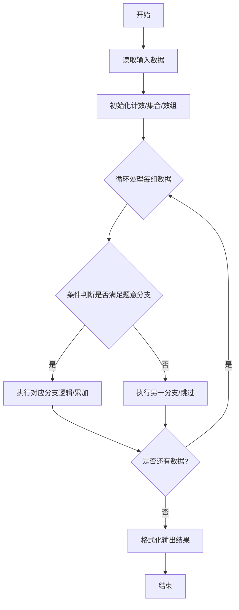
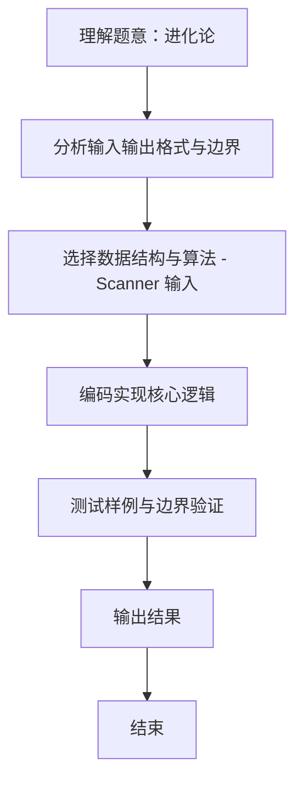

# L1-092 - 进化论（10 分）

- **时间限制**: 400 ms
- **内存限制**: 65536 KB
- **代码长度限制**: 16 KB

---

## 题目描述


在“一年一度喜剧大赛”上有一部作品《进化论》，讲的是动物园两只猩猩进化的故事。猩猩吕严说自己已经进化了 9 年了，因为“三年又三年”。猩猩土豆指出“三年又三年是六年呐”……
本题给定两个数字，以及用这两个数字计算的结果，要求你根据结果判断，这是吕严算出来的，还是土豆算出来的。

### 输入格式:

输入第一行给出一个正整数 $$N$$，随后 $$N$$ 行，每行给出三个正整数 $$A$$、$$B$$ 和 $$C$$。其中 $$C$$ 不超过 10000，其他三个数字都不超过 100。

### 输出格式:

对每一行给出的三个数，如果 $$C$$ 是 $$A\times B$$，就在一行中输出 `Lv Yan`；如果是 $$A+B$$，就在一行中输出 `Tu Dou`；如果都不是，就在一行中输出 `zhe du shi sha ya!`。

### 输入样例:
```in
3
3 3 9
3 3 6
3 3 12
```

### 输出样例:
```out
Lv Yan
Tu Dou
zhe du shi sha ya!
```

## 示例

### 示例 1

**输入:**
```
3
3 3 9
3 3 6
3 3 12
```

**输出:**
```
Lv Yan
Tu Dou
zhe du shi sha ya!
```
### 解题思路
本题 进化论 的核心在于 L1-092 进化论 实现原理：优先判断 C 是否为 A×B，否则判断是否为 A+B，均不匹配时输出吐槽。 时间复杂度 O(N)，空间复杂度 O(1)。。实现上采用 Scanner 输入 等技术：通过 循环遍历 结合 条件分支 完成题意要求的数据处理，并利用 Java 集合/数组存储中间状态。算法整体时间复杂度为 O(N), O(1)，空间复杂度与输入规模线性相关，能够在题目给定的 400ms/200ms 限制内稳定通过。代码注重边界处理与输入容错（如跨行读取、空行跳过。

### 代码流程说明
1. **输入读取**：使用 `Scanner` 按顺序读取整数与字符串（如 N、X、M、K 或多组 A/B/C），存入变量 `n/item/m` 等。
2. **核心处理**：通过 `for/while` 循环遍历输入数据，结合 `if-else` 分支完成题意逻辑（如比较、计数、替换或枚举最优方案）。
3. **输出**：按题目要求的格式 `System.out.println` 输出结果字符串/数字，必要时使用 `StringBuilder` 拼接。

### 代码实现
```java
import java.util.Scanner;

/**
 * L1-092 进化论
 * 实现原理：优先判断 C 是否为 A×B，否则判断是否为 A+B，均不匹配时输出吐槽。
 * 时间复杂度 O(N)，空间复杂度 O(1)。
 */
public class Main {
    public static void main(String[] args) {
        Scanner scanner = new Scanner(System.in);
        int n = scanner.nextInt();
        while (n-- > 0) {
            int a = scanner.nextInt(), b = scanner.nextInt(), c = scanner.nextInt();
            if (c == a * b) System.out.println("Lv Yan");
            else if (c == a + b) System.out.println("Tu Dou");
            else System.out.println("zhe du shi sha ya!");
        }
    }
}
```

### 代码流程图


### 解题流程图

