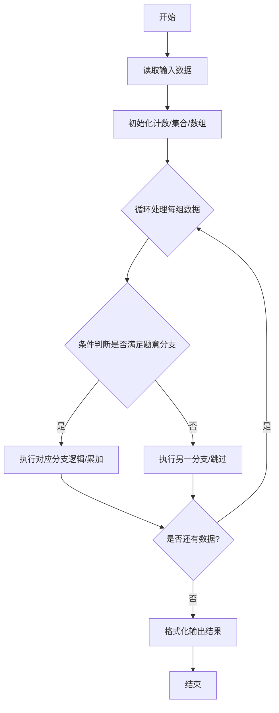
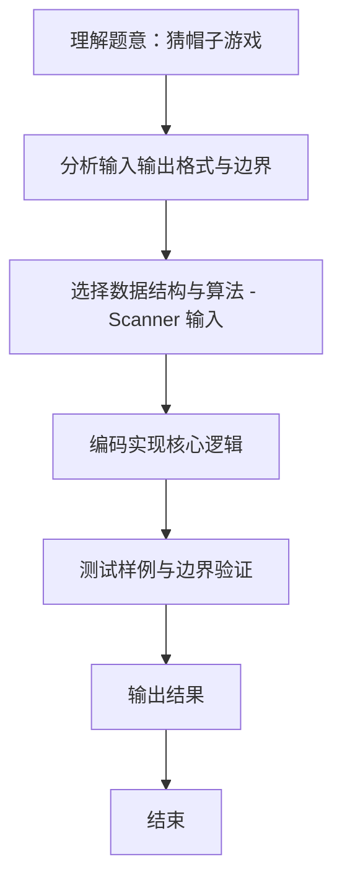

# L1-093 - 猜帽子游戏（15 分）

- **时间限制**: 400 ms
- **内存限制**: 65536 KB
- **代码长度限制**: 16 KB

---

## 题目描述


宝宝们在一起玩一个猜帽子游戏。每人头上被扣了一顶帽子，有的是黑色的，有的是黄色的。每个人可以看到别人头上的帽子，但是看不到自己的。游戏开始后，每个人可以猜自己头上的帽子是什么颜色，或者可以弃权不猜。如果没有一个人猜错、并且至少有一个人猜对了，那么所有的宝宝共同获得一个大奖。如果所有人都不猜，或者只要有一个人猜错了，所有宝宝就都没有奖。
下面顺序给出一排帽子的颜色，假设每一群宝宝来玩的时候，都是按照这个顺序发帽子的。然后给出每一群宝宝们猜的结果，请你判断他们能不能得大奖。

### 输入格式:

输入首先在一行中给出一个正整数 $$N$$（$$2 < N \le 100$$），是帽子的个数。第二行给出 $$N$$ 顶帽子的颜色，数字 `1` 表示黑色，`2` 表示黄色。
再下面给出一个正整数 $$K$$（$$\le 10$$），随后 $$K$$ 行，每行给出一群宝宝们猜的结果，除了仍然用数字 `1` 表示黑色、`2` 表示黄色之外，`0` 表示这个宝宝弃权不猜。
同一行中的数字用空格分隔。

### 输出格式:

对于每一群玩游戏的宝宝，如果他们能获得大奖，就在一行中输出 `Da Jiang!!!`，否则输出 `Ai Ya`。

### 输入样例:
```in
5
1 1 2 1 2
3
0 1 2 0 0
0 0 0 0 0
1 2 2 0 2
```

### 输出样例:
```out
Da Jiang!!!
Ai Ya
Ai Ya
```

## 示例

### 示例 1

**输入:**
```
5
1 1 2 1 2
3
0 1 2 0 0
0 0 0 0 0
1 2 2 0 2
```

**输出:**
```
Da Jiang!!!
Ai Ya
Ai Ya
```
### 解题思路
本题 猜帽子游戏 的核心在于 L1-093 猜帽子游戏 实现原理：每组猜测必须至少一人猜且所有非零猜测都与真实帽色相同，才能获奖。 时间复杂度 O(KN)，空间复杂度 O(N)。。实现上采用 Scanner 输入 等技术：通过 循环遍历 结合 条件分支 完成题意要求的数据处理，并利用 Java 集合/数组存储中间状态。算法整体时间复杂度为 O(KN), O(N)，空间复杂度与输入规模线性相关，能够在题目给定的 400ms/200ms 限制内稳定通过。代码注重边界处理与输入容错（如跨行读取、空行跳。

### 代码流程说明
1. **输入读取**：使用 `Scanner` 按顺序读取整数与字符串（如 N、X、M、K 或多组 A/B/C），存入变量 `n/item/m` 等。
2. **核心处理**：通过 `for/while` 循环遍历输入数据，结合 `if-else` 分支完成题意逻辑（如比较、计数、替换或枚举最优方案）。
3. **输出**：按题目要求的格式 `System.out.println` 输出结果字符串/数字，必要时使用 `StringBuilder` 拼接。

### 代码实现
```java
import java.util.Scanner;

/**
 * L1-093 猜帽子游戏
 * 实现原理：每组猜测必须至少一人猜且所有非零猜测都与真实帽色相同，才能获奖。
 * 时间复杂度 O(KN)，空间复杂度 O(N)。
 */
public class Main {
    public static void main(String[] args) {
        Scanner scanner = new Scanner(System.in);
        int n = scanner.nextInt();
        int[] hats = new int[n];
        for (int i = 0; i < n; i++) hats[i] = scanner.nextInt();
        int groups = scanner.nextInt();
        while (groups-- > 0) {
            boolean guessed = false, correct = true;
            for (int i = 0; i < n; i++) {
                int guess = scanner.nextInt();
                if (guess != 0) {
                    guessed = true;
                    if (guess != hats[i]) correct = false;
                }
            }
            System.out.println(guessed && correct ? "Da Jiang!!!" : "Ai Ya");
        }
    }
}
```

### 代码流程图


### 解题流程图

