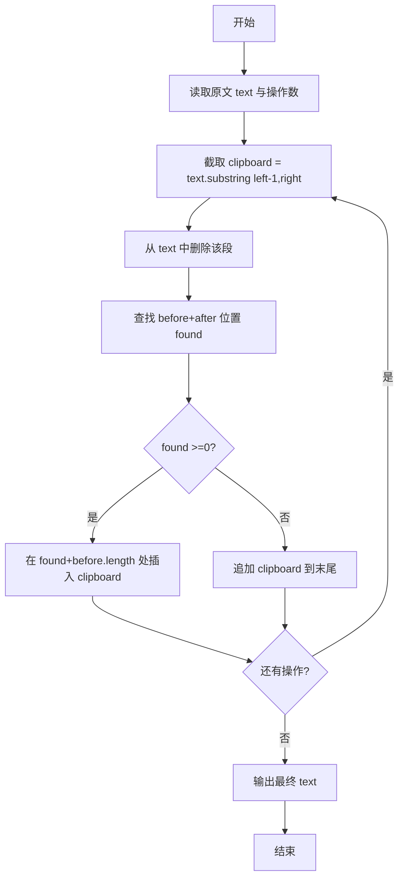
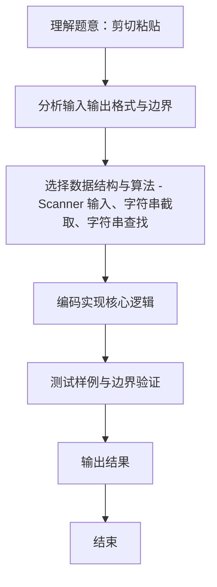

# L1-094 - 剪切粘贴（15 分）

- **时间限制**: 400 ms
- **内存限制**: 65536 KB
- **代码长度限制**: 16 KB

---

## 题目描述


使用计算机进行文本编辑时常见的功能是剪切功能（快捷键：Ctrl + X）。请实现一个简单的具有剪切和粘贴功能的文本编辑工具。

工具需要完成一系列剪切后粘贴的操作，每次操作分为两步：

* 剪切：给定需操作的起始位置和结束位置，将当前字符串中起始位置到结束位置部分的字符串放入剪贴板中，并删除当前字符串对应位置的内容。例如，当前字符串为 `abcdefg`，起始位置为 3，结束位置为 5，则剪贴操作后， 剪贴板内容为 `cde`，操作后字符串变为 `abfg`。字符串位置从 1 开始编号。
* 粘贴：给定插入位置的前后字符串，寻找到插入位置，将剪贴板内容插入到位置中，并清除剪贴板内容。例如，对于上面操作后的结果，给定插入位置前为 `bf`，插入位置后为 `g`，则插入后变为 `abfcdeg`。如找不到应该插入的位置，则直接将插入位置设置为字符串最后，仍然完成插入操作。查找字符串时区分大小写。

每次操作后的字符串即为新的当前字符串。在若干次操作后，请给出最后的编辑结果。

### 输入格式:

输入第一行是一个长度小于等于 200 的字符串 $S$，表示原始字符串。字符串只包含所有可见 ASCII 字符，不包含回车与空格。

第二行是一个正整数 $N$ ($1 \le N \le 100$)，表示要进行的操作次数。

接下来的 $N$ 行，每行是两个数字和两个**长度不大于 5** 的不包含空格的非空字符串，前两个数字表示需要剪切的位置，后两个字符串表示插入位置前和后的字符串，用一个空格隔开。如果有多个可插入的位置，选择最靠近当前操作字符串开头的一个。

剪切的位置保证总是合法的。

### 输出格式:

输出一行，表示操作后的字符串。

### 输入样例:
```in
AcrosstheGreatWall,wecanreacheverycornerintheworld
5
10 18 ery cor
32 40 , we
1 6 tW all
14 18 rnerr eache
1 1 e r
```

### 输出样例:
```out
he,allcornetrrwecaneacheveryGreatWintheworldAcross
```

## 示例

### 示例 1

**输入:**
```
AcrosstheGreatWall,wecanreacheverycornerintheworld
5
10 18 ery cor
32 40 , we
1 6 tW all
14 18 rnerr eache
1 1 e r
```

**输出:**
```
he,allcornetrrwecaneacheveryGreatWintheworldAcross
```

**题目引用自团体程序设计天梯赛真题（2023年）。**
### 解题思路
本题 剪切粘贴 的核心在于 L1-094 剪切粘贴 实现原理：每次先按 1 基闭区间截取剪贴板并从正文删除；随后在正文中查找最早出现的 “前串+后串”，在二者之间插入剪贴板，查找失败则追加到末尾。 时间复杂度 O(操作次数×字符串长度)，空间复杂度 O(字符串长度)。。实现上采用 Scanner 输入、字符串截取、字符串查找 等技术：通过 循环遍历 结合 条件分支 完成题意要求的数据处理，并利用 Java 集合/数组存储中间状态。算法整体时间复杂度为 O(操作次数×字符串长度), O(字符串长度。

### 代码流程说明
1. **输入读取**：使用 `Scanner` 按顺序读取整数与字符串（如 N、X、M、K 或多组 A/B/C），存入变量 `n/item/m` 等。
2. **剪切**：按 1 基闭区间 `[left,right]` 截取 `clipboard = text.substring(left-1,right)`，并从原文删除该段。
3. **粘贴**：在原文中查找 `before+after` 最早出现位置，若找到则在二者之间插入剪贴板，否则追加到末尾。
4. **循环处理**：重复上述操作直至所有操作完成，输出最终字符串。

### 代码实现
```java
import java.util.Scanner;

/**
 * L1-094 剪切粘贴
 * 实现原理：每次先按 1 基闭区间截取剪贴板并从正文删除；随后在正文中查找最早出现的
 * “前串+后串”，在二者之间插入剪贴板，查找失败则追加到末尾。
 * 时间复杂度 O(操作次数×字符串长度)，空间复杂度 O(字符串长度)。
 */
public class Main {
    public static void main(String[] args) {
        Scanner scanner = new Scanner(System.in);
        String text = scanner.next();
        int operations = scanner.nextInt();
        while (operations-- > 0) {
            int left = scanner.nextInt(), right = scanner.nextInt();
            String before = scanner.next(), after = scanner.next();
            String clipboard = text.substring(left - 1, right);
            text = text.substring(0, left - 1) + text.substring(right);
            int found = text.indexOf(before + after);
            if (found < 0) text += clipboard;
            else {
                int insertion = found + before.length();
                text = text.substring(0, insertion) + clipboard + text.substring(insertion);
            }
        }
        System.out.println(text);
    }
}
```

### 代码流程图


### 解题流程图

