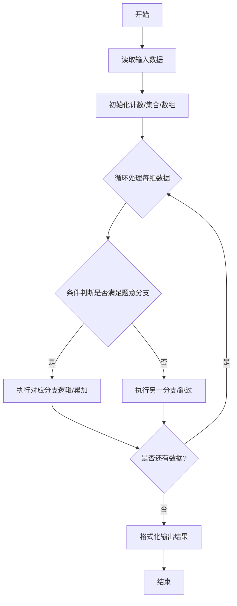
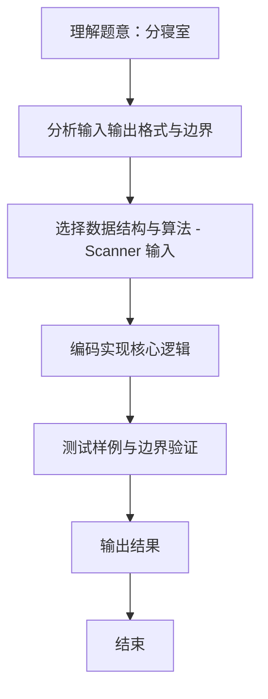

# L1-095 - 分寝室（20 分）

- **时间限制**: 400 ms
- **内存限制**: 65536 KB
- **代码长度限制**: 16 KB

---

## 题目描述

学校新建了宿舍楼，共有 $n$ 间寝室。等待分配的学生中，有女生 $n_0$ 位、男生 $n_1$ 位。所有待分配的学生都必须分到一间寝室。所有的寝室都要分出去，最后不能有寝室留空。\
现请你写程序完成寝室的自动分配。分配规则如下：

* 男女生不能混住；
* 不允许单人住一间寝室；
* 对每种性别的学生，每间寝室入住的人数都必须相同；例如不能出现一部分寝室住 2 位女生，一部分寝室住 3 位女生的情况。但女生寝室都是 2 人一间，男生寝室都是 3 人一间，则是允许的；
* 在有多种分配方案满足前面三项要求的情况下，要求两种性别每间寝室入住的人数差最小。

## 输入格式：

输入在一行中给出 3 个正整数 $n_0$、$n_1$、$n$，分别对应女生人数、男生人数、寝室数。数字间以空格分隔，均不超过 $10^5$。

## 输出格式：

在一行中顺序输出女生和男生被分配的寝室数量，其间以 1 个空格分隔。行首尾不得有多余空格。\
如果有解，题目保证解是唯一的。如果无解，则在一行中输出 `No Solution`。

## 输入样例 1：

```
24 60 10
```

## 输出样例 1：

```
4 6
```

**注意：**输出的方案对应女生都是 24/4=6 人间、男生都是 60/6=10 人间，人数差为 4。满足前三项要求的分配方案还有两种，即女生 6 间（都是 4 人间）、男生 4 间（都是 15 人间）；或女生 8 间（都是 3 人间）、男生 2 间（都是 30 人间）。但因为人数差都大于 4 而不被采用。

## 输入样例 2：

```
29 30 10
```

## 输出样例 2：

```
No Solution
```

**感谢浙江警官职业学院楼满芳老师斧正数据！**

## 题解

### 解题思路
本题 分寝室 的核心在于 L1-095 分寝室 实现原理：枚举女生寝室数 g，男生寝室数即 n-g。两者都必须整除各自人数且每间至少 两人；在合法方案中选择每间人数差绝对值最小的一组。 时间复杂度 O(n)，空间复杂度 O(1)。。实现上采用 Scanner 输入 等技术：通过 循环遍历 结合 条件分支 完成题意要求的数据处理，并利用 Java 集合/数组存储中间状态。算法整体时间复杂度为 O(n), O(1)，空间复杂度与输入规模线性相关，能够在题目给定的 400ms/200ms 限制内稳定通。

### 代码流程说明
1. **输入读取**：使用 `Scanner` 按顺序读取整数与字符串（如 N、X、M、K 或多组 A/B/C），存入变量 `n/item/m` 等。
2. **核心处理**：通过 `for/while` 循环遍历输入数据，结合 `if-else` 分支完成题意逻辑（如比较、计数、替换或枚举最优方案）。
3. **输出**：按题目要求的格式 `System.out.println` 输出结果字符串/数字，必要时使用 `StringBuilder` 拼接。

### 代码实现
```java
import java.util.Scanner;

/**
 * L1-095 分寝室
 * 实现原理：枚举女生寝室数 g，男生寝室数即 n-g。两者都必须整除各自人数且每间至少
 * 两人；在合法方案中选择每间人数差绝对值最小的一组。
 * 时间复杂度 O(n)，空间复杂度 O(1)。
 */
public class Main {
    public static void main(String[] args) {
        Scanner scanner = new Scanner(System.in);
        int girls = scanner.nextInt(), boys = scanner.nextInt(), rooms = scanner.nextInt();
        int bestGirlsRooms = -1, bestDifference = Integer.MAX_VALUE;
        for (int girlRooms = 1; girlRooms < rooms; girlRooms++) {
            int boyRooms = rooms - girlRooms;
            if (girls % girlRooms != 0 || boys % boyRooms != 0) continue;
            int girlsPerRoom = girls / girlRooms, boysPerRoom = boys / boyRooms;
            if (girlsPerRoom < 2 || boysPerRoom < 2) continue;
            int difference = Math.abs(girlsPerRoom - boysPerRoom);
            if (difference < bestDifference) {
                bestDifference = difference;
                bestGirlsRooms = girlRooms;
            }
        }
        if (bestGirlsRooms == -1) System.out.println("No Solution");
        else System.out.println(bestGirlsRooms + " " + (rooms - bestGirlsRooms));
    }
}
```

### 代码流程图


### 解题流程图

