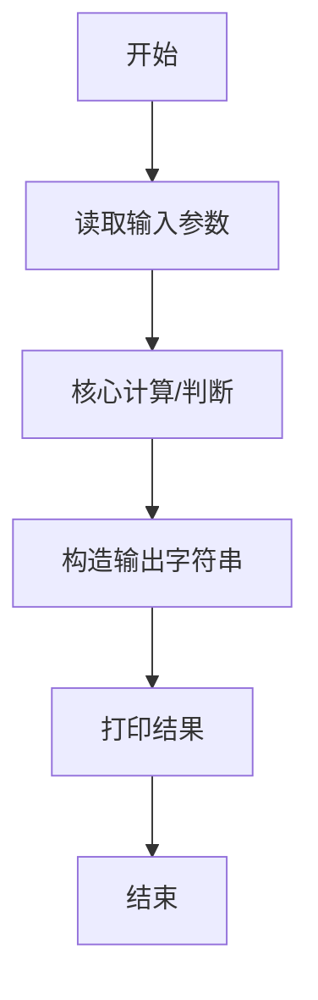
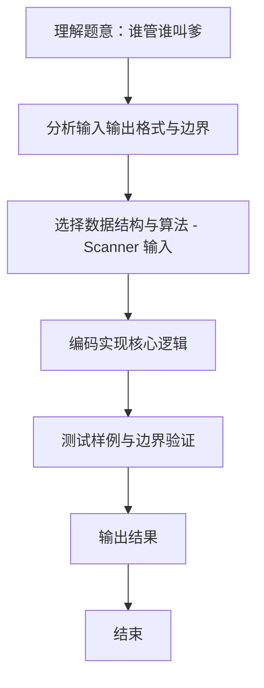

# L1-096 - 谁管谁叫爹（20 分）

- **时间限制**: 400 ms
- **内存限制**: 65536 KB
- **代码长度限制**: 16 KB

---

## 题目描述


《咱俩谁管谁叫爹》是网上一首搞笑饶舌歌曲，来源于东北酒桌上的助兴游戏。现在我们把这个游戏的难度拔高一点，多耗一些智商。
不妨设游戏中的两个人为 A 和 B。游戏开始后，两人同时报出两个整数 $$N_A$$ 和 $$N_B$$。判断谁是爹的标准如下：
- 将两个整数的各位数字分别相加，得到两个和 $$S_A$$ 和 $$S_B$$。如果 $$N_A$$ 正好是 $$S_B$$ 的整数倍，则 A 是爹；如果 $$N_B$$ 正好是 $$S_A$$ 的整数倍，则 B 是爹；
- 如果两人同时满足、或同时不满足上述判定条件，则原始数字大的那个是爹。
本题就请你写一个自动裁判程序，判定谁是爹。

### 输入格式:

输入第一行给出一个正整数 $$N$$（$$\le 100$$），为游戏的次数。以下 $$N$$ 行，每行给出一对不超过 9 位数的正整数，对应 A 和 B 给出的原始数字。题目保证两个数字不相等。

### 输出格式:

对每一轮游戏，在一行中给出赢得“爹”称号的玩家（`A` 或 `B`）。

### 输入样例:
```in
4
999999999 891
78250 3859
267537 52654299
6666 120
```

### 输出样例:
```out
B
A
B
A
```

## 示例

### 示例 1

**输入:**
```
4
999999999 891
78250 3859
267537 52654299
6666 120
```

**输出:**
```
B
A
B
A
```
### 解题思路
本题 谁管谁叫爹 的核心在于 L1-096：分别求数位和并按题意比较整除关系；同时或均不满足时比较原数。。实现上采用 Scanner 输入 等技术：通过 循环遍历 结合 直接计算 完成题意要求的数据处理，并利用 Java 集合/数组存储中间状态。算法整体时间复杂度为 O(n)，空间复杂度与输入规模线性相关，能够在题目给定的 400ms/200ms 限制内稳定通过。代码注重边界处理与输入容错（如跨行读取、空行跳过），保证对多组样例与极端数据的鲁棒性。

### 代码流程说明
1. **输入读取**：使用 `Scanner` 按顺序读取整数与字符串（如 N、X、M、K 或多组 A/B/C），存入变量 `n/item/m` 等。
2. **核心处理**：通过 `for/while` 循环遍历输入数据，结合 `if-else` 分支完成题意逻辑（如比较、计数、替换或枚举最优方案）。
3. **输出**：按题目要求的格式 `System.out.println` 输出结果字符串/数字，必要时使用 `StringBuilder` 拼接。

### 代码实现
```java
import java.util.Scanner;
/** L1-096：分别求数位和并按题意比较整除关系；同时或均不满足时比较原数。 */
public class Main {
 public static void main(String[] args) { Scanner s=new Scanner(System.in); for(int t=s.nextInt();t-->0;){long a=s.nextLong(),b=s.nextLong();boolean x=a%sum(b)==0,y=b%sum(a)==0;System.out.println(x==y?(a>b?"A":"B"):(x?"A":"B"));} }
 static long sum(long x){long r=0;while(x>0){r+=x%10;x/=10;}return r;}
}
```

### 代码流程图


### 解题流程图

