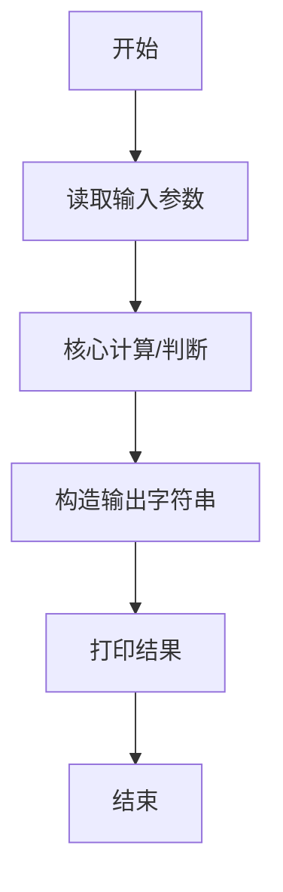
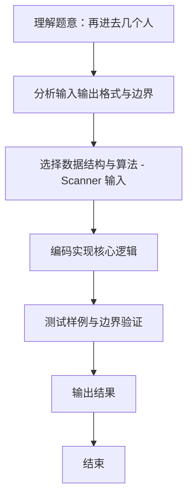

# L1-098 - 再进去几个人（5 分）

- **时间限制**: 400 ms
- **内存限制**: 65536 KB
- **代码长度限制**: 16 KB

---

## 题目描述


数学家、生物学家和物理学家坐在街头咖啡屋里，看着人们从街对面的一间房子走进走出。他们先看到两个人进去。时光流逝。他们又看到三个人出来。
物理学家:“测量不够准确。”
生物学家:“他们进行了繁殖。”
数学家:“如果现在再进去一个人，那房子就空了。”
下面就请你写个程序，根据进去和出来的人数，帮数学家算出来，再进去几个人，那房子就空了。

### 输入格式:

输入在一行中给出 2 个不超过 100 的正整数 A 和 B，其中 A 是进去的人数，B 是出来的人数。题目保证 B 比 A 要大。

### 输出格式:

在一行中输出使得房子变空的、需要再进去的人数。

### 输入样例:
```in
4 7
```

### 输出样例:
```out
3
```

## 示例

### 示例 1

**输入:**
```
4 7
```

**输出:**
```
3
```
### 解题思路
本题 再进去几个人 的核心在于 L1-098：人数变化为 A-B，再进入 B-A 人即可归零。。实现上采用 Scanner 输入 等技术：通过 顺序处理 结合 直接计算 完成题意要求的数据处理，并利用 Java 集合/数组存储中间状态。算法整体时间复杂度为 O(n)，空间复杂度与输入规模线性相关，能够在题目给定的 400ms/200ms 限制内稳定通过。代码注重边界处理与输入容错（如跨行读取、空行跳过），保证对多组样例与极端数据的鲁棒性。

### 代码流程说明
1. **输入读取**：使用 `Scanner` 按顺序读取整数与字符串（如 N、X、M、K 或多组 A/B/C），存入变量 `n/item/m` 等。
2. **核心处理**：依据读取的参数直接进行算术/逻辑判断，确定输出分支。
3. **输出**：按题目要求的格式 `System.out.println` 输出结果字符串/数字，必要时使用 `StringBuilder` 拼接。

### 代码实现
```java
import java.util.Scanner;
/** L1-098：人数变化为 A-B，再进入 B-A 人即可归零。 */
public class Main { public static void main(String[] args){Scanner s=new Scanner(System.in);System.out.println(s.nextInt()*-1+s.nextInt());} }
```

### 代码流程图


### 解题流程图

