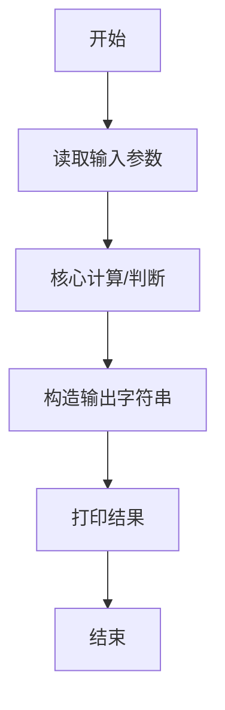
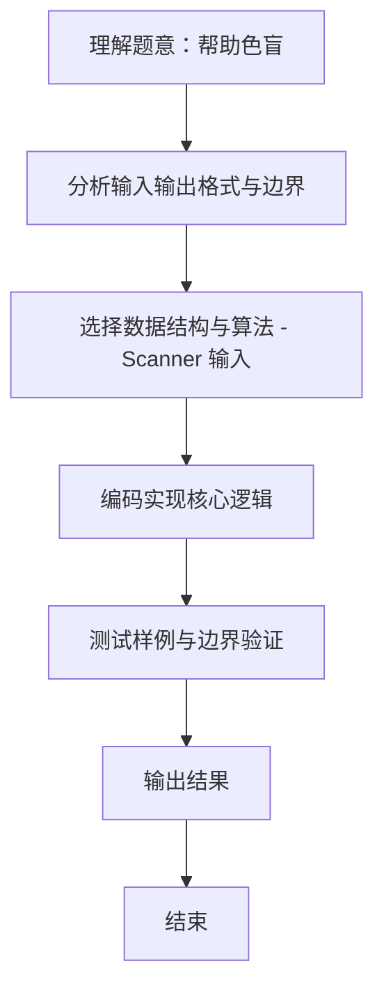

# L1-099 - 帮助色盲（10 分）

- **时间限制**: 400 ms
- **内存限制**: 65536 KB
- **代码长度限制**: 16 KB

---

## 题目描述


在古老的红绿灯面前，红绿色盲患者无法分辨当前亮起的灯是红色还是绿色，有些聪明人通过路口的策略是这样的：当红灯或绿灯亮起时，灯的颜色无法判断，但前方两米内有同向行走的人，就跟着前面那人行动，人家走就跟着走，人家停就跟着停；如果当前是黄灯，那么很快就要变成红灯了，于是应该停下来。麻烦的是，当灯的颜色无法判断时，前方两米内没有人……
本题就请你写一个程序，通过产生不同的提示音来帮助红绿色盲患者判断当前交通灯的颜色；但当患者可以自行判断的时候（例如黄灯或者前方两米内有人），就不做多余的打扰。具体要求的功能为：当前交通灯为红灯或绿灯时，检测其前方两米内是否有同向行走的人 —— 如果有，则患者自己可以判断，程序就不做提示；如果没有，则根据灯的颜色给出不同的提示音。黄灯也不需要给出提示。

### 输入格式:

输入在一行中给出两个数字 A 和 B，其间以空格分隔。其中 A 是当前交通灯的颜色，取值为 0 表示红灯、1 表示绿灯、2 表示黄灯；B 是前方行人的状态，取值为 0 表示前方两米内没有同向行走的人、1 表示有。

### 输出格式:

根据输入的状态在第一行中输出提示音：`dudu` 表示前方为绿灯，可以继续前进；`biii` 表示前方为红灯，应该止步；`-` 表示不做提示。在第二行输出患者应该执行的动作：`move` 表示继续前进、`stop` 表示止步。

### 输入样例 1：
```in
0 0
```

### 输出样例 1：
```out
biii
stop
```

### 输入样例 2：
```in
1 1
```

### 输出样例 2：
```out
-
move
```

## 示例

### 示例 1

**输入:**
```
0 0
```

**输出:**
```
biii
stop
```

### 示例 2

**输入:**
```
1 1
```

**输出:**
```
-
move
```
### 解题思路
本题 帮助色盲 的核心在于 L1-099：黄灯或有人同行不提示；行动仅绿灯时为 move。。实现上采用 Scanner 输入 等技术：通过 顺序处理 结合 直接计算 完成题意要求的数据处理，并利用 Java 集合/数组存储中间状态。算法整体时间复杂度为 O(n)，空间复杂度与输入规模线性相关，能够在题目给定的 400ms/200ms 限制内稳定通过。代码注重边界处理与输入容错（如跨行读取、空行跳过），保证对多组样例与极端数据的鲁棒性。

### 代码流程说明
1. **输入读取**：使用 `Scanner` 按顺序读取整数与字符串（如 N、X、M、K 或多组 A/B/C），存入变量 `n/item/m` 等。
2. **核心处理**：依据读取的参数直接进行算术/逻辑判断，确定输出分支。
3. **输出**：按题目要求的格式 `System.out.println` 输出结果字符串/数字，必要时使用 `StringBuilder` 拼接。

### 代码实现
```java
import java.util.Scanner;
/** L1-099：黄灯或有人同行不提示；行动仅绿灯时为 move。 */
public class Main { public static void main(String[] args){Scanner s=new Scanner(System.in);int a=s.nextInt(),b=s.nextInt();System.out.println(b==0&&a<2?(a==0?"biii":"dudu"):"-");System.out.println(a==1?"move":"stop");} }
```

### 代码流程图


### 解题流程图

