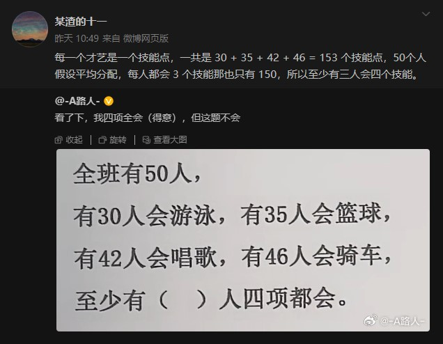
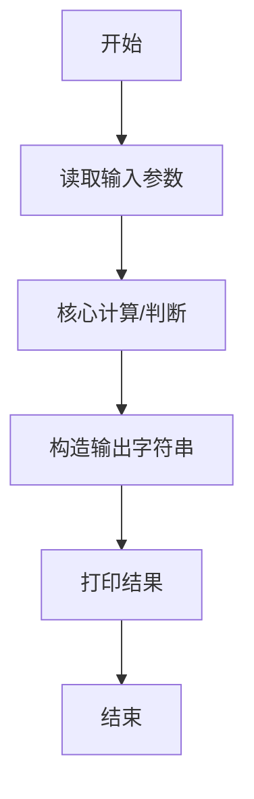
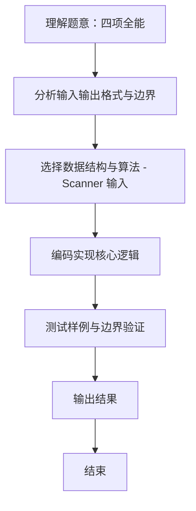

# L1-100 - 四项全能（10 分）

- **时间限制**: 400 ms
- **内存限制**: 65536 KB
- **代码长度限制**: 16 KB

---

## 题目描述



新浪微博上有一个帖子给出了一道题：全班有 50 人，有 30 人会游泳，有 35 人会篮球，有 42 人会唱歌，有 46 人会骑车，至少有（ ）人四项都会。
发帖人不会做这道题，但是回帖有会做的：每一个才艺是一个技能点，一共是 30 + 35 + 42 + 46 = 153 个技能点，50 个人假设平均分配，每人都会 3 个技能那也只有 150，所以至少有 3 人会四个技能。
本题就请你写个程序来自动解决这类问题：给定全班总人数为 $n$，其中有 $m$ 项技能，分别有 $k_1$、$k_2$、……、$k_m$ 个人会，问至少有多少人 $m$ 项都会。

### 输入格式:

输入在第一行中给出 2 个正整数：$n$（$4\le n\le 1000$）和 $m$（$1<m\le n/2$），分别对应全班人数和技能总数。随后一行给出 $m$ 个不超过 $n$ 的正整数，其中第 $i$ 个整数对应会第 $i$ 项技能的人数。

### 输出格式:

输出至少有多少人 $m$ 项都会。

### 输入样例:
```in
50 4
30 35 42 46
```

### 输出样例:
```out
3
```

## 示例

### 示例 1

**输入:**
```
50 4
30 35 42 46
```

**输出:**
```
3
```
### 解题思路
本题 四项全能 的核心在于 L1-100：若无人全能，每人至多贡献 m-1 个技能点；超出的技能点数即至少全能人数。。实现上采用 Scanner 输入 等技术：通过 循环遍历 结合 直接计算 完成题意要求的数据处理，并利用 Java 集合/数组存储中间状态。算法整体时间复杂度为 O(n)，空间复杂度与输入规模线性相关，能够在题目给定的 400ms/200ms 限制内稳定通过。代码注重边界处理与输入容错（如跨行读取、空行跳过），保证对多组样例与极端数据的鲁棒性。

### 代码流程说明
1. **输入读取**：使用 `Scanner` 按顺序读取整数与字符串（如 N、X、M、K 或多组 A/B/C），存入变量 `n/item/m` 等。
2. **核心处理**：通过 `for/while` 循环遍历输入数据，结合 `if-else` 分支完成题意逻辑（如比较、计数、替换或枚举最优方案）。
3. **输出**：按题目要求的格式 `System.out.println` 输出结果字符串/数字，必要时使用 `StringBuilder` 拼接。

### 代码实现
```java
import java.util.Scanner;
/** L1-100：若无人全能，每人至多贡献 m-1 个技能点；超出的技能点数即至少全能人数。 */
public class Main { public static void main(String[] args){Scanner s=new Scanner(System.in);int n=s.nextInt(),m=s.nextInt(),sum=0;for(int i=0;i<m;i++)sum+=s.nextInt();System.out.println(Math.max(0,sum-n*(m-1)));} }
```

### 代码流程图


### 解题流程图

