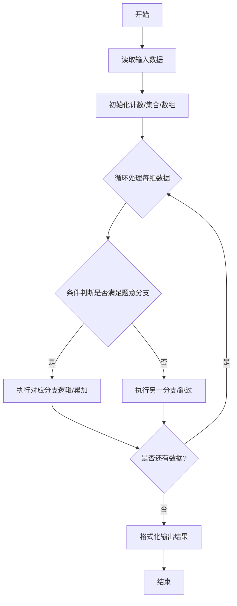
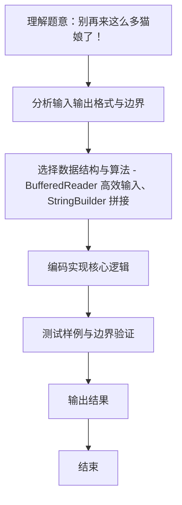

# L1-101 - 别再来这么多猫娘了！（15 分）

- **时间限制**: 400 ms
- **内存限制**: 65536 KB
- **代码长度限制**: 16 KB

---

## 题目描述


以 GPT 技术为核心的人工智能系统出现后迅速引领了行业的变革，不仅用于大量的语言工作（如邮件编写或文章生成等工作），还被应用在一些较特殊的领域——例如去年就有同学尝试使用 ChatGPT 作弊并被当场逮捕（全校被取消成绩）。相信聪明的你一定不会犯一样的错误！

言归正传，对于 GPT 类的 AI，一个使用方式受到不少年轻用户的欢迎——将 AI 变成猫娘：

<br/>


*部分公司使用 AI 进行网络营销，网友同样乐于使用“变猫娘”的方式进行反击。注意：图中内容与题目无关，如无法看到图片不影响解题。*

<br/>

当然，由于训练数据里并不区分道德或伦理倾向，因此如果不加审查，AI 会生成大量的、不一定符合社会公序良俗的内容。尽管关于这个问题仍有争论，但至少在比赛中，我们还是期望 AI 能用于对人类更有帮助的方向上，少来一点猫娘。

因此你的工作是实现一个审查内容的代码，用于对 AI 生成的内容的初步审定。更具体地说，你会得到一段由大小写字母、数字、空格及 ASCII 码范围内的标点符号的文字，以及若干个违禁词以及警告阈值，你需要首先检查内容里有多少违禁词，如果少于阈值个，则简单地将违禁词替换为```<censored>```；如果大于等于阈值个，则直接输出一段警告并输出有几个违禁词。

### 输入格式:

输入第一行是一个正整数 $N$ ($1 \le N \le 100$)，表示违禁词的数量。接下来的 $N$ 行，每行一个长度不超过 10 的、只包含大小写字母、数字及 ASCII 码范围内的标点符号的单词，表示应当屏蔽的违禁词。
然后的一行是一个非负整数 $k$ ($0 \le k \le 100$)，表示违禁词的阈值。
最后是一行不超过 5000 个字符的字符串，表示需要检查的文字。
从左到右处理文本，违禁词则按照输入顺序依次处理；对于有重叠的情况，无论计数还是替换，查找完成后从违禁词末尾继续处理。

### 输出格式:

如果违禁词数量小于阈值，则输出替换后的文本；否则先输出一行一个数字，表示违禁词的数量，然后输出```He Xie Ni Quan Jia!```。

### 输入样例 1：
```in
5
MaoNiang
SeQing
BaoLi
WeiGui
BuHeShi
4
BianCheng MaoNiang ba! WeiGui De Hua Ye Keyi Shuo! BuYao BaoLi NeiRong.
```

### 输出样例 1：
```out
BianCheng <censored> ba! <censored> De Hua Ye Keyi Shuo! BuYao <censored> NeiRong.
```

### 输入样例 2：
```in
5
MaoNiang
SeQing
BaoLi
WeiGui
BuHeShi
3
BianCheng MaoNiang ba! WeiGui De Hua Ye Keyi Shuo! BuYao BaoLi NeiRong.
```

### 输出样例 2：
```out
3
He Xie Ni Quan Jia!
```

### 输入样例 3：
```in
2
AA
BB
3
AAABBB
```

### 输出样例 3：
```out
<censored>A<censored>B
```

### 输入样例 4：
```in
2
AB
BB
3
AAABBB
```

### 输出样例 4：
```out
AA<censored><censored>
```

### 输入样例 5：
```in
2
BB
AB
3
AAABBB
```

### 输出样例 5：
```out
AAA<censored>B
```

## 示例

### 示例 1

**输入:**
```
5
MaoNiang
SeQing
BaoLi
WeiGui
BuHeShi
4
BianCheng MaoNiang ba! WeiGui De Hua Ye Keyi Shuo! BuYao BaoLi NeiRong.
```

**输出:**
```
BianCheng <censored> ba! <censored> De Hua Ye Keyi Shuo! BuYao <censored> NeiRong.
```

### 示例 2

**输入:**
```
5
MaoNiang
SeQing
BaoLi
WeiGui
BuHeShi
3
BianCheng MaoNiang ba! WeiGui De Hua Ye Keyi Shuo! BuYao BaoLi NeiRong.
```

**输出:**
```
3
He Xie Ni Quan Jia!
```

### 示例 3

**输入:**
```
2
AA
BB
3
AAABBB
```

**输出:**
```
<censored>A<censored>B
```

### 示例 4

**输入:**
```
2
AB
BB
3
AAABBB
```

**输出:**
```
AA<censored><censored>
```

### 示例 5

**输入:**
```
2
BB
AB
3
AAABBB
```

**输出:**
```
AAA<censored>B
```
### 解题思路
本题 别再来这么多猫娘了！ 的核心在于 L1-101 别再来这么多猫娘了！ 原理： 1) 题目要求“违禁词按输入顺序依次处理”，即外层按违禁词顺序，内层在当前文本上从左到右、非重叠地查找该词。 找到则计数+1 并替换为 "<censored>"，查找结束后从词末尾继续（不重叠）。。实现上采用 BufferedReader 高效输入、StringBuilder 拼接 等技术：通过 循环遍历 结合 条件分支 完成题意要求的数据处理，并利用 Java 集合/数组存储中间状态。算法整体时间复杂度为 O(。

### 代码流程说明
1. **输入读取**：使用 `BufferedReader` + `StringTokenizer` 逐行读取，兼容空行与多空格，按需跨行补齐参数（如 N、M、S、D 或队员人数），将数据存入数组/邻接表/集合。
2. **核心处理**：通过 `for/while` 循环遍历输入数据，结合 `if-else` 分支完成题意逻辑（如比较、计数、替换或枚举最优方案）。
3. **输出**：按题目要求的格式 `System.out.println` 输出结果字符串/数字，必要时使用 `StringBuilder` 拼接。

### 代码实现
```java
import java.io.*;

/**
 * L1-101 别再来这么多猫娘了！
 * 原理：
 * 1) 题目要求“违禁词按输入顺序依次处理”，即外层按违禁词顺序，内层在当前文本上从左到右、非重叠地查找该词。
 *    找到则计数+1 并替换为 "<censored>"，查找结束后从词末尾继续（不重叠）。因此不能把所有词混在同一位置做优先级比较，
 *    必须对每个词先后在“已替换过的文本”上独立扫描。
 * 2) 样例 5 是关键：违禁词 [BB, AB]，文本 AAABBB。
 *    若按“同位置优先”扫描会先命中 AB（位置2），得到 AA<censored><censored>；而按题意先处理 BB 会先在 3-4 处命中 BB，
 *    得到 AAA<censored>B，后续再处理 AB 就找不到了，符合官方期望。
 * 3) 阈值判断：累计命中次数 cnt，若 cnt < k 输出替换后文本，否则输出 cnt 换行 He Xie Ni Quan Jia!
 *
 * 复杂度：设文本长度 L 初始≤5000，违禁词数 N≤100，词长≤10，替换后文本长度最多 L*10/1 ≈50000。
 *         每轮扫描 O(L)，共 N 轮 → O(N*L) ≤5e5，空间 O(L)。
 */
public class Main {
    public static void main(String[] args) throws Exception {
        BufferedReader br = new BufferedReader(new InputStreamReader(System.in));
        String line = br.readLine();
        if (line == null) return;
        line = line.trim();
        if (line.isEmpty()) return;
        int n = Integer.parseInt(line);
        String[] words = new String[n];
        for (int i = 0; i < n; i++) {
            String w = br.readLine();
            // 违禁词不含空格，整行即为词本身；若为 null 视为空串
            words[i] = (w == null ? "" : w);
        }
        String kLine = br.readLine();
        int k = 0;
        if (kLine != null) k = Integer.parseInt(kLine.trim());
        String s = br.readLine();
        if (s == null) s = "";

        int cnt = 0;
        String cur = s;
        // 按输入顺序依次处理每个违禁词
        for (String w : words) {
            if (w == null || w.isEmpty()) continue;
            StringBuilder sb = new StringBuilder(cur.length() + 1024);
            int p = 0;
            while (p < cur.length()) {
                if (cur.startsWith(w, p)) {
                    cnt++;
                    sb.append("<censored>");
                    p += w.length(); // 非重叠，跳过已匹配区间
                } else {
                    sb.append(cur.charAt(p));
                    p++;
                }
            }
            cur = sb.toString();
        }

        if (cnt < k) {
            System.out.println(cur);
        } else {
            System.out.println(cnt);
            System.out.println("He Xie Ni Quan Jia!");
        }
    }
}
```

### 代码流程图


### 解题流程图

