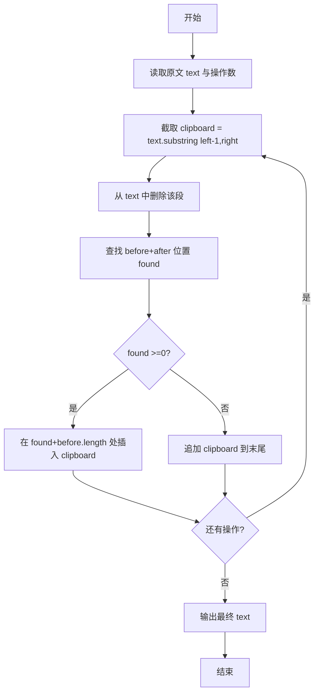
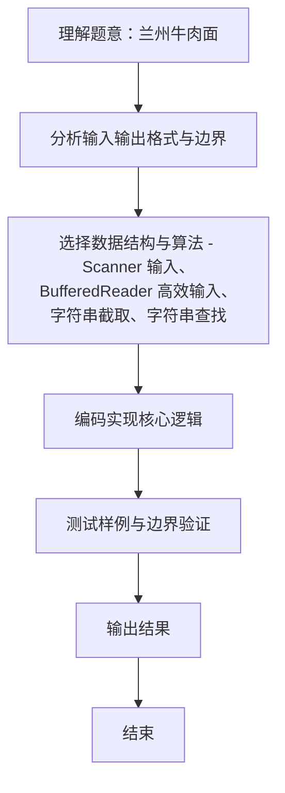

# L1-102 - 兰州牛肉面（15 分）

- **时间限制**: 400 ms
- **内存限制**: 65536 KB
- **代码长度限制**: 16 KB

---

## 题目描述


兰州牛肉面是历史悠久的美食，根据牛肉面的宽窄、配料的种类，可以细分为上百个不同的品种。你进到兰州的任何一家牛肉面馆，只说：“来一碗牛肉面！”就好像进到加州的咖啡馆说“来一杯咖啡”一样，会被店主人当成外星人……
本题的任务是，请你写程序帮助一家牛肉面馆的老板统计一下，他们一天卖出各种品种的牛肉面有多少碗，营业额一共有多少。

### 输入格式:

输入第一行给出一个正整数 $$N$$（$$\le 100$$），为牛肉面的种类数量。这里为了简单起见，我们把不同种类的牛肉面从 1 到 $$N$$ 编号，以后就用编号代替牛肉面品种的名称。第二行给出 $$N$$ 个价格，第 $$i$$ 个价格对应第 $$i$$ 种牛肉面一碗的单价。这里的价格是 [0.01, 200.00] 区间内的实数，以元为单位，精确到分。
随后是一天内客人买面的记录，每条记录占一行，格式为：
```
品种编号 碗数
```
其中`碗数`保证是正整数。当对应的 `品种编号` 为 `0` 时，表示输入结束。这个记录不算在内。

### 输出格式:

首先输出 $$N$$ 行，第 $$i$$ 行输出第 $$i$$ 种牛肉面卖出了多少碗。最后一行输出当天的总营业额，仍然是以元为单位，精确到分。题目保证总营业额不超过 $$10^6$$。

### 输入样例:
```in
5
4.00 8.50 3.20 12.00 14.10
3 5
5 2
1 1
2 3
2 2
1 9
0 0
```

### 输出样例:
```out
10
5
5
0
2
126.70
```

## 示例

### 示例 1

**输入:**
```
5
4.00 8.50 3.20 12.00 14.10
3 5
5 2
1 1
2 3
2 2
1 9
0 0
```

**输出:**
```
10
5
5
0
2
126.70
```
### 解题思路
本题 兰州牛肉面 的核心在于 L1-102 兰州牛肉面 原理： 1) 价格以元为单位，精确到分，需避免 double 二进制误差。改为按字符串解析为“分”（整数）。 解析规则：若含小数点，分 = 元*100 + 分位；补齐/截断到两位小数。 2) 统计每种面卖出碗数 c。实现上采用 Scanner 输入、BufferedReader 高效输入、字符串截取、字符串查找 等技术：通过 循环遍历 结合 条件分支 完成题意要求的数据处理，并利用 Java 集合/数组存储中间状态。算法整体时间复杂度为 O。

### 代码流程说明
1. **输入读取**：使用 `BufferedReader` + `StringTokenizer` 逐行读取，兼容空行与多空格，按需跨行补齐参数（如 N、M、S、D 或队员人数），将数据存入数组/邻接表/集合。
2. **剪切**：按 1 基闭区间 `[left,right]` 截取 `clipboard = text.substring(left-1,right)`，并从原文删除该段。
3. **粘贴**：在原文中查找 `before+after` 最早出现位置，若找到则在二者之间插入剪贴板，否则追加到末尾。
4. **循环处理**：重复上述操作直至所有操作完成，输出最终字符串。

### 代码实现
```java
import java.util.*;
import java.io.*;

/**
 * L1-102 兰州牛肉面
 * 原理：
 * 1) 价格以元为单位，精确到分，需避免 double 二进制误差。改为按字符串解析为“分”（整数）。
 *    解析规则：若含小数点，分 = 元*100 + 分位；补齐/截断到两位小数。
 * 2) 统计每种面卖出碗数 c[i]，总营业额 sum(分) = Σ p[i]*c[i]，p[i]为单价分。
 * 3) 最后按分格式化为 元.分（两位小数）。
 * 时间复杂度 O(N + 销售记录数)，空间 O(N)。
 */
public class Main {
    // 将价格字符串转为分整数，避免浮点误差
    private static int toCents(String s) {
        s = s.trim();
        boolean neg = false;
        if (s.startsWith("-")) { neg = true; s = s.substring(1); }
        int dot = s.indexOf('.');
        int cents;
        if (dot < 0) {
            cents = Integer.parseInt(s) * 100;
        } else {
            String yuanPart = s.substring(0, dot);
            String fenPart = s.substring(dot + 1);
            // 补齐到至少两位，超过两位按原输入截断/四舍五入？题目保证精确到分，故直接补/截
            if (fenPart.length() == 0) fenPart = "00";
            else if (fenPart.length() == 1) fenPart = fenPart + "0";
            else if (fenPart.length() > 2) fenPart = fenPart.substring(0, 2);
            int yuan = yuanPart.isEmpty() ? 0 : Integer.parseInt(yuanPart);
            int fen = Integer.parseInt(fenPart);
            cents = yuan * 100 + fen;
        }
        return neg ? -cents : cents;
    }

    public static void main(String[] args) throws Exception {
        BufferedReader br = new BufferedReader(new InputStreamReader(System.in));
        // 使用 Scanner 风格但基于字符串分词，避免 double
        // 为简化，仍用 Scanner 读取 token，但在价格处使用字符串解析
        Scanner sc = new Scanner(System.in);
        if (!sc.hasNext()) return;
        int n = sc.nextInt();
        int[] price = new int[n];
        for (int i = 0; i < n; i++) {
            String token = sc.next(); // 价格 token 保持字符串形式
            price[i] = toCents(token);
        }
        int[] cnt = new int[n];
        long sum = 0;
        while (sc.hasNextInt()) {
            int x = sc.nextInt();
            int q = sc.nextInt();
            if (x == 0) break;
            // 题目保证 1<=x<=N
            cnt[x - 1] += q;
            sum += (long) price[x - 1] * q;
        }
        for (int c : cnt) System.out.println(c);
        // 格式化为 元.分，保留两位小数
        long yuan = sum / 100;
        long fen = Math.abs(sum % 100);
        // sum 非负（价格非负），直接 printf 也可；此处兼容
        if (sum >= 0) {
            System.out.printf("%d.%02d", yuan, fen);
        } else {
            System.out.printf("-%d.%02d", Math.abs(yuan), fen);
        }
    }
}
```

### 代码流程图


### 解题流程图

