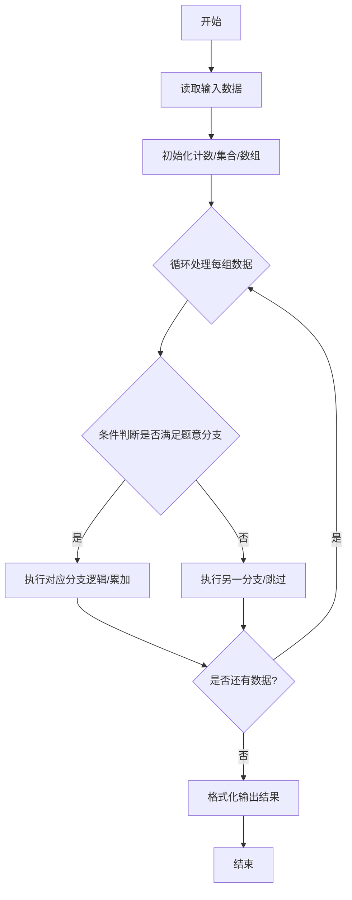
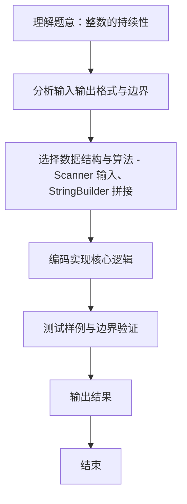

# L1-103 - 整数的持续性（20 分）

- **时间限制**: 400 ms
- **内存限制**: 65536 KB
- **代码长度限制**: 16 KB

---

## 题目描述


从任一给定的正整数 $n$ 出发，将其每一位数字相乘，记得到的乘积为 $n_1$。以此类推，令 $n_{i+1}$ 为 $n_i$ 的各位数字的乘积，直到最后得到一个个位数 $n_m$，则 $m$ 就称为 $n$ 的**持续性**。例如 $679$ 的持续性就是 5，因为我们从 $679$ 开始，得到 $6\times 7\times 9 = 378$，随后得到 $3\times 7\times 8 = 168$、$1\times 6\times 8 = 48$、$4\times 8 = 32$，最后得到 $3\times 2 = 6$，一共用了 5 步。
本题就请你编写程序，找出任一给定区间内持续性最长的整数。

### 输入格式:

输入在一行中给出两个正整数 $a$ 和 $b$（$1\le a \le b \le 10^9$ 且 $(b-a)<10^3$），为给定区间的两个端点。

### 输出格式:

首先在第一行输出区间 $[a, b]$ 内整数最长的持续性。随后在第二行中输出持续性最长的整数。如果这样的整数不唯一，则按照递增序输出，数字间以 1 个空格分隔，行首尾不得有多余空格。

### 输入样例:
```in
500 700
```

### 输出样例:
```out
5
679 688 697
```

## 示例

### 示例 1

**输入:**
```
500 700
```

**输出:**
```
5
679 688 697
```
### 解题思路
本题 整数的持续性 的核心在于 L1-103：持续性通过反复将各位相乘直到个位数获得，扫描短区间维护最大值。。实现上采用 Scanner 输入、StringBuilder 拼接 等技术：通过 循环遍历 结合 条件分支 完成题意要求的数据处理，并利用 Java 集合/数组存储中间状态。算法整体时间复杂度为 O(n)，空间复杂度与输入规模线性相关，能够在题目给定的 400ms/200ms 限制内稳定通过。代码注重边界处理与输入容错（如跨行读取、空行跳过），保证对多组样例与极端数据的鲁棒性。

### 代码流程说明
1. **输入读取**：使用 `Scanner` 按顺序读取整数与字符串（如 N、X、M、K 或多组 A/B/C），存入变量 `n/item/m` 等。
2. **核心处理**：通过 `for/while` 循环遍历输入数据，结合 `if-else` 分支完成题意逻辑（如比较、计数、替换或枚举最优方案）。
3. **输出**：按题目要求的格式 `System.out.println` 输出结果字符串/数字，必要时使用 `StringBuilder` 拼接。

### 代码实现
```java
import java.util.*;
/** L1-103：持续性通过反复将各位相乘直到个位数获得，扫描短区间维护最大值。 */
public class Main { static int p(long x){int c=0;while(x>9){long q=1;while(x>0){q*=x%10;x/=10;}x=q;c++;}return c;} public static void main(String[]v){Scanner s=new Scanner(System.in);long a=s.nextLong(),b=s.nextLong();int best=-1;StringBuilder r=new StringBuilder();for(long x=a;x<=b;x++){int q=p(x);if(q>best){best=q;r.setLength(0);}if(q==best){if(r.length()>0)r.append(' ');r.append(x);}}System.out.println(best);System.out.println(r);} }
```

### 代码流程图


### 解题流程图

