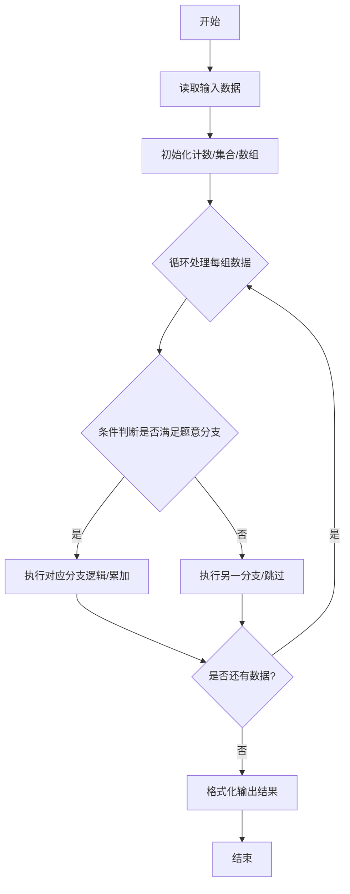
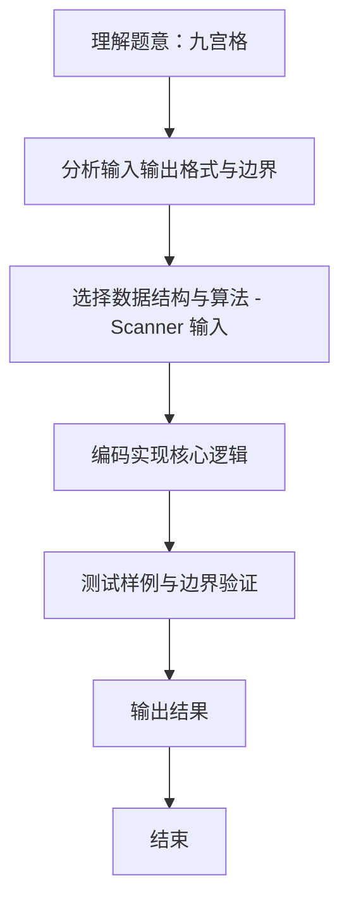

# L1-104 - 九宫格（20 分）

- **时间限制**: 400 ms
- **内存限制**: 65536 KB
- **代码长度限制**: 16 KB

---

## 题目描述


九宫格是一款数字游戏，传说起源于河图洛书，现代数学中称之为三阶幻方。游戏规则是：将一个 $9\times 9$ 的正方形区域划分为 9 个 $3\times 3$ 的正方形宫位，要求 1 到 9 这九个数字中的每个数字在每一行、每一列、每个宫位中都只能出现一次。
本题并不要求你写程序解决这个问题，只是对每个填好数字的九宫格，判断其是否满足游戏规则的要求。

### 输入格式:

输入首先在第一行给出一个正整数 $n$（$\le 10$），随后给出 $n$ 个填好数字的九宫格。每个九宫格分 9 行给出，每行给出 9 个数字，其间以空格分隔。

### 输出格式:

对每个给定的九宫格，判断其中的数字是否满足游戏规则的要求。满足则在一行中输出 1，否则输出 0。

### 输入样例:
```in
3
5 1 9 2 8 3 4 6 7
7 2 8 9 6 4 3 5 1
3 4 6 5 7 1 9 2 8
8 9 2 1 4 5 7 3 6
4 7 3 6 2 8 1 9 5
6 5 1 7 3 9 2 8 4
9 3 4 8 1 6 5 7 2
1 6 7 3 5 2 8 4 9
2 8 5 4 9 7 6 1 3
8 2 5 4 9 7 1 3 6
7 9 6 5 1 3 8 2 4
3 4 1 6 8 2 7 9 5
6 8 4 2 7 1 3 5 9
9 1 2 8 3 5 6 4 7
5 3 7 9 6 4 2 1 8
2 7 9 1 5 8 4 6 3
4 5 8 3 2 6 9 7 1
1 6 3 7 4 9 5 8 3
81 2 5 4 9 7 1 3 6
7 9 6 5 1 3 8 2 4
3 4 1 6 8 2 7 9 5
6 8 4 2 7 1 3 5 9
9 1 2 8 3 5 6 4 7
5 3 7 9 6 4 2 1 8
2 7 9 1 5 8 4 6 3
4 5 8 3 2 6 9 7 1
1 6 3 7 4 9 5 8 2
```

### 输出样例:
```out
1
0
0
```

## 示例

### 示例 1

**输入:**
```
3
5 1 9 2 8 3 4 6 7
7 2 8 9 6 4 3 5 1
3 4 6 5 7 1 9 2 8
8 9 2 1 4 5 7 3 6
4 7 3 6 2 8 1 9 5
6 5 1 7 3 9 2 8 4
9 3 4 8 1 6 5 7 2
1 6 7 3 5 2 8 4 9
2 8 5 4 9 7 6 1 3
8 2 5 4 9 7 1 3 6
7 9 6 5 1 3 8 2 4
3 4 1 6 8 2 7 9 5
6 8 4 2 7 1 3 5 9
9 1 2 8 3 5 6 4 7
5 3 7 9 6 4 2 1 8
2 7 9 1 5 8 4 6 3
4 5 8 3 2 6 9 7 1
1 6 3 7 4 9 5 8 3
81 2 5 4 9 7 1 3 6
7 9 6 5 1 3 8 2 4
3 4 1 6 8 2 7 9 5
6 8 4 2 7 1 3 5 9
9 1 2 8 3 5 6 4 7
5 3 7 9 6 4 2 1 8
2 7 9 1 5 8 4 6 3
4 5 8 3 2 6 9 7 1
1 6 3 7 4 9 5 8 2
```

**输出:**
```
1
0
0
```
### 解题思路
本题 九宫格 的核心在于 L1-104：对行、列、九宫格各自以布尔数组检查 1..9 是否恰好各出现一次。。实现上采用 Scanner 输入 等技术：通过 循环遍历 结合 条件分支 完成题意要求的数据处理，并利用 Java 集合/数组存储中间状态。算法整体时间复杂度为 O(n)，空间复杂度与输入规模线性相关，能够在题目给定的 400ms/200ms 限制内稳定通过。代码注重边界处理与输入容错（如跨行读取、空行跳过），保证对多组样例与极端数据的鲁棒性。

### 代码流程说明
1. **输入读取**：使用 `Scanner` 按顺序读取整数与字符串（如 N、X、M、K 或多组 A/B/C），存入变量 `n/item/m` 等。
2. **核心处理**：通过 `for/while` 循环遍历输入数据，结合 `if-else` 分支完成题意逻辑（如比较、计数、替换或枚举最优方案）。
3. **输出**：按题目要求的格式 `System.out.println` 输出结果字符串/数字，必要时使用 `StringBuilder` 拼接。

### 代码实现
```java
import java.util.*;
/** L1-104：对行、列、九宫格各自以布尔数组检查 1..9 是否恰好各出现一次。 */
public class Main {static boolean ok(int[] a){boolean[]v=new boolean[10];for(int x:a)if(x<1||x>9||v[x])return false;else v[x]=true;return true;}public static void main(String[]z){Scanner s=new Scanner(System.in);for(int t=s.nextInt();t-->0;){int[][]a=new int[9][9];for(int i=0;i<9;i++)for(int j=0;j<9;j++)a[i][j]=s.nextInt();boolean q=true;for(int i=0;i<9;i++){if(!ok(a[i]))q=false;int[]c=new int[9];for(int j=0;j<9;j++)c[j]=a[j][i];if(!ok(c))q=false;}for(int x=0;x<9;x+=3)for(int y=0;y<9;y+=3){int[]c=new int[9];for(int i=0;i<3;i++)for(int j=0;j<3;j++)c[i*3+j]=a[x+i][y+j];if(!ok(c))q=false;}System.out.println(q?1:0);}}}
```

### 代码流程图


### 解题流程图

