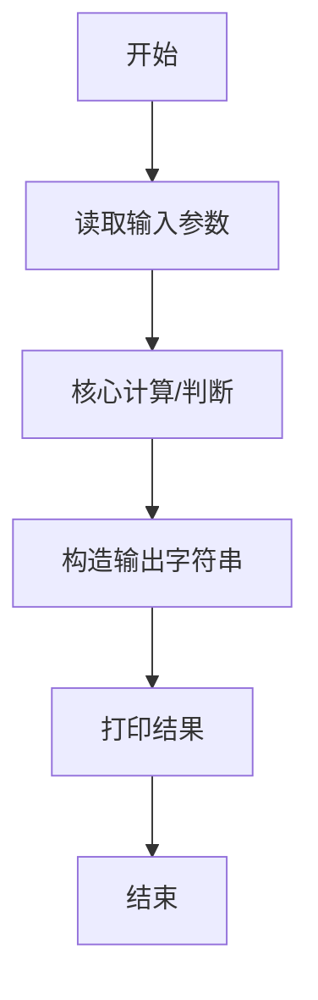
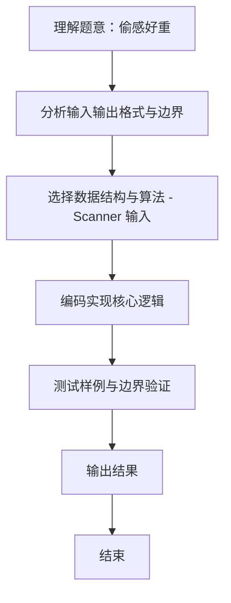

# L1-106 - 偷感好重（5 分）

- **时间限制**: 400 ms
- **内存限制**: 65536 KB
- **代码长度限制**: 16 KB

---

## 题目描述


以上图片截自新浪微博“iPanda 熊猫频道”，说“大熊猫吃苹果边吃边拿偷感好重。滚滚嘴里含 2 块，右手拿 1 块，左手捂 3 块…… 请问，它一共得到了多少块小苹果？”本题就请你计算一下这个问题的答案。

### 输入格式:

输入在一行中给出 3 个不超过 100 的正整数，分别为熊猫嘴里含的、右手拿的、左手捂的小苹果块数。同行数字间以空格分隔。

### 输出格式:

在一行中输出熊猫一共得到的小苹果块数。

### 输入样例:
```in
2 1 3
```

### 输出样例:
```out
6
```

## 示例

### 示例 1

**输入:**
```
2 1 3
```

**输出:**
```
6
```
### 解题思路
本题 偷感好重 的核心在于 L1-106：读取题目给出的三个整数并输出其和。。实现上采用 Scanner 输入 等技术：通过 顺序处理 结合 直接计算 完成题意要求的数据处理，并利用 Java 集合/数组存储中间状态。算法整体时间复杂度为 O(n)，空间复杂度与输入规模线性相关，能够在题目给定的 400ms/200ms 限制内稳定通过。代码注重边界处理与输入容错（如跨行读取、空行跳过），保证对多组样例与极端数据的鲁棒性。

### 代码流程说明
1. **输入读取**：使用 `Scanner` 按顺序读取整数与字符串（如 N、X、M、K 或多组 A/B/C），存入变量 `n/item/m` 等。
2. **核心处理**：依据读取的参数直接进行算术/逻辑判断，确定输出分支。
3. **输出**：按题目要求的格式 `System.out.println` 输出结果字符串/数字，必要时使用 `StringBuilder` 拼接。

### 代码实现
```java
import java.util.*;
/** L1-106：读取题目给出的三个整数并输出其和。 */
public class Main { public static void main(String[]a){Scanner s=new Scanner(System.in);System.out.println(s.nextInt()+s.nextInt()+s.nextInt());} }
```

### 代码流程图


### 解题流程图

