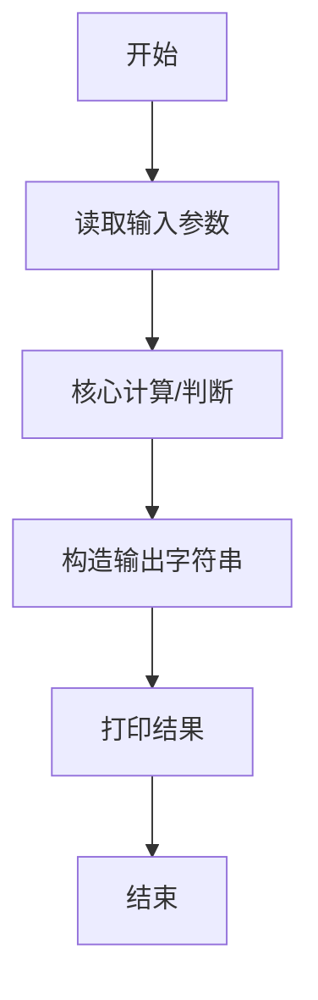
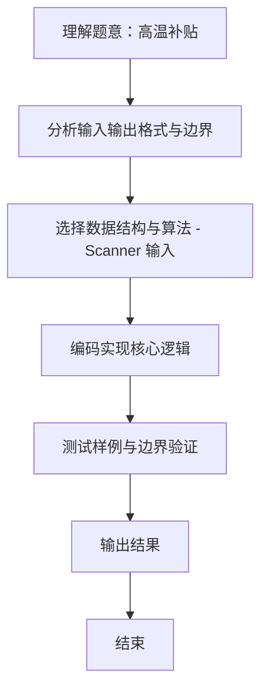

# L1-107 - 高温补贴（10 分）

- **时间限制**: 400 ms
- **内存限制**: 65536 KB
- **代码长度限制**: 16 KB

---

## 题目描述


高温补贴是为保证炎夏季节高温条件下经济建设和企业生产经营活动的正常进行，保障企业职工在劳动生产过程中的安全和身体健康进行的补贴。国家规定，用人单位安排劳动者在高温天气下（日最高气温达到 35° 以上），露天工作，以及不能采取有效措施将工作场所温度降低到 33° 以下的，应当向劳动者支付高温补贴。
给定当日最高气温、以及某用人单位的工作条件，请你写个程序判断，该单位员工能否获得高温补贴。

### 输入格式:

输入在一行中给出 3 个整数，即当日最高气温 $T$、工作场所状态 $S$、工作场所温度 $t$。其中温度为 $[-40, 50]$ 区间内的整数；工作场所状态为 1 表示露天，0 表示室内。

### 输出格式:

根据输入情况，如果可以获得高温补贴，则在一行中输出 `Bu Tie`（补贴），第二行输出 $T$ 的值；否则输出不补贴的原因：如果室内外温度都超标，仅仅是因为室内工作就不补贴，则输出 `Shi Nei`（室内），第二行输出 $T$ 的值；如果在室外工作但天气不热、或工作场所温度不高，则输出 `Bu Re`（不热），第二行输出 $t$ 的值；如果天气不热、或工作场所温度不高，且在室内工作，则输出 `Shu Shi`（舒适），第二行输出 $t$ 的值。

### 输入样例 1：
```in
36 1 33
```

### 输出样例 1：
```out
Bu Tie
36
```

### 输入样例 2：
```in
36 0 33
```

### 输出样例 2：
```out
Shi Nei
36
```

### 输入样例 3：
```in
36 1 27
```

### 输出样例 3：
```out
Bu Re
27
```

### 输入样例 4：
```in
36 0 24
```

### 输出样例 4：
```out
Shu Shi
24
```

## 示例

### 示例 1

**输入:**
```
36 1 33
```

**输出:**
```
Bu Tie
36
```

### 示例 2

**输入:**
```
36 0 33
```

**输出:**
```
Shi Nei
36
```

### 示例 3

**输入:**
```
36 1 27
```

**输出:**
```
Bu Re
27
```

### 示例 4

**输入:**
```
36 0 24
```

**输出:**
```
Shu Shi
24
```
### 解题思路
本题 高温补贴 的核心在于 L1-107 高温补贴 原理：判断是否达到高温补贴条件：T>=35 且 t>=33 - 若高温且露天工作(S==1) -> Bu Tie - 若高温且室内(S==0) -> Shi Nei - 否则若露天 -> Bu Re - 否则 -> 。实现上采用 Scanner 输入 等技术：通过 顺序处理 结合 条件分支 完成题意要求的数据处理，并利用 Java 集合/数组存储中间状态。算法整体时间复杂度为 O(1), O(1)，空间复杂度与输入规模线性相关，能够在题目给定的。

### 代码流程说明
1. **输入读取**：使用 `Scanner` 按顺序读取整数与字符串（如 N、X、M、K 或多组 A/B/C），存入变量 `n/item/m` 等。
2. **核心处理**：依据读取的参数直接进行算术/逻辑判断，确定输出分支。
3. **输出**：按题目要求的格式 `System.out.println` 输出结果字符串/数字，必要时使用 `StringBuilder` 拼接。

### 代码实现
```java
import java.util.Scanner;

/**
 * L1-107 高温补贴
 * 原理：判断是否达到高温补贴条件：T>=35 且 t>=33
 *   - 若高温且露天工作(S==1) -> Bu Tie
 *   - 若高温且室内(S==0) -> Shi Nei
 *   - 否则若露天 -> Bu Re
 *   - 否则 -> Shu Shi
 * 第二行输出：高温时输出 T，否则输出 t（与题面“BuTie/ShiNei->T, BuRe/ShuShi->t”一致）
 * 时间复杂度 O(1)，空间 O(1)
 */
public class Main {
    public static void main(String[] args) {
        Scanner sc = new Scanner(System.in);
        int T = sc.nextInt();
        int S = sc.nextInt();
        int t = sc.nextInt();
        sc.close();
        boolean high = (T >= 35 && t >= 33);
        if (S == 1) {
            if (high) System.out.println("Bu Tie");
            else System.out.println("Bu Re");
        } else {
            if (high) System.out.println("Shi Nei");
            else System.out.println("Shu Shi");
        }
        // 高温输出 T，否则输出 t
        System.out.println(high ? T : t);
    }
}
```

### 代码流程图


### 解题流程图

