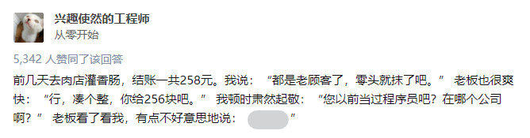
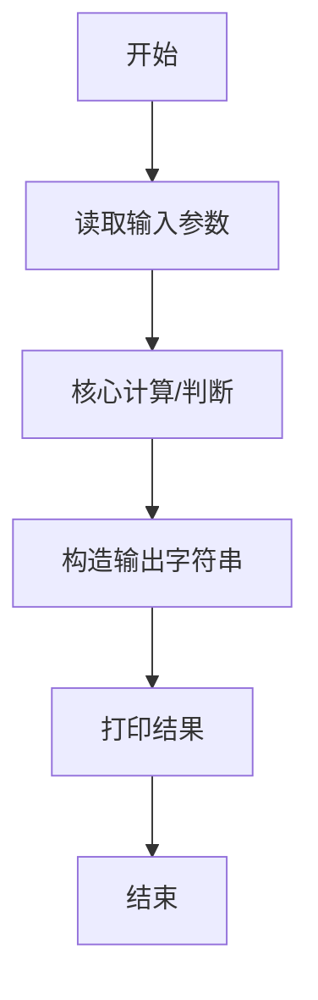
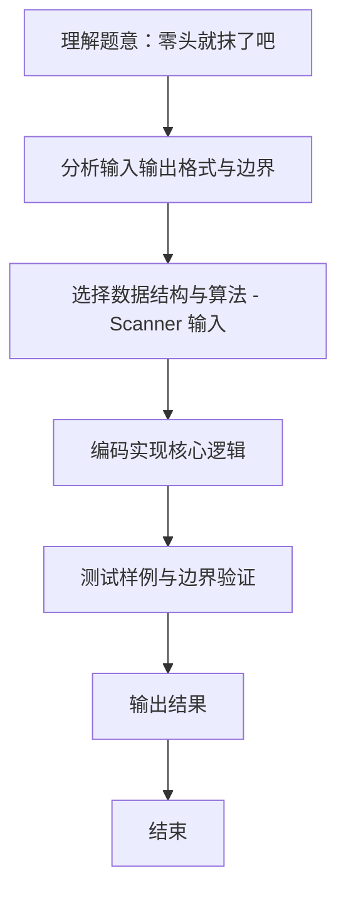

# L1-108 - 零头就抹了吧（10 分）

- **时间限制**: 400 ms
- **内存限制**: 65536 KB
- **代码长度限制**: 16 KB

---

## 题目描述



这是知乎上看到的：前几天去肉店灌香肠，结账一共258元。我说：“都是老顾客了，零头就抹了吧。”老板也很爽快：“行，凑个整，你给256块吧。”我顿时肃然起敬：“您以前当过程序员吧？在哪个公司啊？”老板看了看我，有点不好意思地说：“XX”。

本题就请你写个程序，帮老板计算他怎么抹零头。

## 输入格式：

输入在一行中给出一个正整数 $$N$$（$$\le 10^9$$），为客人应该付的钱。

## 输出格式：

在一行中输出老板抹掉零头后应收的钱。

## 输入样例：
```
258
```

## 输出样例：
```
256
```

## 样例说明：

256 在二进制中是 100 000 000，被程序员认为是个很“整”的数。所有二进制中最高位是 1 后面全是 0 的数字都是程序员世界里的“整”数。256 是小于 258 的最大的“整”数，所以老板收取这个数。

## 题解

### 解题思路
本题 零头就抹了吧 的核心在于 L1-108 零头就抹了吧 原理：找到不超过 N 的最大 2 的幂，即 2^floor(log2 N) 从 base=1 开始不断翻倍，直到 2*base > N 为止 时间复杂度 O(log N)，空间 O(1)。实现上采用 Scanner 输入 等技术：通过 循环遍历 结合 直接计算 完成题意要求的数据处理，并利用 Java 集合/数组存储中间状态。算法整体时间复杂度为 O(log N), O(1)，空间复杂度与输入规模线性相关，能够在题目给定的 400ms/。

### 代码流程说明
1. **输入读取**：使用 `Scanner` 按顺序读取整数与字符串（如 N、X、M、K 或多组 A/B/C），存入变量 `n/item/m` 等。
2. **核心处理**：通过 `for/while` 循环遍历输入数据，结合 `if-else` 分支完成题意逻辑（如比较、计数、替换或枚举最优方案）。
3. **输出**：按题目要求的格式 `System.out.println` 输出结果字符串/数字，必要时使用 `StringBuilder` 拼接。

### 代码实现
```java
import java.util.Scanner;

/**
 * L1-108 零头就抹了吧
 * 原理：找到不超过 N 的最大 2 的幂，即 2^floor(log2 N)
 * 从 base=1 开始不断翻倍，直到 2*base > N 为止
 * 时间复杂度 O(log N)，空间 O(1)
 */
public class Main {
    public static void main(String[] args) {
        Scanner sc = new Scanner(System.in);
        long N = sc.nextLong();
        sc.close();
        long base = 1;
        while (base * 2 <= N) {
            base *= 2;
        }
        System.out.println(base);
    }
}
```

### 代码流程图


### 解题流程图

