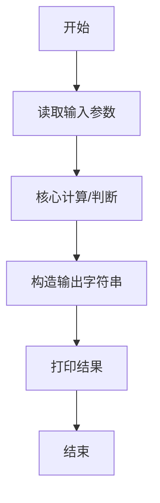
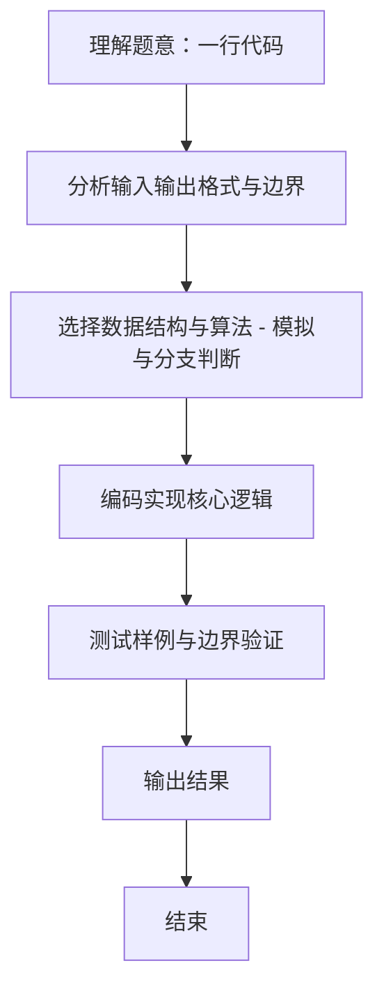

# L1-113 - 一行代码（5 分）

- **时间限制**: 400 ms
- **内存限制**: 65536 KB
- **代码长度限制**: 16 KB

---

## 题目描述


每次一行代码，建起我们的未来 —— 本题非常简单，就请你直接在屏幕上输出这句话：“Building the Future, One Line of Code at a Time.”。

### 输入格式:

本题没有输入。

### 输出格式:

在一行中输出 `Building the Future, One Line of Code at a Time.`。

### 输入样例:
```in
无
```

### 输出样例:
```out
Building the Future, One Line of Code at a Time.
```

## 示例

### 示例 1

**输入:**
```
无
```

**输出:**
```
Building the Future, One Line of Code at a Time.
```
### 解题思路
本题 一行代码 的核心在于 L1-113 一行代码 原理：无输入，直接输出固定句子 时间复杂度 O(1)。实现上采用 模拟与分支判断 等技术：通过 顺序处理 结合 直接计算 完成题意要求的数据处理，并利用 Java 集合/数组存储中间状态。算法整体时间复杂度为 O(1)，空间复杂度与输入规模线性相关，能够在题目给定的 400ms/200ms 限制内稳定通过。代码注重边界处理与输入容错（如跨行读取、空行跳过），保证对多组样例与极端数据的鲁棒性。

### 代码流程说明
1. **输入读取**：解析标准输入，获取题目所需参数与数据序列。
2. **核心处理**：依据读取的参数直接进行算术/逻辑判断，确定输出分支。
3. **输出**：按题目要求的格式 `System.out.println` 输出结果字符串/数字，必要时使用 `StringBuilder` 拼接。

### 代码实现
```java
/**
 * L1-113 一行代码
 * 原理：无输入，直接输出固定句子
 * 时间复杂度 O(1)
 */
public class Main {
    public static void main(String[] args) {
        System.out.println("Building the Future, One Line of Code at a Time.");
    }
}
```

### 代码流程图


### 解题流程图

