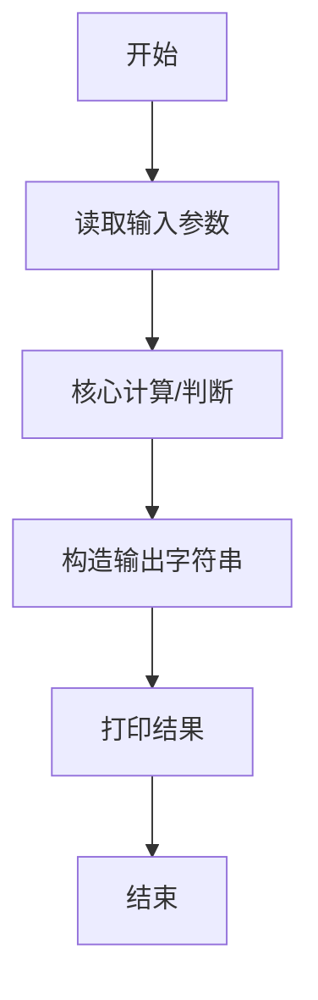
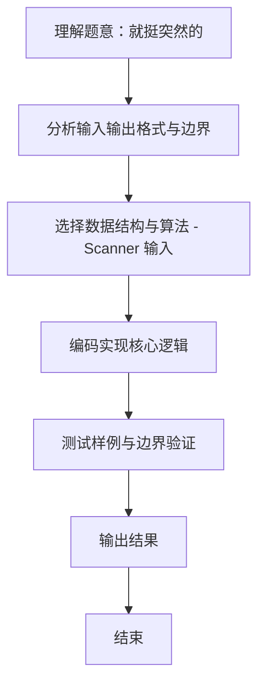

# L1-115 - 就挺突然的（10 分）

- **时间限制**: 400 ms
- **内存限制**: 65536 KB
- **代码长度限制**: 16 KB

---

## 题目描述


上面是新浪微博上的一张图，内容是“蹲厕所时突然想到，2026 年出生的孩子，能活到 3001 年”，就，挺突然的……

本题假设人类最长寿命为 250 岁，请你编写程序判断一下墙上的标语是否合理。

### 输入格式:

输入在一行给出 2 个不超过 5000 的正整数 $A$ 和 $B$，对应的标语为“蹲厕所时突然想到，$A$ 年出生的孩子，能活到 $B$ 年”。

### 输出格式:

首先在第一行输出写标语的人认为 $A$ 年出生的孩子有多长的寿命。如果该寿命超过了人类最长寿命，在第二行中输出 `jiu ting tu ran de...`；如果该寿命不是正数，输出 `hai sheng ma?`；如果寿命在正常范围内，输出 `nin tai cong ming le!`

### 输入样例 1：
```in
2026 3001
```

### 输出样例 1：
```out
975
jiu ting tu ran de...
```

### 输入样例 2：
```in
3001 2026
```

### 输出样例 2：
```out
-975
hai sheng ma?
```

### 输入样例 3：
```in
2025 2275
```

### 输出样例 3：
```out
250
nin tai cong ming le!
```

## 示例

### 示例 1

**输入:**
```
2026 3001
```

**输出:**
```
975
jiu ting tu ran de...
```

### 示例 2

**输入:**
```
3001 2026
```

**输出:**
```
-975
hai sheng ma?
```

### 示例 3

**输入:**
```
2025 2275
```

**输出:**
```
250
nin tai cong ming le!
```
### 解题思路
本题 就挺突然的 的核心在于 L1-115 就挺突然的 原理：寿命 = B - A；分三档输出提示语 age<=0 -> hai sheng ma? ; 1..250 -> nin tai cong ming le! ; >250 -> jiu ting tu ran 。实现上采用 Scanner 输入 等技术：通过 顺序处理 结合 条件分支 完成题意要求的数据处理，并利用 Java 集合/数组存储中间状态。算法整体时间复杂度为 O(1)，空间复杂度与输入规模线性相关，能够在题目给定的 400m。

### 代码流程说明
1. **输入读取**：使用 `Scanner` 按顺序读取整数与字符串（如 N、X、M、K 或多组 A/B/C），存入变量 `n/item/m` 等。
2. **核心处理**：依据读取的参数直接进行算术/逻辑判断，确定输出分支。
3. **输出**：按题目要求的格式 `System.out.println` 输出结果字符串/数字，必要时使用 `StringBuilder` 拼接。

### 代码实现
```java
import java.util.Scanner;

/**
 * L1-115 就挺突然的
 * 原理：寿命 = B - A；分三档输出提示语
 *   age<=0 -> hai sheng ma? ; 1..250 -> nin tai cong ming le! ; >250 -> jiu ting tu ran de...
 * 时间复杂度 O(1)
 */
public class Main {
    public static void main(String[] args) {
        Scanner sc = new Scanner(System.in);
        int A = sc.nextInt();
        int B = sc.nextInt();
        sc.close();
        int age = B - A;
        System.out.println(age);
        if (age <= 0) {
            System.out.println("hai sheng ma?");
        } else if (age <= 250) {
            System.out.println("nin tai cong ming le!");
        } else {
            System.out.println("jiu ting tu ran de...");
        }
    }
}
```

### 代码流程图


### 解题流程图

