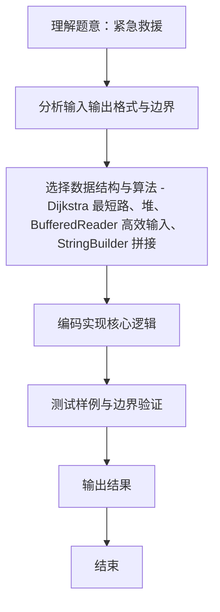

# L2-001 - 紧急救援（25 分）

- **时间限制**: 200 ms
- **内存限制**: 65536 KB
- **代码长度限制**: 16 KB

---

## 题目描述


作为一个城市的应急救援队伍的负责人，你有一张特殊的全国地图。在地图上显示有多个分散的城市和一些连接城市的快速道路。每个城市的救援队数量和每一条连接两个城市的快速道路长度都标在地图上。当其他城市有紧急求助电话给你的时候，你的任务是带领你的救援队尽快赶往事发地，同时，一路上召集尽可能多的救援队。

### 输入格式:

输入第一行给出4个正整数$$N$$、$$M$$、$$S$$、$$D$$，其中$$N$$（$$2\le N\le 500$$）是城市的个数，顺便假设城市的编号为0 ~ $$(N-1)$$；$$M$$是快速道路的条数；$$S$$是出发地的城市编号；$$D$$是目的地的城市编号。

第二行给出$$N$$个正整数，其中第$$i$$个数是第$$i$$个城市的救援队的数目，数字间以空格分隔。随后的$$M$$行中，每行给出一条快速道路的信息，分别是：城市1、城市2、快速道路的长度，中间用空格分开，数字均为整数且不超过500。输入保证救援可行且最优解唯一。

### 输出格式:

第一行输出最短路径的条数和能够召集的最多的救援队数量。第二行输出从$$S$$到$$D$$的路径中经过的城市编号。数字间以空格分隔，输出结尾不能有多余空格。

### 输入样例:
```in
4 5 0 3
20 30 40 10
0 1 1
1 3 2
0 3 3
0 2 2
2 3 2
```

### 输出样例:
```out
2 60
0 1 3
```

## 示例

### 示例 1

**输入:**
```
4 5 0 3
20 30 40 10
0 1 1
1 3 2
0 3 3
0 2 2
2 3 2
```

**输出:**
```
2 60
0 1 3
```
### 解题思路
本题 紧急救援 的核心在于 L2-001 紧急救援: Dijkstra 统计最短路条数、最大救援队数量并还原路径。实现上采用 Dijkstra 最短路、堆、BufferedReader 高效输入、StringBuilder 拼接 等技术：通过 循环遍历 结合 条件分支 完成题意要求的数据处理，并利用 Java 集合/数组存储中间状态。算法整体时间复杂度为 O(N^2), O(M log N)，空间复杂度与输入规模线性相关，能够在题目给定的 400ms/200ms 限制内稳定通过。代码注重边界处理。

### 代码流程说明
1. **输入读取**：使用 `BufferedReader` + `StringTokenizer` 逐行读取，兼容空行与多空格，按需跨行补齐参数（如 N、M、S、D 或队员人数），将数据存入数组/邻接表/集合。
2. **最短路求解**：初始化 `dist[]` 为 INF、`cnt[]`、`maxTeam[]`、`pre[]`，以 Dijkstra 贪心每次选取未访问的最小 dist 结点 `u`，松弛其邻接边，相等时累加路径条数并按救援队数量择优更新前驱。
3. **路径还原**：从终点 `D` 逆向通过 `pre[]` 回溯至起点 `S`，反转后拼接为路径序列。
4. **结果输出**：输出 `cnt[D]` 与 `maxTeam[D]`，第二行输出空格分隔的路径。

### 代码实现
```java
import java.util.*;
import java.io.*;

// L2-001 紧急救援: Dijkstra 统计最短路条数、最大救援队数量并还原路径
// 时间复杂度 O(N^2) N<=500, 亦可用堆优化 O(M log N)
public class Main {
    public static void main(String[] args) throws Exception {
        BufferedReader br = new BufferedReader(new InputStreamReader(System.in, "UTF-8"));
        String line;
        // 读取第一行 N M S D
        StringTokenizer st = null;
        // 跳过空行
        while ((line = br.readLine()) != null && line.trim().isEmpty()) {}
        if (line == null) return;
        st = new StringTokenizer(line);
        // 可能分多行读取, 确保4个整数
        List<Integer> first = new ArrayList<>();
        while (st.hasMoreTokens()) first.add(Integer.parseInt(st.nextToken()));
        while (first.size() < 4) {
            line = br.readLine();
            if (line == null) break;
            st = new StringTokenizer(line);
            while (st.hasMoreTokens()) first.add(Integer.parseInt(st.nextToken()));
        }
        int N = first.get(0), M = first.get(1), S = first.get(2), D = first.get(3);
        int[] team = new int[N];
        // 读取救援队数量 N 个, 可能跨行
        int idx = 0;
        while (idx < N) {
            line = br.readLine();
            if (line == null) break;
            if (line.trim().isEmpty()) continue;
            st = new StringTokenizer(line);
            while (st.hasMoreTokens() && idx < N) {
                team[idx++] = Integer.parseInt(st.nextToken());
            }
        }
        // 邻接矩阵/表
        List<int[]>[] adj = new ArrayList[N];
        for (int i = 0; i < N; i++) adj[i] = new ArrayList<>();
        for (int i = 0; i < M; i++) {
            line = br.readLine();
            while (line != null && line.trim().isEmpty()) line = br.readLine();
            if (line == null) break;
            st = new StringTokenizer(line);
            // 可能一行不完整, 但题目保证完整
            while (st.countTokens() < 3) {
                String extra = br.readLine();
                if (extra != null) line += " " + extra;
                st = new StringTokenizer(line);
            }
            int u = Integer.parseInt(st.nextToken());
            int v = Integer.parseInt(st.nextToken());
            int w = Integer.parseInt(st.nextToken());
            adj[u].add(new int[]{v, w});
            adj[v].add(new int[]{u, w});
        }

        final int INF = Integer.MAX_VALUE / 4;
        int[] dist = new int[N];
        Arrays.fill(dist, INF);
        int[] cnt = new int[N];
        int[] maxTeam = new int[N];
        int[] pre = new int[N];
        boolean[] vis = new boolean[N];
        Arrays.fill(pre, -1);
        dist[S] = 0;
        cnt[S] = 1;
        maxTeam[S] = team[S];

        for (int iter = 0; iter < N; iter++) {
            int u = -1;
            int best = INF;
            for (int i = 0; i < N; i++) if (!vis[i] && dist[i] < best) { best = dist[i]; u = i; }
            if (u == -1) break;
            vis[u] = true;
            for (int[] e : adj[u]) {
                int v = e[0], w = e[1];
                if (vis[v]) continue;
                if (dist[u] + w < dist[v]) {
                    dist[v] = dist[u] + w;
                    cnt[v] = cnt[u];
                    maxTeam[v] = maxTeam[u] + team[v];
                    pre[v] = u;
                } else if (dist[u] + w == dist[v]) {
                    cnt[v] += cnt[u];
                    if (maxTeam[u] + team[v] > maxTeam[v]) {
                        maxTeam[v] = maxTeam[u] + team[v];
                        pre[v] = u;
                    }
                }
            }
        }

        System.out.println(cnt[D] + " " + maxTeam[D]);
        // 还原路径
        List<Integer> path = new ArrayList<>();
        int cur = D;
        while (cur != -1) {
            path.add(cur);
            cur = pre[cur];
        }
        Collections.reverse(path);
        StringBuilder sb = new StringBuilder();
        for (int i = 0; i < path.size(); i++) {
            if (i > 0) sb.append(' ');
            sb.append(path.get(i));
        }
        System.out.println(sb.toString());
    }
}
```

### 代码流程图
```mermaid
flowchart TD
  A[开始] --> B[读取 N M S D 及救援队人数/邻接表]
  B --> C[初始化 dist/cnt/maxTeam/pre/vis]
  C --> D{是否还有未访问结点?}
  D -->|是| E[选取 dist 最小的 u 标记已访问]
  E --> F[遍历邻边松弛更新 dist/cnt/maxTeam/pre]
  F --> D
  D -->|否| G[输出 cnt[D] 和 maxTeam[D]]
  G --> H[回溯 pre 还原路径并输出]
  H --> Z[结束]
```

### 解题流程图

