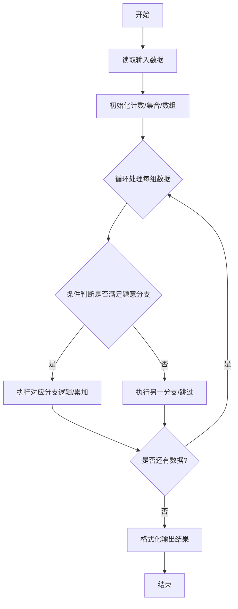
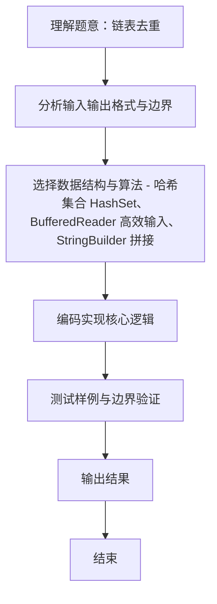

# L2-002 - 链表去重（25 分）

- **时间限制**: 400 ms
- **内存限制**: 65536 KB
- **代码长度限制**: 16 KB

---

## 题目描述


给定一个带整数键值的链表 $$L$$，你需要把其中绝对值重复的键值结点删掉。即对每个键值 $$K$$，只有第一个绝对值等于 $$K$$ 的结点被保留。同时，所有被删除的结点须被保存在另一个链表上。例如给定 $$L$$ 为 21→-15→-15→-7→15，你需要输出去重后的链表 21→-15→-7，还有被删除的链表 -15→15。

### 输入格式:

输入在第一行给出 L 的第一个结点的地址和一个正整数 $$N$$（$$\le 10^5$$，为结点总数）。一个结点的地址是非负的 5 位整数，空地址 NULL 用 $$-1$$ 来表示。

随后 $$N$$ 行，每行按以下格式描述一个结点：
```
地址 键值 下一个结点
```

其中`地址`是该结点的地址，`键值`是绝对值不超过$$10^4$$的整数，`下一个结点`是下个结点的地址。

### 输出格式:

首先输出去重后的链表，然后输出被删除的链表。每个结点占一行，按输入的格式输出。

### 输入样例:
```in
00100 5
99999 -7 87654
23854 -15 00000
87654 15 -1
00000 -15 99999
00100 21 23854
```

### 输出样例:
```out
00100 21 23854
23854 -15 99999
99999 -7 -1
00000 -15 87654
87654 15 -1
```

## 示例

### 示例 1

**输入:**
```
00100 5
99999 -7 87654
23854 -15 00000
87654 15 -1
00000 -15 99999
00100 21 23854
```

**输出:**
```
00100 21 23854
23854 -15 99999
99999 -7 -1
00000 -15 87654
87654 15 -1
```
### 解题思路
本题 链表去重 的核心在于 L2-002 链表去重: 按绝对值去重，保留首次出现，删除其余。实现上采用 哈希集合 HashSet、BufferedReader 高效输入、StringBuilder 拼接 等技术：通过 循环遍历 结合 条件分支 完成题意要求的数据处理，并利用 Java 集合/数组存储中间状态。算法整体时间复杂度为 O(N)，空间复杂度与输入规模线性相关，能够在题目给定的 400ms/200ms 限制内稳定通过。代码注重边界处理与输入容错（如跨行读取、空行跳过），保证对多组样例与极端数据的鲁棒性。

### 代码流程说明
1. **输入读取**：使用 `BufferedReader` + `StringTokenizer` 逐行读取，兼容空行与多空格，按需跨行补齐参数（如 N、M、S、D 或队员人数），将数据存入数组/邻接表/集合。
2. **集合构建**：将每组数据存入 `HashSet` 去重，计算交集大小 `Nc` 与并集大小 `Nt`。
3. **相似度计算**：按 `Nc/Nt*100%` 格式化为两位小数输出。

### 代码实现
```java
import java.util.*;
import java.io.*;

// L2-002 链表去重: 按绝对值去重，保留首次出现，删除其余
// 时间复杂度 O(N)
public class Main {
    public static void main(String[] args) throws Exception {
        BufferedReader br = new BufferedReader(new InputStreamReader(System.in, "UTF-8"));
        String line = br.readLine();
        while (line != null && line.trim().isEmpty()) line = br.readLine();
        if (line == null) return;
        StringTokenizer st = new StringTokenizer(line);
        String headStr = st.nextToken();
        int head = headStr.equals("-1") ? -1 : Integer.parseInt(headStr);
        int N = Integer.parseInt(st.nextToken());

        int MAX = 100000;
        int[] data = new int[MAX];
        int[] nxt = new int[MAX];
        boolean[] exist = new boolean[MAX];
        Arrays.fill(nxt, -1);

        for (int i = 0; i < N; i++) {
            line = br.readLine();
            while (line != null && line.trim().isEmpty()) line = br.readLine();
            if (line == null) break;
            st = new StringTokenizer(line);
            String addrStr = st.nextToken();
            int addr = Integer.parseInt(addrStr);
            int key = Integer.parseInt(st.nextToken());
            String nextStr = st.nextToken();
            int next = nextStr.equals("-1") ? -1 : Integer.parseInt(nextStr);
            data[addr] = key;
            nxt[addr] = next;
            exist[addr] = true;
        }

        Set<Integer> seen = new HashSet<>();
        List<Integer> keep = new ArrayList<>();
        List<Integer> removed = new ArrayList<>();

        int cur = head;
        // 防止非法环，计数安全
        int steps = 0;
        while (cur != -1 && steps <= N + 5) {
            if (cur < 0 || cur >= MAX || !exist[cur]) break;
            int abs = Math.abs(data[cur]);
            if (!seen.contains(abs)) {
                seen.add(abs);
                keep.add(cur);
            } else {
                removed.add(cur);
            }
            cur = nxt[cur];
            steps++;
        }

        StringBuilder sb = new StringBuilder();
        for (int i = 0; i < keep.size(); i++) {
            int addr = keep.get(i);
            int k = data[addr];
            int nextAddr = (i + 1 < keep.size()) ? keep.get(i + 1) : -1;
            sb.append(String.format("%05d %d %s", addr, k, nextAddr == -1 ? "-1" : String.format("%05d", nextAddr)));
            sb.append('\n');
        }
        for (int i = 0; i < removed.size(); i++) {
            int addr = removed.get(i);
            int k = data[addr];
            int nextAddr = (i + 1 < removed.size()) ? removed.get(i + 1) : -1;
            sb.append(String.format("%05d %d %s", addr, k, nextAddr == -1 ? "-1" : String.format("%05d", nextAddr)));
            if (i != removed.size() - 1) sb.append('\n');
            else if (sb.length() > 0 && sb.charAt(sb.length() - 1) == '\n') {
                // keep trailing? 不要多余换行
            }
        }
        // 如果 keep 为空但有 removed, 避免开头空行
        String out = sb.toString();
        // 去掉末尾换行由 println 统一? 直接打印
        System.out.print(out);
        // 若有输出且末尾没有换行，补一个? 题目要求每结点一行，已包含
        if (!out.isEmpty() && !out.endsWith("\n")) System.out.println();
        else if (!out.isEmpty() && out.endsWith("\n")) {
            // trim last newline's extra print already done
        }
    }
}
```

### 代码流程图


### 解题流程图

