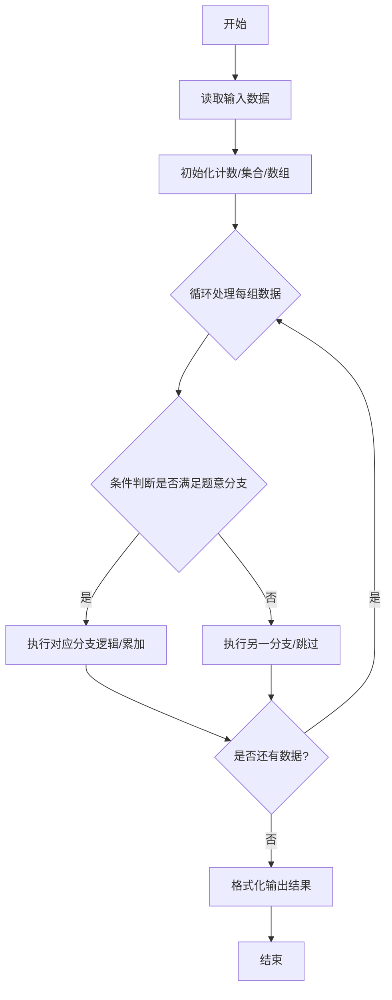
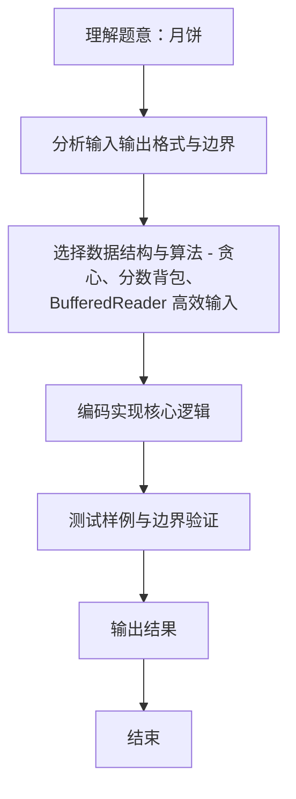

# L2-003 - 月饼（25 分）

- **时间限制**: 150 ms
- **内存限制**: 65536 KB
- **代码长度限制**: 16 KB

---

## 题目描述


月饼是中国人在中秋佳节时吃的一种传统食品，不同地区有许多不同风味的月饼。现给定所有种类月饼的库存量、总售价、以及市场的最大需求量，请你计算可以获得的最大收益是多少。

注意：销售时允许取出一部分库存。样例给出的情形是这样的：假如我们有 3 种月饼，其库存量分别为 18、15、10 万吨，总售价分别为 75、72、45 亿元。如果市场的最大需求量只有 20 万吨，那么我们最大收益策略应该是卖出全部 15 万吨第 2 种月饼、以及 5 万吨第 3 种月饼，获得 72 + 45/2 = 94.5（亿元）。

### 输入格式:

每个输入包含一个测试用例。每个测试用例先给出一个不超过 1000 的正整数 $$N$$ 表示月饼的种类数、以及不超过 500（以万吨为单位）的正整数 $$D$$ 表示市场最大需求量。随后一行给出 $$N$$ 个正数表示每种月饼的库存量（以万吨为单位）；最后一行给出 $$N$$ 个正数表示每种月饼的总售价（以亿元为单位）。数字间以空格分隔。

### 输出格式:

对每组测试用例，在一行中输出最大收益，以亿元为单位并精确到小数点后 2 位。

### 输入样例:
```in
3 20
18 15 10
75 72 45
```

### 输出样例:
```out
94.50
```

## 示例

### 示例 1

**输入:**
```
3 20
18 15 10
75 72 45
```

**输出:**
```
94.50
```
### 解题思路
本题 月饼 的核心在于 L2-003 月饼: 分数背包按单价贪心。实现上采用 贪心、分数背包、BufferedReader 高效输入 等技术：通过 循环遍历 结合 条件分支 完成题意要求的数据处理，并利用 Java 集合/数组存储中间状态。算法整体时间复杂度为 O(N log N)，空间复杂度与输入规模线性相关，能够在题目给定的 400ms/200ms 限制内稳定通过。代码注重边界处理与输入容错（如跨行读取、空行跳过），保证对多组样例与极端数据的鲁棒性。

### 代码流程说明
1. **输入读取**：使用 `BufferedReader` + `StringTokenizer` 逐行读取，兼容空行与多空格，按需跨行补齐参数（如 N、M、S、D 或队员人数），将数据存入数组/邻接表/集合。
2. **排序/贪心**：将对象按关键属性（如单价、余额、价格）降序/升序排序，必要时按次关键字稳定排序。
3. **遍历处理**：顺序扫描排序后序列，累计结果或按题意判断输出。

### 代码实现
```java
import java.util.*;
import java.io.*;

// L2-003 月饼: 分数背包按单价贪心
// 时间复杂度 O(N log N)
public class Main {
    static class Cake {
        double stock;
        double price;
        double unit;
        Cake(double s, double p) { stock = s; price = p; unit = p / s; }
    }
    public static void main(String[] args) throws Exception {
        BufferedReader br = new BufferedReader(new InputStreamReader(System.in, "UTF-8"));
        String line;
        while ((line = br.readLine()) != null && line.trim().isEmpty()) {}
        if (line == null) return;
        StringTokenizer st = new StringTokenizer(line);
        int N = Integer.parseInt(st.nextToken());
        double D = Double.parseDouble(st.nextToken());
        double[] stock = new double[N];
        double[] price = new double[N];
        // 读取库存
        int idx = 0;
        while (idx < N) {
            if (!st.hasMoreTokens()) {
                line = br.readLine();
                if (line == null) break;
                st = new StringTokenizer(line);
                continue;
            }
            stock[idx++] = Double.parseDouble(st.nextToken());
        }
        // 读取总售价
        idx = 0;
        // 可能已在同一行剩余? 重新读取
        // 如果上一轮结束后 st 还有剩余, 已处理; 现在读取下一行
        // 为简单重新按行读满 N 个
        List<Double> prices = new ArrayList<>();
        // 先把剩余 tokens 加入
        while (st.hasMoreTokens()) prices.add(Double.parseDouble(st.nextToken()));
        while (prices.size() < N) {
            line = br.readLine();
            if (line == null) break;
            if (line.trim().isEmpty()) continue;
            st = new StringTokenizer(line);
            while (st.hasMoreTokens()) prices.add(Double.parseDouble(st.nextToken()));
        }
        for (int i = 0; i < N; i++) price[i] = prices.get(i);

        List<Cake> list = new ArrayList<>();
        for (int i = 0; i < N; i++) list.add(new Cake(stock[i], price[i]));
        list.sort((a,b) -> Double.compare(b.unit, a.unit));

        double remain = D;
        double ans = 0;
        for (Cake c : list) {
            if (remain <= 1e-9) break;
            if (c.stock <= remain) {
                ans += c.price;
                remain -= c.stock;
            } else {
                ans += c.unit * remain;
                remain = 0;
            }
        }
        System.out.printf("%.2f\n", ans);
    }
}
```

### 代码流程图


### 解题流程图

