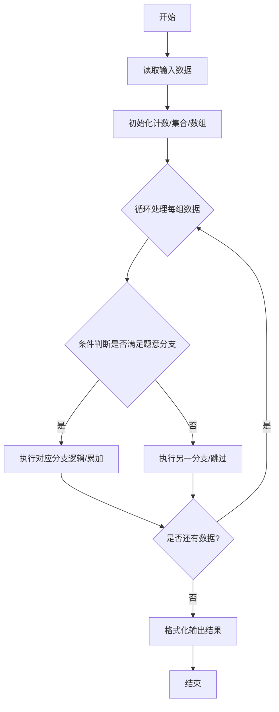
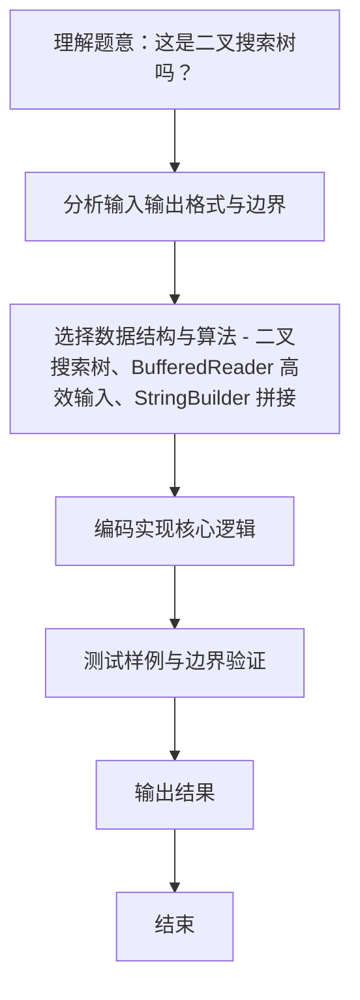

# L2-004 - 这是二叉搜索树吗？（25 分）

- **时间限制**: 400 ms
- **内存限制**: 65536 KB
- **代码长度限制**: 16 KB

---

## 题目描述


一棵二叉搜索树可被递归地定义为具有下列性质的二叉树：对于任一结点，

- 其左子树中所有结点的键值小于该结点的键值；
- 其右子树中所有结点的键值大于等于该结点的键值；
- 其左右子树都是二叉搜索树。

所谓二叉搜索树的“镜像”，即将所有结点的左右子树对换位置后所得到的树。

给定一个整数键值序列，现请你编写程序，判断这是否是对一棵二叉搜索树或其镜像进行前序遍历的结果。

### 输入格式:

输入的第一行给出正整数 $$N$$（$$\le 1000$$）。随后一行给出 $$N$$ 个整数键值，其间以空格分隔。

### 输出格式:

如果输入序列是对一棵二叉搜索树或其镜像进行前序遍历的结果，则首先在一行中输出 `YES` ，然后在下一行输出该树后序遍历的结果。数字间有 1 个空格，一行的首尾不得有多余空格。若答案是否，则输出 `NO`。

### 输入样例 1：
```in
7
8 6 5 7 10 8 11
```

### 输出样例 1：
```out
YES
5 7 6 8 11 10 8
```

### 输入样例 2：
```in
7
8 10 11 8 6 7 5
```

### 输出样例 2：
```out
YES
11 8 10 7 5 6 8
```

### 输入样例 3：
```in
7
8 6 8 5 10 9 11
```

### 输出样例 3：
```out
NO
```

## 示例

### 示例 1

**输入:**
```
7
8 6 5 7 10 8 11
```

**输出:**
```
YES
5 7 6 8 11 10 8
```

### 示例 2

**输入:**
```
7
8 10 11 8 6 7 5
```

**输出:**
```
YES
11 8 10 7 5 6 8
```

### 示例 3

**输入:**
```
7
8 6 8 5 10 9 11
```

**输出:**
```
NO
```
### 解题思路
本题 这是二叉搜索树吗？ 的核心在于 L2-004 这是二叉搜索树吗？: 判断前序是否为 BST 或镜像 BST, 并输出后序。实现上采用 二叉搜索树、BufferedReader 高效输入、StringBuilder 拼接 等技术：通过 循环遍历 结合 条件分支 完成题意要求的数据处理，并利用 Java 集合/数组存储中间状态。算法整体时间复杂度为 O(N^2), O(N)，空间复杂度与输入规模线性相关，能够在题目给定的 400ms/200ms 限制内稳定通过。代码注重边界处理与输入容错（如跨。

### 代码流程说明
1. **输入读取**：使用 `BufferedReader` + `StringTokenizer` 逐行读取，兼容空行与多空格，按需跨行补齐参数（如 N、M、S、D 或队员人数），将数据存入数组/邻接表/集合。
2. **建树/判定**：依据前序（或后序+中序）递归划分左右子树区间，判断是否满足 BST 或镜像 BST 规则，期间记录后序序列。
3. **遍历输出**：若判定成功则输出后序遍历序列，否则输出 `NO`。

### 代码实现
```java
import java.util.*;
import java.io.*;

// L2-004 这是二叉搜索树吗？: 判断前序是否为 BST 或镜像 BST, 并输出后序
// BST 规则: 左子树 < 根, 右子树 >= 根
// 镜像: 左 >= 根, 右 < 根
// 时间复杂度 O(N^2) 最坏, N<=1000 可接受; 可优化 O(N)
public class Main {
    static int[] pre;
    static List<Integer> post;
    static boolean ok;

    static void solve(int l, int r, boolean mirror) { // [l,r)
        if (!ok) return;
        if (l >= r) return;
        if (l + 1 == r) { post.add(pre[l]); return; }
        int root = pre[l];
        int split = -1;
        if (!mirror) {
            // 第一个 >= root
            int i = l + 1;
            while (i < r && pre[i] < root) i++;
            split = i;
            // 检查右半部分都 >= root
            for (int j = split; j < r; j++) if (pre[j] < root) { ok = false; return; }
        } else {
            int i = l + 1;
            while (i < r && pre[i] >= root) i++;
            split = i;
            for (int j = split; j < r; j++) if (pre[j] >= root) { ok = false; return; }
        }
        solve(l + 1, split, mirror);
        solve(split, r, mirror);
        post.add(root);
    }

    public static void main(String[] args) throws Exception {
        BufferedReader br = new BufferedReader(new InputStreamReader(System.in, "UTF-8"));
        String line;
        while ((line = br.readLine()) != null && line.trim().isEmpty()) {}
        if (line == null) return;
        int N = Integer.parseInt(line.trim());
        pre = new int[N];
        int idx = 0;
        StringTokenizer st = null;
        while (idx < N) {
            line = br.readLine();
            if (line == null) break;
            if (line.trim().isEmpty()) continue;
            st = new StringTokenizer(line);
            while (st.hasMoreTokens() && idx < N) pre[idx++] = Integer.parseInt(st.nextToken());
        }
        if (N == 0) { System.out.println("NO"); return; }

        // 先尝试正常 BST
        post = new ArrayList<>();
        ok = true;
        solve(0, N, false);
        if (ok) {
            System.out.println("YES");
            printPost();
            return;
        }
        // 尝试镜像
        post = new ArrayList<>();
        ok = true;
        solve(0, N, true);
        if (ok) {
            System.out.println("YES");
            printPost();
        } else {
            System.out.println("NO");
        }
    }

    static void printPost() {
        StringBuilder sb = new StringBuilder();
        for (int i = 0; i < post.size(); i++) {
            if (i > 0) sb.append(' ');
            sb.append(post.get(i));
        }
        System.out.println(sb.toString());
    }
}
```

### 代码流程图


### 解题流程图

